# 数据结构和算法(java)

## 0.概述

1. 数据结构和算法的重要性

    Ⅰ. 数据结构和算法是程序的重要组成部分。它们是计算机科学中的基础和核心，因为在计算机程序中，数据是不可或缺的，而数据结构则是存储和管理数据的方式。算法则是指处理数据的步骤和方式。因此，数据结构和算法是程序中不可或缺的组成部分。
    Ⅱ. 数据结构和算法极大地影响着程序的性能。采用不同的数据结构和算法，程序的执行效率可能会相差很多数量级。例如，在搜索一个列表时，线性搜索的效率较低，而二分搜索的效率较高。因此，合理地选择数据结构和算法可以大大提高程序的性能和效率。
    
    Ⅲ. 数据结构和算法是解决复杂问题的有效工具。复杂的问题往往需要分解为多个子问题，采用数据结构和算法可以方便地管理子问题的信息和状态，从而有效地解决复杂问题。例如，在图像处理和机器学习等领域，数据结构和算法被广泛应用。
    
    Ⅳ. 数据结构和算法在不同领域中都有广泛的应用。例如，在数据库管理、图像处理、网络编程、游戏开发等领域中，数据结构和算法都是不可或缺的。此外，在求职时，掌握数据结构和算法也是程序员的重要竞争力之一。

因此，数据结构和算法是计算机科学中非常重要的组成部分，它们不仅影响着程序的性能和效率，还解决了许多复杂问题，并在不同领域中都有广泛的应用。

2. 数据结构和算法的关系

    ①. 数据data结构(structure)是一门研究组织数据方式的学科，有了编程语言也就有了数据结构。学好数据结构可以编写出更加漂亮，更加有效率的代码。
    ②. 要学习好数据结构就要多多考虑如何将生活中遇到的问题，用程序去实现解决。

    ③. 程序 = 数据结构 + 算法

    ④. 数据结构是算法的基础，换言之，想要学好算法，需要把数据结构学到位

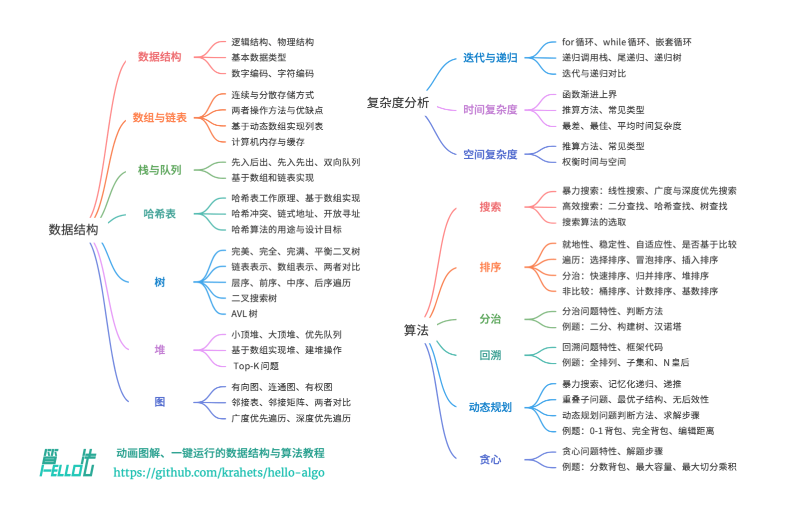

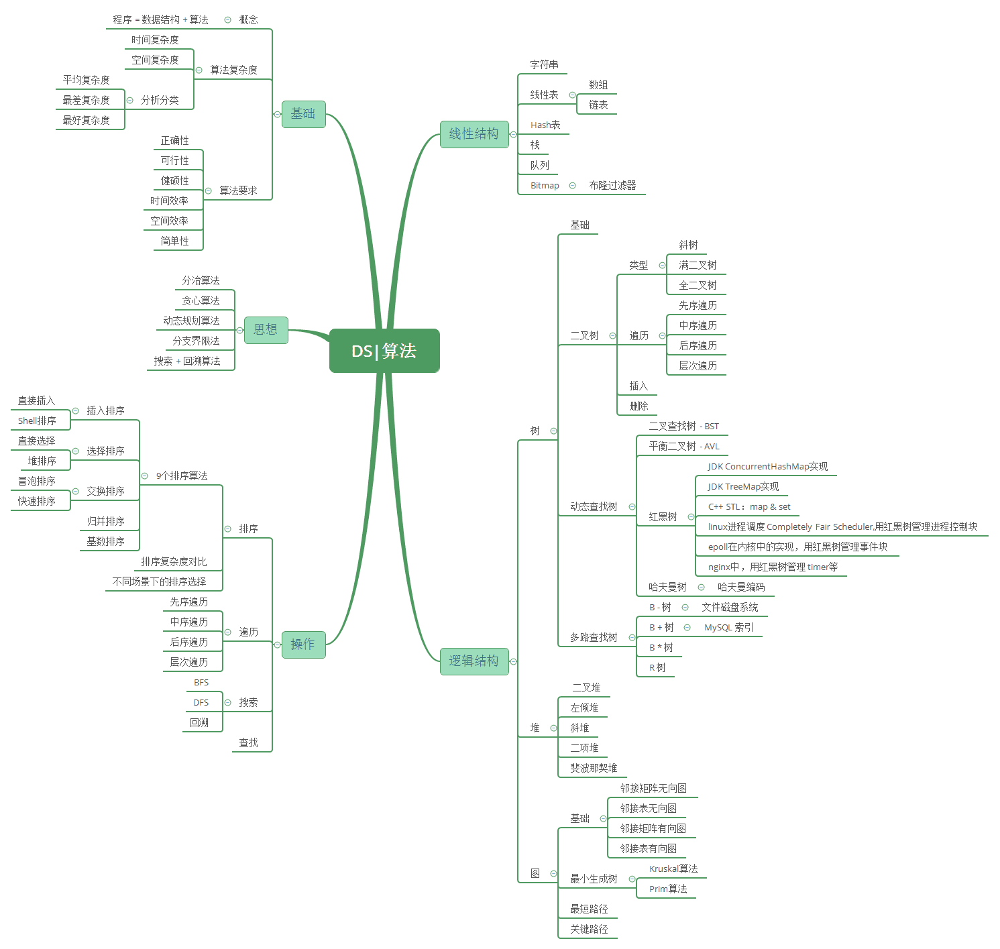

3.数据结构分类

1).线性结构

**特点**：数据元素之间存在**一对一的线性关系**

**存储结构**：顺序存储结构和链式存储结构

**常见的线性结构**：数组、链表、队列、栈

2).非线性结构

**常见的非线性结构**：二维数组、多为数组、广义表、**树结构、图结构**


## 1.稀疏数组(sparse array)

**1.基本介绍**

> 当一个数组中大部分元素为0，或者为同一个值的数组时，可以使用稀疏数组来保存该数组。

稀疏数组的处理方法是：

   1. 记录数组一共有几行几列，有多少个不同的值。
   2. 思想：把具有不同值的元素的行列及值记录在一个小规模的数组中，从而缩小程序的规模    


**2.代码实现**

```java
package sparsearray;

public class SparseArray {

    public static void main(String[] args) {
        //创建一个原始的二维数组 11 * 11
        //0 表示没有棋子 1 表示黑子 2表示白子
        int chessArr[][] = new int[11][11];
        chessArr[8][9] = 1;
        chessArr[5][1] = 2;
        chessArr[5][3] = 2;

        //输出原始的二维数组
        System.out.println("原始的二维数组");
        for (int[] row : chessArr) {
            for (int data : row) {
                System.out.printf("%d\t", data);
            }
            System.out.println();
        }

        //将二维数组转为稀疏数组
        //1.先遍历二维数组 得到非0数据的个数
        int sum = 0;
        int rows = chessArr.length;
        int columns = chessArr[0].length;
        for (int i = 0; i < rows; i++) {
            for (int j = 0; j < columns; j++) {
                if (chessArr[i][j] != 0) {
                    sum++;
                }
            }
        }
        System.out.println("sum=" + sum);
        //2.创建对应的稀疏数组
        int sparseArray[][] = new int[sum + 1][3];
        //给稀疏数组赋值
        sparseArray[0][0] = rows;
        sparseArray[0][1] = columns;
        sparseArray[0][2] = sum;

        //把非零值存放到稀疏数组
        int count = 1; //count用于记录是第几个非零数值
        for (int i = 0; i < rows; i++) {
            for (int j = 0; j < columns; j++) {
                if (chessArr[i][j] != 0) {
                    sparseArray[count][0] = i;
                    sparseArray[count][1] = j;
                    sparseArray[count][2] = chessArr[i][j];
                    count++;
                }
            }
        }
        //输出稀疏数组
        System.out.println();
        System.out.println("转换的稀疏数组为——————");
        for (int[] sparse : sparseArray) {
            System.out.printf("%d\t%d\t%d\t",
                    sparse[0], sparse[1], sparse[2]);
            System.out.println();
        }

        //将稀疏数组恢复成二维数组
        int chessArrNew[][] = new int[sparseArray[0][0]][sparseArray[0][1]];
        for (int i = 1; i <= sparseArray[0][2]; i++) {
            chessArrNew[sparseArray[i][0]][sparseArray[i][1]] = sparseArray[i][2];
        }

        //输出恢复后的二维数组
        System.out.println("原始的二维数组");
        for (int[] row : chessArrNew) {
            for (int data : row) {
                System.out.printf("%d\t", data);
            }
            System.out.println();
        }

    }
}

```


## 2.队列(queue)

队列是只允许在一端进行插入操作，而在另一端进行删除操作的线性表。

队列是一个有序列表，可以用**数组**或**链表**来实现。

遵循**先进先出**的原则  **first in first out**

### 1).数组模拟队列

用一块连续的存储单元存放队列中的元素，并附加两个指针front和rear分别指示队头元素和队尾元素的位置。

通常，有两种方法设置front和rear指针:一是让front指向队头元素，rear指向队尾元素的下一位置；二是让front指队头元素的前一位置，rear指向队尾元素。 下图是第二种方式：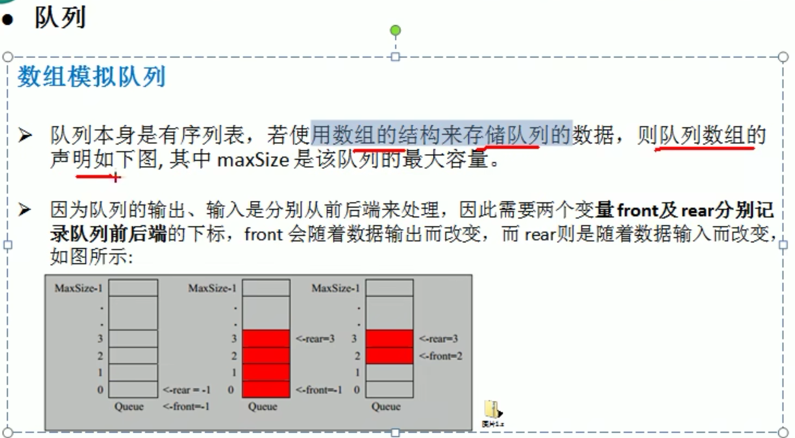


**代码实现**

```java
//使用数组模拟队列-编写一个ArrayQueue类
class ArrayQueue {
    private int maxSize; //容量
    private int front; //队列头
    private int rear; //队列尾
    private int[] arr; //该数据用于存放数据，模拟队列

    //创建队列的构造器
    public ArrayQueue(int arrMaxSize) {
        maxSize = arrMaxSize;
        arr = new int[maxSize];
        front = -1; //指向队列头部，即：指向队列第一个数据的前一个位置
        rear = -1; //指向队列尾，即：队列最后一个数据
    }

    //判断队列是否为满
    public boolean isFull() {
        return rear == maxSize - 1;
    }

    //判断队列是否为空
    public boolean isEmpty() {
        return rear == front;
    }

    //添加数据到队列
    public void addQueue(int n) {
        //判断队列是否为满
        if (isFull()) {
            System.out.println("队列满，不能添加新数据");
            return;
        }
        rear++;
        arr[rear] = n;
    }

    //获取队列的数据，出队列
    public int getQueue() {
        //判断队列是否为空
        if (isEmpty()) {
            //通过抛出异常来处理
            throw new RuntimeException("队列为空，不能取数据");
        }
        front++;
        return arr[front];
    }
    
    //显示队列的所有数据
    public void showQueue() {
        if (isEmpty()) {
            System.out.println("队列空。。。");
        }
        for (int i = 0; i < arr.length; i++) {
            System.out.printf("arr[%d]=%d", i, arr[i]);
        }
    }

    //显示队列的头数据
    public int peekQueue() {
        if (isEmpty()) {
            throw new RuntimeException("队列是空的");
        }
        return arr[front + 1];
    }
}
```

### 2).数组模拟环形队列

1. front指向队头元素,初始值为0
2. rear指向队尾元素的下一位置(希望空出一个空间作为约定)，初始值为0
3. 队列满判定： (rear + 1) % maxSzie = front   即：尾索引的下一个为头索引时表示队满
4. 队列空判定：rear == front 空
5. 队列有效数据个数：（rear + maxSize - front）% maxSize  

**代码实现**  

```java
package queue;

public class CircularQueue {
    private int[] queue;
    private int front;
    private int rear;
    private int capacity;

    public CircularQueue(int k) {
        capacity = k + 1; // 多一个空间用于判断队列满
        queue = new int[capacity];
        // front = 0; 默认为0可以不初始化
        // rear = 0;
    }
    
    // 判断队列是否为空
    public boolean isEmpty() {
        return front == rear;
    }

    // 判断队列是否已满
    public boolean isFull() {
        return (rear + 1) % capacity == front;
    }

    // 插入元素到队尾
    public boolean enQueue(int value) {
        // 判断队列是否已满
        if (isFull()) {
            // 如果队列已满，则返回false
            return false;
        }
        // 将元素值放入队列的队尾
        queue[rear] = value;
        // 更新队尾指针
        rear = (rear + 1) % capacity;
        // 返回true表示成功入队
        return true;
    }

    // 从队头删除元素
    public boolean deQueue() {
        if (isEmpty()) {
            return false;
        }
        front = (front + 1) % capacity;
        return true;
    }

    // 获取队头元素
    public int Front() {
        if (isEmpty()) {
            return -1; // 队列为空时返回-1或其他错误码
        }
        return queue[front];
    }

    // 获取队尾元素
    public int Rear() {
        if (isEmpty()) {
            return -1; // 队列为空时返回-1或其他错误码
        }
        return queue[(rear - 1 + capacity) % capacity];
    }

    // 出队列
    public int poll() {
        if (isEmpty()) {
            return -1; // 队列为空时返回-1或其他错误码
        }
        int value = queue[front];
        front = (front + 1) % capacity;
        return value;
    }

    //显示队列所有元素
    public void display() {
        if (isEmpty()) {
            System.out.println("队列为空");
            return;
        }
        for (int i = front; i != rear; i = (i + 1) % capacity) {
            System.out.print(queue[i] + " ");
        }
        System.out.println();
    }

    // 获取队列长度
    public int size() {
        return (rear - front + capacity) % capacity;
    }

    
}
```


## 3.链表

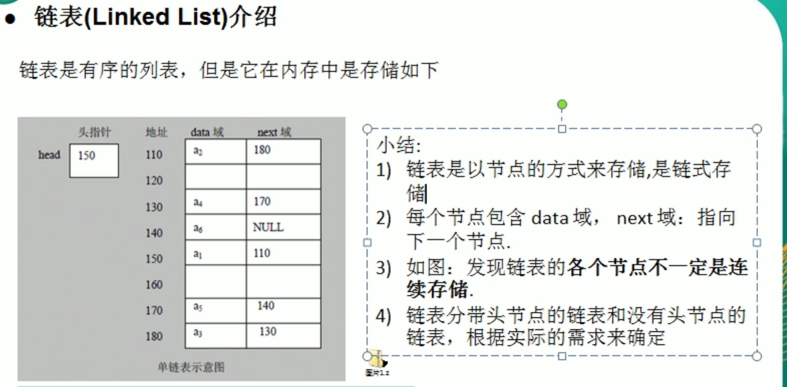

链表(Linked List)是有序的列表，


## 4.栈

### 1.介绍：

  1). 栈 stack

  2). 栈是一个**先入后出（FILO-First In Last ）**的有序列表。

  3). 栈(stack)是限制线性表中元素的插入和删除只能在线性表的同一端进行的一种特殊线性表。

  4). 允许插入和删除的一端，为变化的一端，称为栈顶(Top)，固定的一端，为栈底(Bottom)。


### 2.栈的应用场景
  1).子程序的调用：在跳往子程序前，会先将下个指令的地址存到堆栈中，直到子程序执行完后再将地址去除，已回到原来的程序中。

  2).处理递归调用：和子程序的调用类似，只是除了存储下一个指令的地址外，也将参数、区域变量等数据存入堆栈中。

  3).表达式的转换[中缀表达式转后缀表达式]与求值(实际解决)。

  4).二叉树的遍历。

  5).图形的深度优先(depth-first)搜索法。


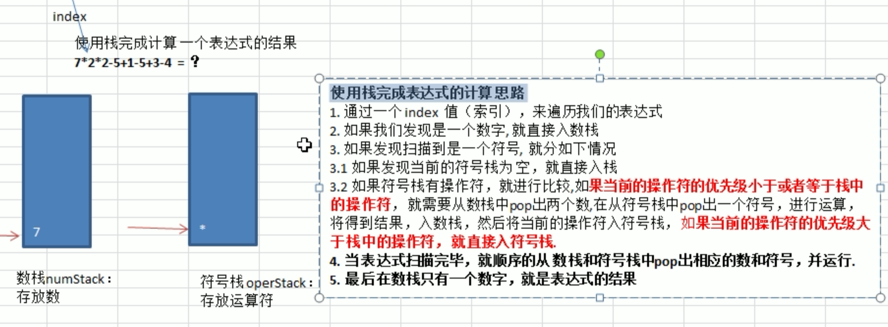


### 3.后缀表达式(逆波兰)

**中缀表达式转换为后缀表达式**

```txt
1.初始化两个栈：运算符栈s1和存储中间结果的栈s2
2.从左至右扫描中缀表达式
3.遇到操作数时，将其压入s2
4.遇到运算符时，比较其与s1栈顶运算符的优先级：
	a.如果s1为空，或栈顶运算符为左括号"(",则直接将此运算符入栈
	b.否则，若优先级比栈顶运算符的高，也将运算符压入s1
	c.否则，将s1栈顶的运算符弹出并压入到s2中，再次转到(4-a)与s1中新的栈顶运算符想比较
5.遇到括号时：
	a.如果是左括号"(",则直接压入s1
	b.如果是右括号")",则依次弹出s1栈顶的运算符，并压入s2,直到遇到左括号为止，此时将这一对括号丢弃
6.重复步骤2至5，直到表达式的最右边
7.将s1中剩余的运算符依次弹出并压入s2
8.依次弹出s2中的元素并输出，结果的逆序即为中缀表达式对应的后缀表达式
```


## 5.递归(recursion)

### 1.概念

​	简单的说:递归就是方法自己调用自己，每次调用时传入不同的变量，递归有助于编程者解决复杂的问题，同时可以让代码变得简洁。

### 2.递归应用场景

- 各种数学问题：如 8皇后问题，汉诺塔，阶乘问题，迷宫问题，球和篮子问题
- 各种算法也会使用到递归：如 快排，归并排序，二分查找，分治算法等。
- 将用栈解决的问题 ——> 递归代码比较简洁。

### 3.递归需要遵守的重要规则

1. 执行一个方法时，就创建一个新的受保护的独立空间(栈空间)
2. 方法的局部变量是独立的，不会互相影响
3. 如果方法中使用的是引用类型变量(比如数组)，就会共享该引用类型的数据。
4. 递归必须向退出递归的条件逼近，否则就是无限递归
5. 当一个方法执行完毕，或者遇到return，就会返回，遵守谁调用，就将结果返回给谁，同时当方法执行完毕或者返回时，该方法也就执行完毕。

## 6.排序算法

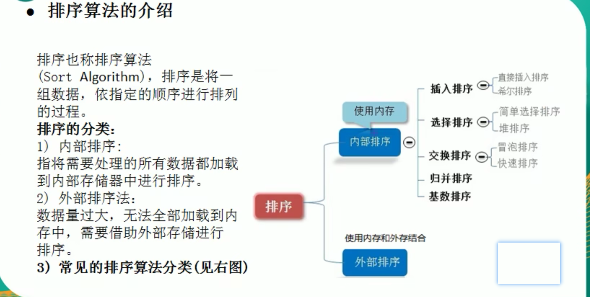


### 0.算法的时间复杂度

**时间频度**

> **时间频度：**一个算法花费的时间与算法中语句的执行次数成正比例，哪个算法中语句执行次数多，它花费时间就多。**一个算法中的语句执行次数称为语句频度或时间频度。** 记为：**T(n)** 。


**时间复杂度**

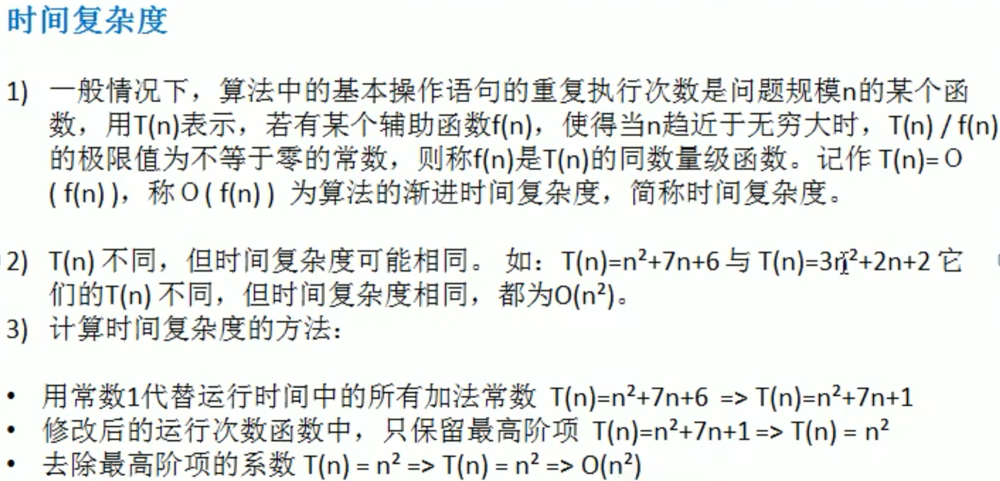


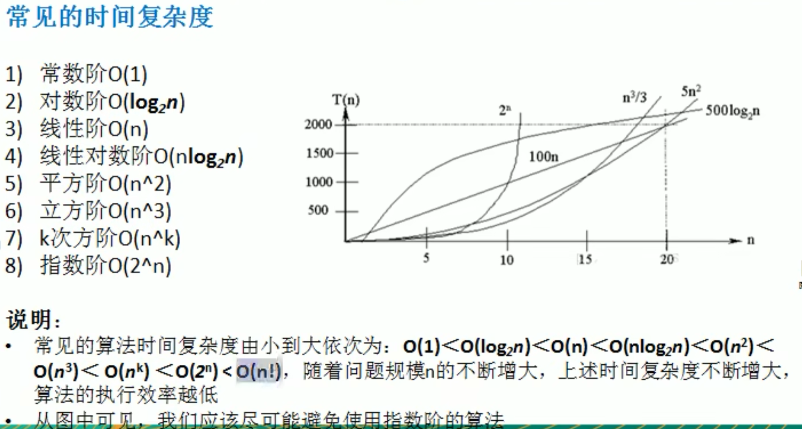


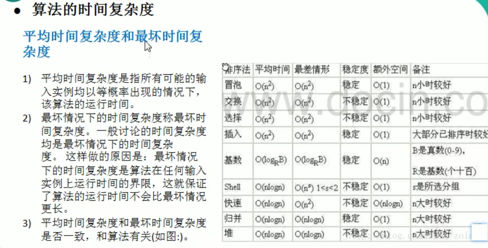


#### 空间复杂度

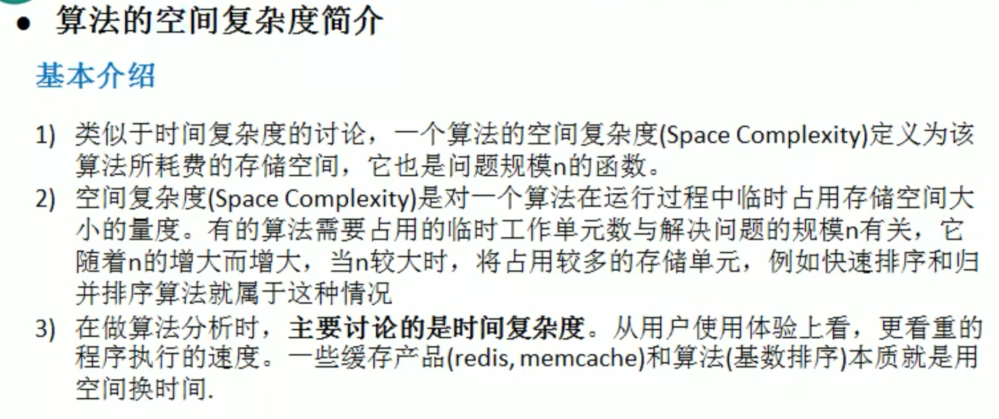


### 1.冒泡排序

>**冒泡排序(Bubble Sorting)** 的基本思想是：通过对待排序序列从前向后（从下标较小的元素开始），依次比较相邻元素的值，若发现逆序则交换，使值较大的元素逐渐从前移向后部，就像水底的气泡一样逐渐向上冒。
>
>因为排序的过程中，各元素不断接近自己的位置，如果一趟比较下来没有进行过交换，就说明序列有序，因此要在排序过程中设置一个标志flag来判断元素是否进行过交换。从而减少不必要的比较。

```java
public static void bubbleSort(int[] arr) {
        // 临时变量 用于存放交换数据
        int temp = 0;

        // 标识变量 标识是否发生过交换
        boolean flag = false;

        for (int i = 1; i < arr.length; i++) {
            for (int j = 0; j < arr.length - i; j++) {
                if (arr[j] > arr[j + 1]) {
                    flag = true;
                    temp = arr[j];
                    arr[j] = arr[j + 1];
                    arr[j + 1] = temp;
                }
            }
            if(!flag) {
                break;
            } else {
                flag = false;
            }
            // System.out.println("第"+ i + "次排序后数组");
            // System.out.println(Arrays.toString(arr));
        }
    }
```


### 2.选择排序

> **选择排序(selection sort)**也属于内部排序法，是从欲排序的数据中，直接按指定的规则选出某一元素，再依规定交换位置后达到排序的目的。

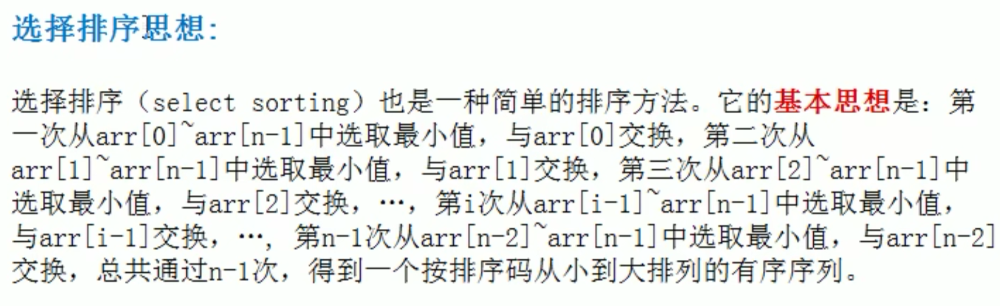


```java
public static void selectSort(int[] arr) {
        int minIndex;
        int minVal;
        for (int i = 0; i < arr.length - 1; i++) {
            minVal = arr[i];
            minIndex = i;
            for (int j = i + 1; j < arr.length; j++) {
                if (arr[j] < minVal) {
                    minVal = arr[j];
                    minIndex = j;
                }
            }
            if (minIndex != i) {
                arr[minIndex] = arr[i];
                arr[i] = minVal;	
            }
        }
    }
```


### 3.插入排序

> **插入排序(Insertion Sort)**属于内部排序法，是对于欲排序的元素以插入的方式找寻该元素的适当位置，以达到排序的目的。

```java
public static void insertSort(int[] arr) {

        for (int i = 0; i < arr.length - 1; i++) {
            // 插入点(正在比较的元素的index,会动态变化)
            int insertIndex = i;
            // 本轮待插入的元素值
            int insertVal = arr[i + 1];

            // 找插入位置
            while (insertIndex >= 0 && insertVal < arr[insertIndex]) {
                arr[insertIndex + 1] = arr[insertIndex];
                insertIndex--;
            }
            // 若有移动 在比较的元素后面一个位置插入
            if (insertIndex != i) {
                arr[++insertIndex] = insertVal;
            }
        }

    }
```


### 4.希尔排序

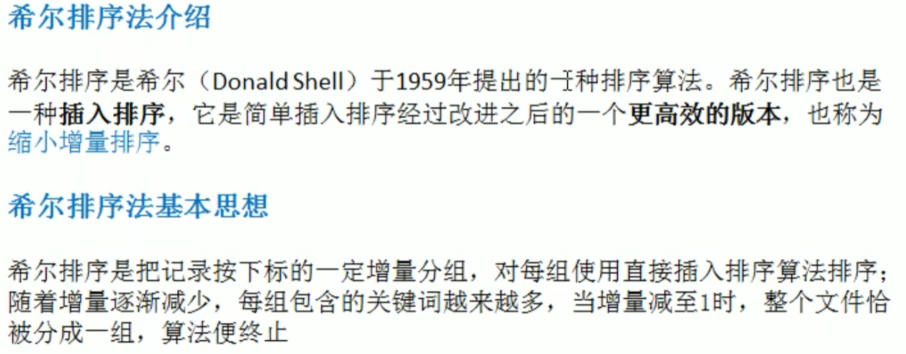

交换法 移动法

```java
// 交换式
    public static void shellSortExchange(int[] arr) {
        // 交换变量
        int temp;
        // 增量
        int gap = arr.length / 2;

        for (; gap >= 1; gap = gap / 2) {
            for (int i = gap; i < arr.length; i++) {
                for (int j = i - gap; j >= 0; j -= gap) {
                    if (arr[j] > arr[j + gap]) {
                        temp = arr[j];
                        arr[j] = arr[j + gap];
                        arr[j + gap] = temp;
                    }
                }
            }
            // System.out.println("增量 " + gap + " 排序后数组");
            // System.out.println(Arrays.toString(arr));

        }
    }


    // 移动式
    public static void shellSort(int[] arr) {

        // 增量
        int gap = arr.length / 2;

        for (; gap >= 1; gap = gap / 2) {
            for (int i = 0; i < arr.length - gap; i++) {
                // 插入点(正在比较的元素的index,会动态变化)
                int insertIndex = i;
                // 本轮待插入的元素值
                int insertVal = arr[i + gap];

                // 找插入位置
                while (insertIndex >= 0 && insertVal < arr[insertIndex]) {
                    // 后移gap位
                    arr[insertIndex + gap] = arr[insertIndex];
                    // 插入点前移
                    insertIndex = insertIndex - gap;
                }
                // 若有移动 在比较的元素后面gap个位置插入
                if (insertIndex < i) {
                    arr[insertIndex + gap] = insertVal;
                }

            }
            // System.out.println("增量 " + gap + " 排序后数组");
            // System.out.println(Arrays.toString(arr));

        }
    }
```


### **5.快速排序(que)**

**快速排序（Quick Sort）**是一种高效的排序算法，由C. A. R. Hoare在1960年提出。它的基本思想是：通过一趟排序将要排序的数据分割成独立的两部分，其中一部分的所有数据都比另一部分的所有数据都要小，然后再按此方法对这两部分数据分别进行快速排序，整个排序过程可以递归进行，以此达到整个数据变成有序序列。

**快速排序的基本步骤：**

1. **选择基准值（Pivot）**：从数列中挑出一个元素，称为“基准”（pivot），通常选择序列的第一个元素、最后一个元素或者中间元素。
2. **分区（Partitioning）**：重新排序数列，所有比基准值小的元素摆放在基准前面，所有比基准值大的元素摆在基准的后面（相同的数可以到任一边）。在这个分区退出之后，该基准就处于数列的中间位置。这个称为分区（partition）操作。
3. **递归（Recursion）**：递归地将小于基准值元素的子数列和大于基准值元素的子数列排序。

**中间元素**

```java
# 韩老师
public static void quickSort(int[] arr, int left, int right) {

        int l = left; //左下标
        int r = right;  //右下标
        int pivot = arr[(l + r) / 2];
        int temp;
        while (l < r) {
            // 在pivot的左边一直找，找到大于等于pivot的值，才退出
            while (arr[l] < pivot) {
                l += 1;
            }
            // 在pivot的右边一直找，找到小于等于pivot的值，才退出
            while (arr[r] > pivot) {
                r -= 1;
            }

            if (l >= r) {
                break;
            }

            // 交换
            temp = arr[l];
            arr[l] = arr[r];
            arr[r] = temp;
       

            if (arr[l] == pivot) {
                r -= 1;
            }

            if (arr[r] == pivot) {
                l += 1;
            }
        }

        
        if (l == r) {
            l += 1;
            r -= 1;
        }

        // 向左递归
        if (left < r) {
            quickSort(arr, left, r);
        }

        // 向右递归
        if (right > l) {
            quickSort(arr, l, right);
        }

    }
```


```java
# 豆包代码
public class QuickSort {

    // 交换数组中的两个元素
    public static void swap(int[] arr, int i, int j) {
        int temp = arr[i];
        arr[i] = arr[j];
        arr[j] = temp;
    }

    // 划分函数，以中间元素为基准
    public static int partition(int[] arr, int low, int high) {
        int mid = (low + high) / 2;
        int pivot = arr[mid];
        swap(arr, mid, high);

        int i = (low - 1);

        for (int j = low; j <= high - 1; j++) {
            if (arr[j] <= pivot) {
                i++;
                swap(arr, i, j);
            }
        }
        swap(arr, i + 1, high);
        return (i + 1);
    }

    // 快速排序函数
    public static void quickSort(int[] arr, int low, int high) {
        if (low < high) {
            int pi = partition(arr, low, high);

            quickSort(arr, low, pi - 1);
            quickSort(arr, pi + 1, high);
        }
    }
```


**最后一个元素**

```java
# 文心代码
public class QuickSort {  
  
    public static void quickSort(int[] arr, int low, int high) {  
        if (low < high) {  
            // pi是分区操作后基准值的最终位置  
            int pi = partition(arr, low, high);  
  
            // 递归排序基准值左边的子数组  
            quickSort(arr, low, pi - 1);  
  
            // 递归排序基准值右边的子数组  
            quickSort(arr, pi + 1, high);  
        }  
    }  
  
    // 分区操作，返回基准值的最终位置  
    private static int partition(int[] arr, int low, int high) {  
        // 选择最右边的元素作为基准值  
        int pivot = arr[high];  
        int i = (low - 1); // 较小元素的索引  
  
        for (int j = low; j < high; j++) {  
            // 如果当前元素小于或等于基准值  
            if (arr[j] <= pivot) {  
                i++;  
  
                // 交换arr[i]和arr[j]  
                int temp = arr[i];  
                arr[i] = arr[j];  
                arr[j] = temp;  
            }  
        }  
  
        // 将基准值交换到它的最终位置  
        int temp = arr[i + 1];  
        arr[i + 1] = arr[high];  
        arr[high] = temp;  
  
        return i + 1;  
    }  
}


```


### 6.归并排序

**归并排序（Merge Sort）**是一种高效的排序算法，采用分治法（Divide and Conquer）的一个非常典型的应用（分治法将问题**分(divide)**成一些小的问题然后递归求解，而**治(conquer)**的阶段则将分的阶段得到的各答案“修补”在一起，即分而治之）。

归并排序的基本思想是将一个数组分成两半，对每半部分递归地应用归并排序，然后将结果合并成一个有序数组。

**归并排序的步骤**

1. **分解**：将数组分解成两个较小的子数组，直到子数组的大小为1。
2. **递归进行排序并合并**：递归地对子数组进行排序，并将已排序的子数组合并成一个大的有序数组，直到合并为1个完整的数组。


```java
public static void mergeSort(int[] arr, int left, int right, int[] temp) {

        if (left < right) {
            int mid = (left + right) / 2;
            
            // 向左进行分解
            mergeSort(arr, left, mid, temp);
            
            // 向右进行分解
            mergeSort(arr, mid + 1, right, temp);
            
            // 合并
            merge(arr, left, mid, right, temp);
            // System.out.println("mid=" + mid + "时---" + Arrays.toString(temp));
        }
    }

    /**
     * 
     * @param arr   原始数组
     * @param left  左边有序序列初始索引
     * @param mid   中间索引
     * @param right 右边索引
     * @param right 右边索引
     * @param temp  中转数组
     */
    public static void merge(int[] arr, int left, int mid, int right, int[] temp) {

        int i = left; // 初始化i 左边有序序列初始索引
        int j = mid + 1; // 初始化j 右边有序序列初始索引
        int t = 0; // 指向temp[] 的当前索引

        // 1.先把左右两边(有序)的数据按规则填充到temp数组
        // 直到两边有一边处理完毕
        while (i <= mid && j <= right) {
            if (arr[i] <= arr[j]) {
                temp[t] = arr[i];
                i++;
            } else {
                temp[t] = arr[j];
                j++;
            }
            t++;
        }

        // 2.将剩余数据的一边的剩余数据依次全部填充到temp
        // 左边剩余
        while (i <= mid) {
            temp[t] = arr[i];
            t++;
            i++;
        }

        // 右边剩余
        while (j <= right) {
            temp[t] = arr[j];
            t++;
            j++;
        }

        // 3.将temp数组元素拷贝到arr
        // 并不是每一次都拷贝所有
        t = 0;
        int tempLeft = left;
        // System.out.printf("tempLeft=%d right=%d\n", tempLeft, right);
        while (tempLeft <= right) {
            arr[tempLeft] = temp[t];
            t++;
            tempLeft++;
        }

    }
```


### 7.基数排序

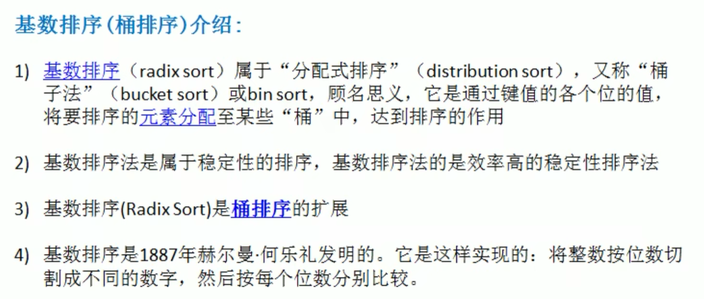

**基数排序（Radix Sort）**是一种非比较型整数排序算法，其原理是将整数按位数切割成不同的数字，然后按每个位数分别比较。具体来说，基数排序按照低位先排序，然后收集；再按照高位排序，然后再收集；以此类推，直到最高位。有时候也采用与之相反的顺序——先按高位排序，再按低位排序。

基数排序有两种方法：

1. **最高位优先（MSD, Most Significant Digit first）排序**：从最高位开始进行排序。
2. **最低位优先（LSD, Least Significant Digit first）排序**：从最低位开始进行排序。

基数排序的过程可以描述如下（以LSD为例）：

1. 找出数组中最大数，并找到最大数的位数；
2. 从最低位开始，按照位值（0到9）进行排序；
3. 对每一个位重复执行按位排序，直到达到最高位；
4. 串联每次排序后的结果，得到排序完成的数组。

基数排序的时间复杂度为O(nk)，其中n是排序元素的个数，k是数字的最大位数。其优点是稳定、速度快，尤其适合整数排序。缺点是空间复杂度较高，因为需要额外的存储空间来存储每一位的排序结果。

基数排序是桶排序的扩展，通过把要排序的元素分配到几个有序的桶里，再依次收集桶里的数据。基数排序在特定条件下（如电话号码、身份证号等）非常高效。


```java
public static void radixSort(int[] arr) {

        // 得到数组中最大的位数
        int max = arr[0];
        for (int item : arr) {
            if (item > max) {
                max = item;
            }
        }
        int maxLength = (max + "").length();

        // 定义一个二维数组，表示10各桶 每一个桶就是一个一维数组
        // 基数排序 是使用空间换时间的经典算法
        int[][] bucket = new int[10][arr.length];

        // 为了记录每个桶中实际存放了多少个数据,我们定义一个一维数组来记录各个桶的每次放入的数据个数
        int[] bucketElementCounts = new int[10];
        int digitOfElement;

        for (int i = 0, n = 1; i < maxLength; i++, n *= 10) {

            for (int j = 0; j < arr.length; j++) {
                digitOfElement = arr[j] / n % 10;
                // 放入对应的桶中
                bucket[digitOfElement][bucketElementCounts[digitOfElement]] = arr[j];
                bucketElementCounts[digitOfElement]++;
            }

            // 按照桶的顺序 将数据放入到原数组
            int index = 0;

            for (int k = 0; k < bucketElementCounts.length; k++) {
                if (bucketElementCounts[k] > 0) {
                    for (int l = 0; l < bucketElementCounts[k]; l++) {
                        // 去除元素 放入到arr
                        arr[index++] = bucket[k][l];
                    }
                }
                // 计数桶数据 重置
                bucketElementCounts[k] = 0;
            }
            // System.out.printf("第%d轮,处理arr = %s\n", i + 1, Arrays.toString(arr));
        }

    }
```


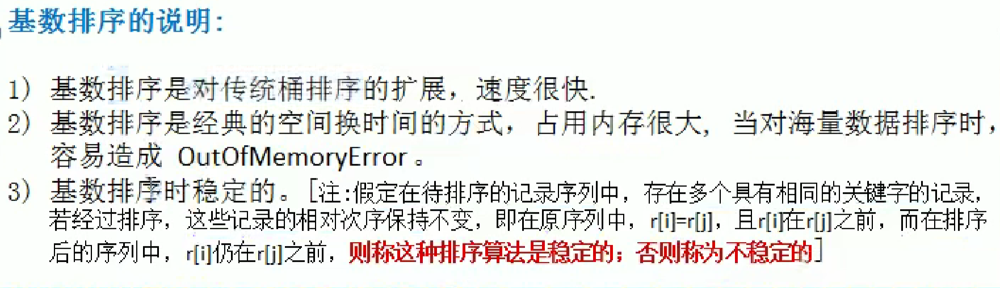

4） 如果有负数时，不要用基数排序。 如果要支持负数参考....


### 8.堆排序

[需要用到树的知识,在后面](#jump)                           <span id = "back"></span>

### 总结

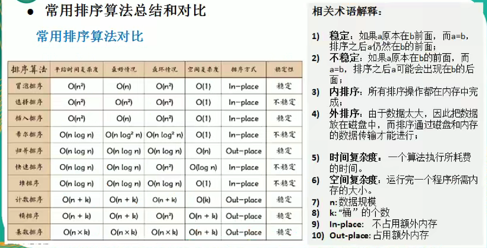


## 7.查找算法

### 0.线性查找

略

### 1.二分查找

```java
package _07search;

import java.util.ArrayList;
import java.util.List;
import java.util.stream.Collectors;

public class BinarySearch {

    public static void main(String[] args) {
        int[] arr = { 1, 8, 10, 89, 1000, 1000, 1000, 1000 };
        // int resIndex = binarySearch(arr, 0, arr.length - 1, 1000);
        // System.out.println("resIndex = " + resIndex);

        List<Integer> resIndexList = binarySearchAll(arr, 0, arr.length - 1, 1000);
        resIndexList = resIndexList.stream().sorted().collect(Collectors.toList());

        System.out.println("resIndexList" + resIndexList);
        // resIndexList.stream().sorted().forEach(System.out::println);

    }

    /**
     * 二分查找
     * 
     * @param arr     目标数组
     * @param left    左索引
     * @param right   右索引
     * @param findVal 要查找的值
     * @return 查找到的元素下标 -1未找到
     */
    public static int binarySearch(int[] arr, int left, int right, int findVal) {
        if (left > right) {
            return -1;
        }

        int mid = (left + right) / 2;

        if (findVal < arr[mid]) { // 向左递归
            return binarySearch(arr, left, mid - 1, findVal);
        } else if (findVal > arr[mid]) { // 向右递归
            return binarySearch(arr, mid + 1, right, findVal);
        } else {
            return mid;
        }

    }

    /**
     * 二分查找所有元素
     * 
     * @param arr     目标数组
     * @param left    左索引
     * @param right   右索引
     * @param findVal 要查找的值
     * @return 查找到的元素下标集合 集合为空则未找到
     */
    public static List<Integer> binarySearchAll(int[] arr, int left, int right, int findVal) {
        List<Integer> resList = new ArrayList();

        int temp;

        if (left > right) {
            return new ArrayList<Integer>();
        }

        int mid = (left + right) / 2;

        if (findVal < arr[mid]) { // 向左递归
            return binarySearchAll(arr, left, mid - 1, findVal);
        } else if (findVal > arr[mid]) { // 向右递归
            return binarySearchAll(arr, mid + 1, right, findVal);
        } else {
            // 找到后 先不返回
            resList.add(mid);
            temp = mid - 1;
            while (temp > 0 && arr[temp] == findVal) {
                resList.add(temp);
                temp--;

            }
            temp = mid + 1;
            while (temp < arr.length && arr[temp] == findVal) {
                resList.add(temp);
                temp++;

            }
            return resList;
        }

    }
}

```


### 2.插值查找(que)

插值查找（	）是一种在大量数据中查找某一特定元素的搜索算法。它特别适用于数据分布比较均匀的情况，比如数组中的元素是按照某种特定规律（如等差数列）排序的。插值查找通过计算元素在数组中的大致位置来减少搜索范围，从而提高查找效率。

**基本原理**

插值查找的基本思想是根据要查找的关键字与查找表中最大最小关键字比较后的估计，从查找表的适当位置开始，根据要查找元素的键值key与查找表中最大最小元素的键值比较后的插值作为索引，在数组中查找关键字key。如果表中没有关键字key，则查找不成功。

**插值查找算法步骤**

1. **确定查找范围**：首先，确定数组中的最小值和最大值，以及它们对应的索引位置（通常是最小值位于索引0，最大值位于索引n-1，n为数组长度）。

2. **计算插值**：根据要查找的关键字key、最小值min和最大值max，计算key在数组中的大致位置。插值公式通常为：

   [
   pos = \left\lfloor \frac{(key - min) * (n - 1)}{(max - min)} \right\rfloor
   ]

   这里，`\lfloor x \rfloor` 表示对x向下取整。

3. **进行查找**：在计算出的位置`pos`开始查找，如果`pos`位置的元素正好是`key`，则查找成功；否则，根据`key`与`pos`位置元素的比较结果（大于或小于），在`pos`的左侧或右侧继续查找，直到找到`key`或搜索范围为空。

**优缺点**

- **优点**：对于分布均匀的有序数组，插值查找的效率很高，接近二分查找。
- **缺点**：对于分布极不均匀的数据，插值查找可能会退化为线性查找，效率降低。

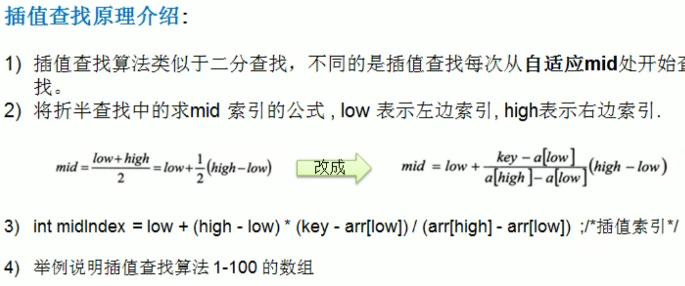

key 就是要查的的值findVal 

key-a[low]/a[high]-a[low]就是key位于数组中的百分比位置


```java

    public static int interpolation(int[] arr, int left, int right, int findVal) {

        if (left > right || findVal < arr[left] || findVal > arr[right]) {
            return -1;
        }

        int mid = left + (right - left) * (findVal - arr[left]) / (arr[right] - arr[left]);

        if (findVal < arr[mid]) {
            return interpolation(arr, left, mid - 1, findVal);
        } else if (findVal > arr[mid]) {
            return interpolation(arr, mid + 1, right, findVal);
        } else {
            return mid;
        }

    }
```


### 3.斐波那契查找 (que)


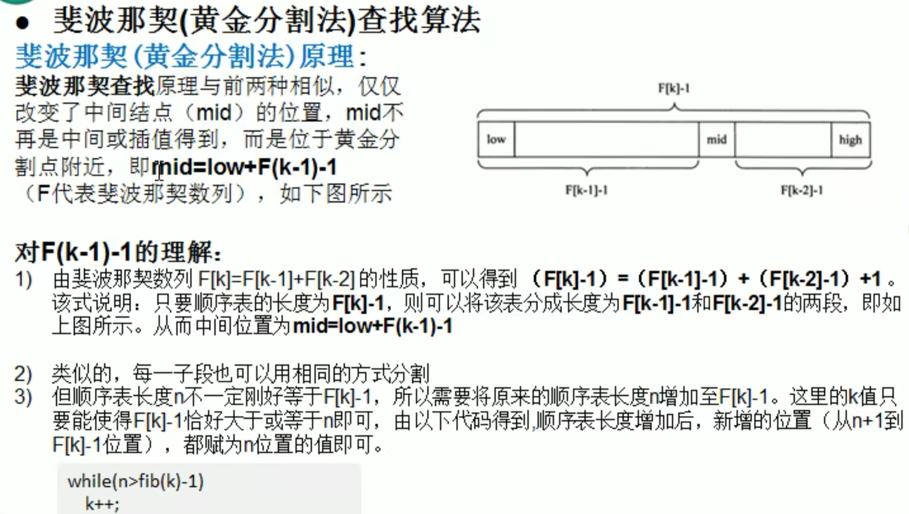


```java
package _07search;

import java.util.Arrays;

public class FibonacciSearch {

    private static int maxsize = 20;

    public static void main(String[] args) {
        int[] arr = { 1, 8, 10, 89, 1000};
        System.out.println(fbiSearch(arr, 1000));
    }

    // 因为后面 mid=low+F(k-1)-1, 需要使用fibonacci数列
    // 非递归的方法生成fibonacci数列
    public static int[] fib() {
        int[] f = new int[maxsize];
        f[0] = 0;
        f[1] = 1;

        for (int i = 2; i < f.length; i++) {
            f[i] = f[i - 1] + f[i - 2];
        }
        return f;
    }

    // 非递归方式编写fibonacci查找算法
    /**
     * 
     * @param arr 查找的数列
     * @param key 关键码(查找的值)
     * @return 返回对应下标 -1没找到
     */
    public static int fbiSearch(int[] arr, int key) {
        int low = 0;
        int high = arr.length - 1;
        int k = 0; // fibonacci 分割数值下标
        int mid = 0; // 存放mid值

        // 生成fibonacci数列
        int f[] = fib();
        // 获取fibonacci分割数值的下标
        while (arr.length > f[k] - 1) {
            k++;
        }


        // 将原查找表扩展为长度为f[k]的表（如果元素不足，则补充重复最后一个元素）
        int[] temp = Arrays.copyOf(arr, f[k]);
        for (int i = high + 1; i < temp.length; i++) {
            temp[i] = arr[high];
        }

        // 找到key
        while (low < high) {
            mid = low + f[k - 1] - 1;
            if (key < temp[mid]) { // 向左
                high = mid - 1;
                //
                k--;
            } else if (key > temp[mid]) { // 向右
                low = mid + 1;
                k -= 2;
            } else { // 找到了
                if (mid < arr.length) {
                    return mid;
                } else {
                    return arr.length - 1;
                }
            }
        }

        // 补充的代码 
        if (low == high && key == arr[low]) {
            return low;
        }
        return -1;
    }
}

```


## 8.哈希表


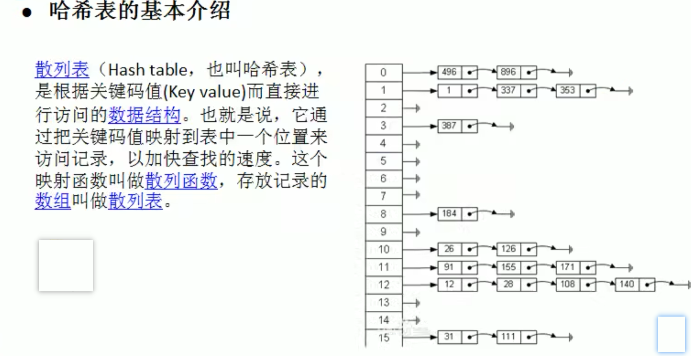

数组 + 链表

数组 + 二叉树


### 1.散列函数(Hash Function)

**散列函数（Hash Function**），也称为哈希函数，是计算机科学中一种重要的技术，它在数据结构、密码学等领域都有广泛的应用。以下是对散列函数的详细解析：

>
>
>### 一、定义与原理
>
>散列函数是一种将输入数据（也称为关键字或消息）映射到固定大小的散列值（也称为哈希值或指纹）的函数。这种映射过程通常通过一系列复杂的计算实现，旨在将任意长度的输入数据转换成固定长度的输出数据。散列函数的输出值域通常远小于输入值域，因此存在多个输入数据映射到同一个输出值的可能性，这种现象称为“哈希碰撞”。
>
>### 二、性质与要求
>
>散列函数应满足以下性质和要求：
>
>1. **确定性**：对于相同的输入，散列函数应产生相同的输出。
>2. **均匀分布**：散列函数应将输入数据均匀地分布到散列值的范围内，以减少碰撞的概率。
>3. **抗碰撞性**：对于任意不同的输入数据，生成的散列值应具有较大的差异，以减小碰撞的概率。
>4. **易于计算**：散列函数应具有高效的计算性能，以便在实际应用中能够快速生成散列值。
>5. **单向性**（在密码学中）：对于给定的散列值，应难以计算出对应的输入数据，以保护数据的机密性。
>
>### 三、常见算法
>
>散列函数的构造方法多种多样，常见的算法包括：
>
>1. **直接定址法**：取关键字或关键字的某个线性函数值为哈希地址。
>2. **除留余数法**：将输入数据除以一个质数，并取余数作为散列值。这是最简单也最常用的构造哈希函数的方法。
>3. **平方取中法**：对输入数据进行平方运算后取中间几位作为散列值。
>4. **折叠法**：将输入数据分割成若干段，然后将这些段相加得到散列值。
>5. **乘法散列法**：将输入数据乘以一个常数因子，并取乘积的小数部分作为散列值。
>
>### 四、应用领域
>
>散列函数在多个领域有重要应用，包括但不限于：
>
>1. **数据结构**：在散列表中，散列函数用于将输入数据映射到数组中的一个位置，以实现快速的数据查找和插入。
>2. **密码学**：哈希函数（一种特殊的散列函数）在密码学中有广泛应用，如密码存储、数字签名和密钥派生等。哈希函数通过对数据进行加密处理，保护数据的机密性和完整性。
>3. **数据校验**：在数据传输和存储过程中，可以使用散列函数对数据进行校验，以确保数据的完整性和一致性。
>4. **语音识别**：在某些语音识别应用中，散列函数用于将音频数据转换为固定的散列值，以便进行快速匹配和识别。
>
>### 五、总结
>
>散列函数是计算机科学中一种强大的工具，它通过复杂的计算过程将输入数据映射为固定长度的散列值。散列函数具有确定性、均匀分布、抗碰撞性等重要性质，并在数据结构、密码学、数据校验和语音识别等领域有广泛应用。随着计算机科学的发展，散列函数的算法和应用也将不断演进和完善。


## 9.树

**二叉树**

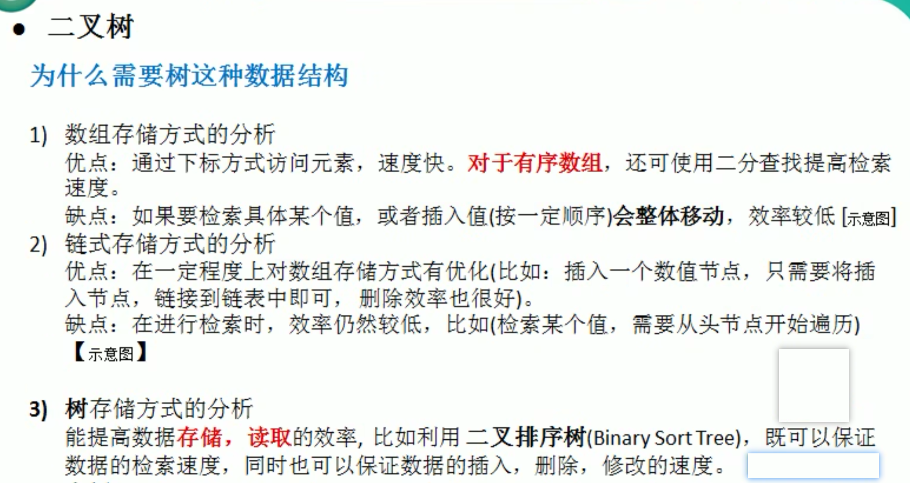


**完全二叉树（Complete Binary Tree**）是一种特殊的二叉树结构，它遵循以下规则：

1. **完全二叉树的定义**：若设二叉树的深度为h，除第h层外，其它各层 (1～h-1) 的结点数都达到最大个数，第h层所有的结点都连续集中在最左边，这就是完全二叉树。简单来说，就是除了最后一层外，每一层都被完全填满，并且所有节点都尽可能地向左对齐。

2. **特点**：
   - 叶子节点只可能出现在层序最大的两层。
   - 对于任意一节点，若其右子树的最大层数为k，则其左子树的最大层数为k或k+1。
   - 满二叉树（Full Binary Tree）是完全二叉树的一个特例，其中每一层都被完全填满。
   - 在完全二叉树中，若某个节点没有左孩子，则它一定没有右孩子，即该节点为叶子节点。
   - 同样的节点数，完全二叉树的深度最小。

3. **存储方式**：
   - 完全二叉树可以用数组（或称为顺序存储结构）来存储，这是因为完全二叉树的特性使得其节点可以按照层序遍历的顺序存储在一个数组中，且不需要额外的指针来指示左右子节点的位置。对于数组中任意一个位置为i的节点（假设数组**从0开始**索引），其左子节点的位置为2*i+1，右子节点的位置为2*i+2，父节点的位置为(i-1)/2（向下取整）。

4. **应用**：
   - 完全二叉树是堆（Heap）的一种常见实现方式，特别是二叉堆（Binary Heap），在优先队列、排序算法（如堆排序）中有广泛应用。
   - 在计算机科学中，完全二叉树常用于数据结构的优化，因为它们允许以数组的形式高效存储和访问，同时保持二叉树的特性。

总之，完全二叉树是一种特殊的二叉树结构，其结构紧凑，易于用数组实现，并在多种算法和数据结构中有着广泛的应用。


### 1.**顺序存储二叉树**


### 2.**线索化二叉树(que)**


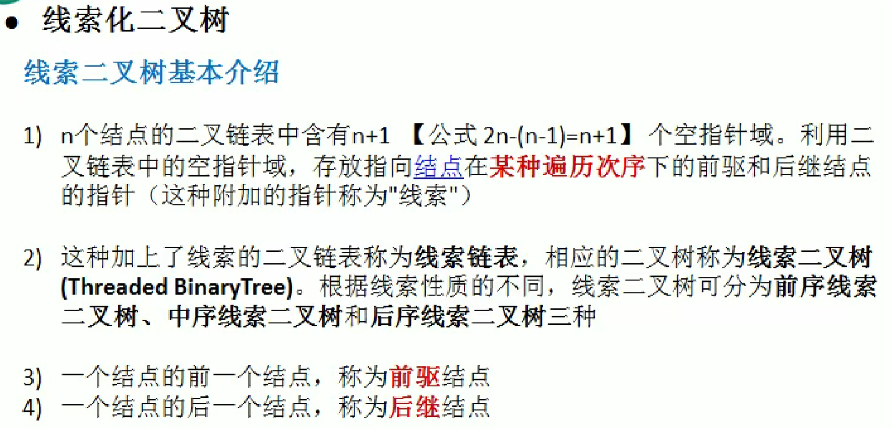


### 堆排序

**<span id = 'jump'>堆排序</span>**    [back](#back)

**基本介绍**

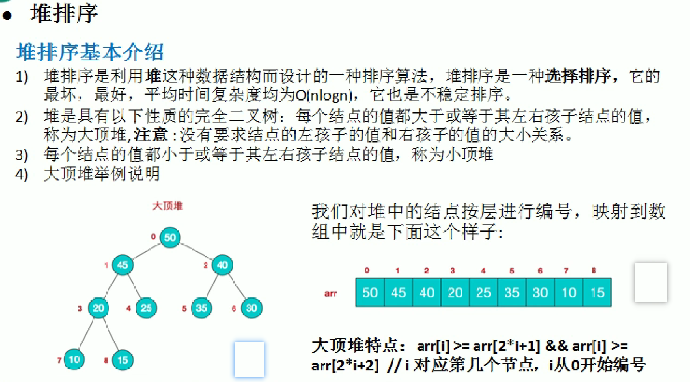


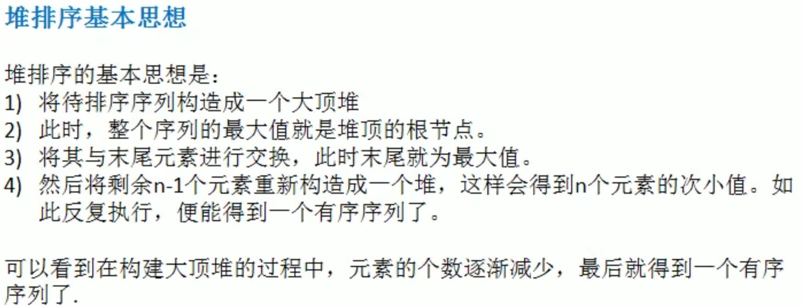

大顶堆  → 升序排序

小顶堆  → 降序排序

**堆排序（Heap Sort）**是一种基于比较的排序算法，它利用堆这种数据结构来设计。堆是一个近似完全二叉树的结构，并同时满足堆积的性质：即子节点的键值或索引总是小于（或者大于）它的父节点。

堆排序算法可以分为两个主要的过程：

1. **建立堆（Build Heap）**：将无序序列构造成一个堆，根据升序或降序需求选择大顶堆或小顶堆。
2. **堆排序（Heap Sort）**：将堆顶元素（最大或最小元素）与末尾元素进行交换，此时末尾就是最大值。然后将剩余n-1个元素重新构造成一个堆，这样会得到n个元素的次小值。如此反复执行，便能得到一个有序序列了。

实现思路

1. 建立堆

- **从最后一个非叶子节点开始，向堆顶调整**。
- 假设给定数组为`arr`，长度为`n`，则**最后一个非叶子节点的索引为`(n-2)/2`**（因为数组索引从0开始）。
- 从这个节点开始，向堆顶（索引0）遍历，对每个节点执行下沉（heapify）操作，以确保其子树满足堆的性质。

2. 堆排序

- **将堆顶元素（最大值）与堆尾元素交换**。
- 由于尾部的最大值已经就位，现在不需要再考虑它，故将堆的大小减1。
- 对新的堆顶元素执行下沉操作，重新调整堆。
- 重复上述步骤，直到堆的大小为1，此时数组已经有序。

**文心示例代码**

```java
public class HeapSort {  
  
    // 下沉操作，用于维护堆的性质  
    private static void heapify(int arr[], int n, int i) {  
        int largest = i; // 初始化最大为根  
        int l = 2 * i + 1; // 左 = 2*i + 1  
        int r = 2 * i + 2; // 右 = 2*i + 2  
  
        // 如果左子节点大于根  
        if (l < n && arr[l] > arr[largest]) {  
            largest = l;  
        }  
  
        // 如果右子节点是最大值  
        if (r < n && arr[r] > arr[largest]) {  
            largest = r;  
        }  
  
        // 如果最大值不是根  
        if (largest != i) {  
            int swap = arr[i];  
            arr[i] = arr[largest];  
            arr[largest] = swap;  
  
            // 递归地堆化受影响的子树  
            heapify(arr, n, largest);  
        }  
    }  
  
    // 堆排序函数  
    public static void heapSort(int arr[]) {  
        int n = arr.length;  
  
        // 构建初始堆  
        for (int i = n / 2 - 1; i >= 0; i--) {  
            heapify(arr, n, i);  
        }  
  
        // 一个个从堆顶取出元素  
        for (int i = n - 1; i > 0; i--) {  
            // 移动当前根到末尾  
            int temp = arr[0];  
            arr[0] = arr[i];  
            arr[i] = temp;  
  
            // 调用max heapify在减少的堆上  
            heapify(arr, i, 0);  
        }  
    }  
  
    // 测试堆排序  
    public static void main(String args[]) {  
        int arr[] = {12, 11, 13, 5, 6, 7};  
        int n = arr.length;  
  
        heapSort(arr);  
  
        System.out.println("Sorted array is");  
        for (int i = 0; i < n; ++i)  
            System.out.print(arr[i] + " ");  
        System.out.println();  
    }  
}
```


**韩老师代码实现**

```java
public class HeapSort {
    public static void main(String[] args) {
        int arr[] = { 4, 6, 8, 5, 9 , -233, 777, 666};
        bigHeapSort(arr);
        System.out.println("final___ " + Arrays.toString(arr));
    }

    // 编写一个堆排序的方法
    public static void bigHeapSort(int[] arr) {
        System.out.println("堆排序");

        // 构建初始堆
        // 从下到上
        for (int i = arr.length / 2 - 1; i >= 0; i--) {
            adjustBigHeap(arr, i, arr.length);
        }

        // 一个个从堆顶取出元素
        int temp;
        for (int i = arr.length - 1; i > 0; i--) {
            temp = arr[i];
            arr[i] = arr[0];
            arr[0] = temp;

            // 处理 长度减一后的堆
            // 思考一下：为什么这里直接是最上面下沉
            // System.out.println(arr.length - i + 1 + "change " + Arrays.toString(arr));
            adjustBigHeap(arr, 0, i);
            // System.out.println(arr.length - i + 1 + "adjust " + Arrays.toString(arr));

        }

    }

    /**
     * 
     * @param arr    待调整数组
     * @param i      非叶子节点在数组中的索引
     * @param length 对多少个元素进行调整 不是数组的长度 
     */
    // 将一个数组(二叉树)，调整成一个大顶堆 这是一个下沉操作
    public static void adjustBigHeap(int[] arr, int i, int length) {
        // 下沉(heapify)操作 即：堆顶(一开始是根节点)不是最大值就就 下沉 与最大的子节点交换
        // 每下沉一层后 交换的子节点作为新的堆顶 继续下沉操作
        // 下沉的节点索引为 i 会随着下沉变动 即 i = k
        // 下沉的节点值为 temp 即最开始的根节点值
        int temp = arr[i];
        for (int k = i * 2 + 1; k < length; k = k * 2 + 1) {
            if (k + 1 < length && arr[k] < arr[k + 1]) {
                k++;
            }
            if (arr[k] > temp) {
                arr[i] = arr[k];
                i = k;
            } else {
                break;
            }
        }
        arr[i] = temp;
    }
}

```


### 3.赫夫曼huffman

#### Ⅰ.赫夫曼树

**基本介绍**

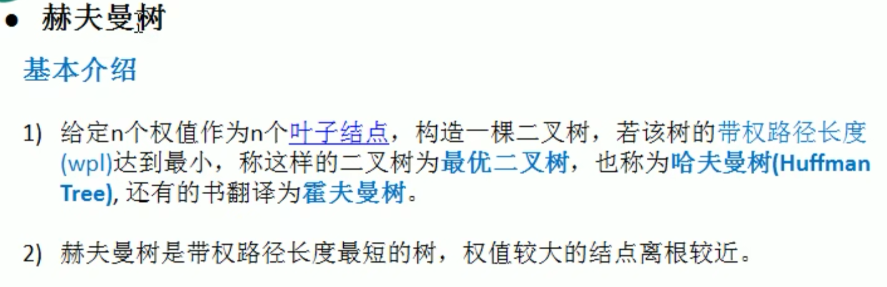

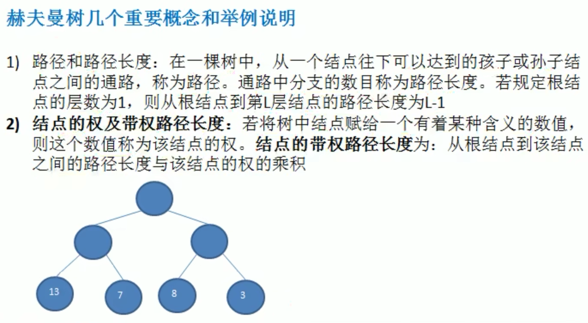

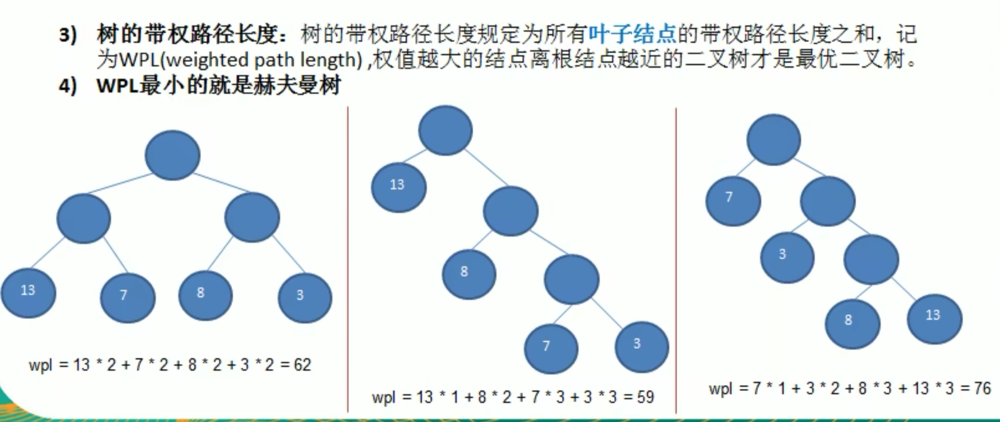


**创建思路**

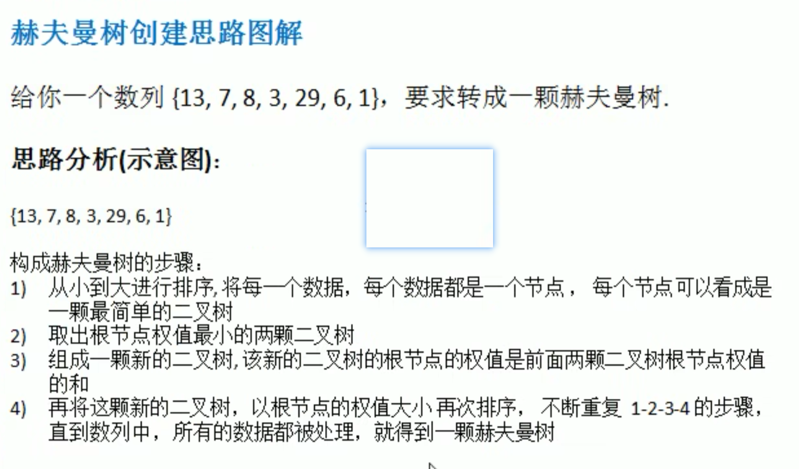

<div align=left>
    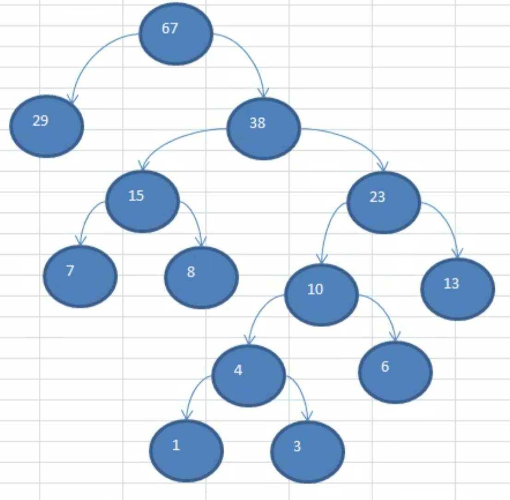
</div>


**实现代码**

```java
public class HuffmanTree {
    public static void main(String[] args) {
        int arr[] = { 13, 7, 8, 3, 29, 6, 1 };
        Node root = createHuffmanTree(arr);

        // 测试
        preOrder(root);
    }

    // 生成赫夫曼树
    public static Node createHuffmanTree(int[] arr) {
        // 1.构建node集合 并排序
        List<Node> nodes = Arrays.stream(arr) // 将数组转换为流
                .boxed() // 将流中的int转换为Integer
                .sorted() // 排序
                .map(item -> new Node(item)) // 转换成node对象
                .collect(Collectors.toList()); // 收集到list
        // nodes.forEach(System.out::println);
        // System.out.println(nodes);

        while (nodes.size() > 1) {
            // 2.去除根节点权值最小的两颗二叉树,构建成新二叉树
            Node leftNode = nodes.get(0);
            Node rightNode = nodes.get(1);
            Node parent = new Node(leftNode.value + rightNode.value);
            parent.left = leftNode;
            parent.right = rightNode;

            // 删除处理过的二叉树
            nodes.remove(leftNode);
            nodes.remove(rightNode);
            // 将parent 加入到nodes
            nodes.add(parent);

            // 排序 四种方法
            // Collections.sort(nodes);
            // nodes.sort(Node::compareTo);
            // nodes =
            // nodes.stream().sorted(Comparator.comparing(Node::getValue).reversed()).collect(Collectors.toList());
            nodes = nodes.stream().sorted(new Comparator<Node>() {
                public int compare(Node n1, Node n2) {
                    return n1.getValue() - n2.getValue();
                }
            }).collect(Collectors.toList());
            // System.out.println(nodes + "-----");

        }
        return nodes.get(0);
    }

    //
    public static void preOrder(Node root) {
        if (root != null) {
            root.preOrder();
        } else {
            System.out.println("空树");
        }
    }

}

// 结点类
public class Node implements Comparable<Node> {
    int value; // 节点权值
    Node left; // 指向左子节点
    Node right; // 指向右子节点

    public Node(int value) {
        this.value = value;
    }

    // 前序遍历
    public void preOrder() {
        System.out.println(this);

        if (this.left != null) {
            this.left.preOrder();     
        }
        if (this.right != null) {
            this.right.preOrder();
        }
    }

    @Override
    public String toString() {
        return "Node [value=" + value + "]";
    }

    @Override
    public int compareTo(Node o) {
        // 从小到大
        return this.value - o.value;
    }

    public int getValue() {
        return value;
    }
    
}

```


#### Ⅱ.赫夫曼编码

**简介**

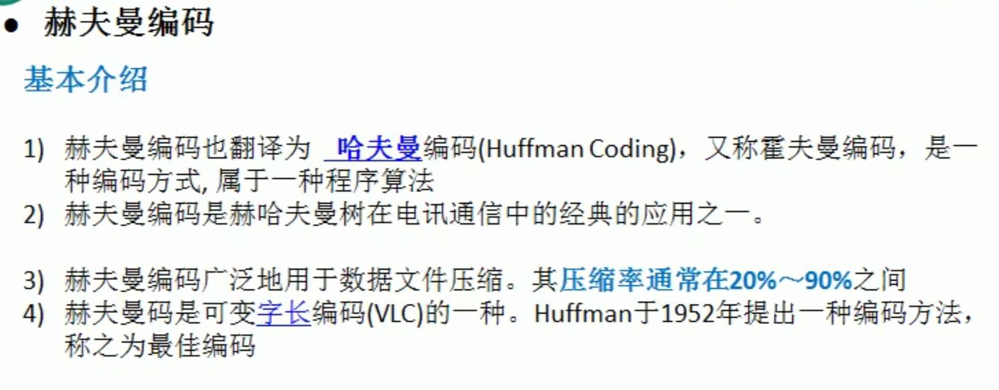


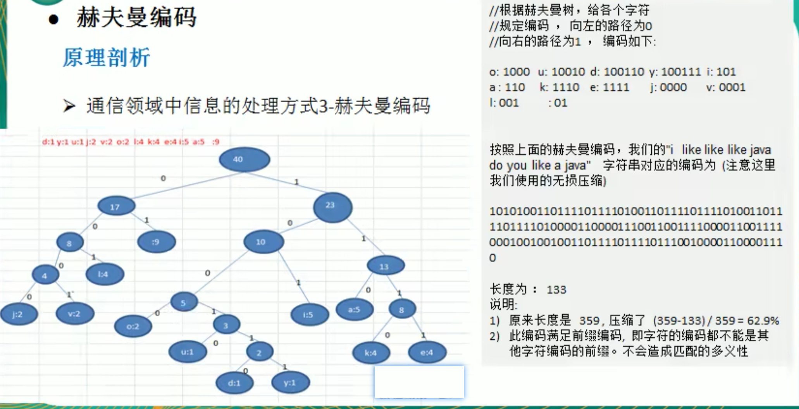


##### 压缩(编码)

**Node 节点类**

```java
package _11huffmancode;

public class Node implements Comparable<Node>{

    // 存放数据本身 字母对应的ASCII码值 'a' = 97 ...
    Byte data;
    // 权值 字符出现的次数
    int weight;
    
    Node left;
    Node right;

    public Node(Byte data, int weight) {
        this.data = data;
        this.weight = weight;
    }

    // 前序遍历
    public void preOrder () {
        System.out.println(this);
        if (this.left != null) {
            this.left.preOrder();
        }

        if (this.right != null) {
            this.right.preOrder();
        }
    }

    @Override
    public int compareTo(Node o) {
        // 顺序排序
        return this.weight - o.weight;
    }

    @Override
    public String toString() {
        return "Node [data=" + data + ", weight=" + weight + "]";
    }

    
}

```


**生成赫夫曼编码表的方法**


```java
static Map<Byte, String> huffmanCodes = new HashMap<>();
 

    // 生成赫夫曼树对应的赫夫曼编码
    // 1.将赫夫曼编码存放在Map<Byte, String> 形式
    // 按前序遍历树的路径 向左为0 向右为1
    // 32->01 97->100 100->11000
    // 2.生成赫夫曼编码表示，用StringBuilder 拼接路径

    // 调用方便重载
    private static Map<Byte, String> getCodes(Node huffmanTreeRoot) {
        if (huffmanTreeRoot == null) {
            return null;
        } 
        getCodes(huffmanTreeRoot, "", new StringBuilder());
        return huffmanCodes;
    }

    /**
     * 
     * 由传入的node节点获取所有对应叶子节点的赫夫曼编码,放入到map中
     *  
     * @param node 
     * @param code 路径 向左为0 向右为1
     * @param stringBuilder 
     */
    private static void getCodes(Node node, String code, StringBuilder stringBuilder) {
        if (node != null) {
            StringBuilder concateCode = new StringBuilder(stringBuilder);
            concateCode.append(code);
            if (node.data == null) { // 说明是非叶子节点
                // 向左
                getCodes(node.left, "0", concateCode);
                // 向右
                getCodes(node.right, "1", concateCode);
            } else {
                // 是叶子节点 将对应的赫夫曼编码放入map
                huffmanCodes.put(node.data, concateCode.toString());
            }
        }
    }   

    // 前序遍历
    private static void preOrder(Node root) {
        if (root == null) {
            System.out.println("赫夫曼树为空");
        } else {
            root.preOrder();
        }
    }

    private static List<Node> getNodes(byte[] bytes) {
        List<Node> nodes = new ArrayList<>();
        // 遍历bytes, 统计 每一个byte出现的次数->map[key,value]
        Map<Byte, Integer> counts = new HashMap<>();
        for (byte b : bytes) {
            Integer count = counts.get(b);
            if (count != null) {
                counts.put(b, ++count);
            } else {
                counts.put(b, 1);
            }
        }

        // 把每个键值对转成node对象 加入到nodes集合
        // 方法一
        // for (Entry<Byte,Integer> entrySet : counts.entrySet()) {
        // nodes.add(new Node(entrySet.getKey(), entrySet.getValue()));
        // }
        // 方法二
        counts.forEach((b, count) -> nodes.add(new Node(b, count)));

        return nodes;
    }

	// 生成赫夫曼树
    private static Node createHuffmanTree(List<Node> nodes) {
        while (nodes.size() > 1) {
            // 1.排序 从小到大
            Collections.sort(nodes);

            // 2.去除根节点权值最小的两颗二叉树 构建成新二叉树
            Node leftNode = nodes.get(0);
            Node rightNode = nodes.get(1);
            Node parent = new Node(null, leftNode.weight + rightNode.weight);
            // 挂到parent
            parent.left = leftNode;
            parent.right = rightNode;
            // 从nodes集合 移除处理过的二叉树
            nodes.remove(leftNode);
            nodes.remove(rightNode);
            // 将新生成的树加入到nodes集合
            nodes.add(parent);
        }
        // 集合里面最后的一个节点就是huffman树的根节点
        return nodes.get(0);
    }
```


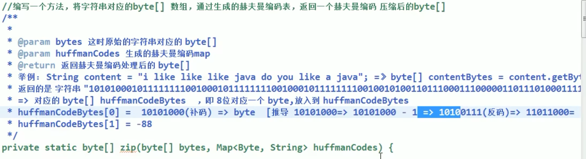

**二进制 原码 反码 补码** 

>
>在计算机科学中，二进制数的原码、反码和补码是表示数值的三种重要方式，特别是在处理有符号整数时。以下是对这三种表示方法的详细解释：
>
>### 一、原码（True Form）
>
>**定义**：
>原码是一种计算机中对数字的二进制定点表示方法。它在数值前面增加了一位符号位（即最高位为符号位），正数该位为0，负数该位为1（0有两种表示：+0和-0，但通常计算机中只处理+0）。其余位表示数值的大小。
>
>**特点**：
>- 简单直观，便于输入输出。
>- 但不能直接参与运算，否则可能出错，因为符号位不能直接参与数值运算。
>
>**示例**：
>- 8位二进制表示中，+11的原码为00001011，-11的原码为10001011。
>
>### 二、反码（One's Complement）
>
>**定义**：
>反码是二进制数的一种表示方式，其中正数的反码与原码相同，而负数的反码是对原码（除了符号位）按位取反得到的。
>
>**特点**：
>- 正数的反码与原码相同。
>- 负数的反码是将原码（除符号位外）的0变为1，1变为0。
>
>**示例**：
>- 8位二进制表示中，+11的反码仍为00001011，-11的原码为10001011，其反码为11110100（符号位不变，其余位取反）。
>
>### 三、补码（Two's Complement）
>
>**定义**：
>补码是计算机中用于表示有符号整数的一种编码方式。正数的补码与原码相同，**负数的补码是对原码（除了符号位）按位取反后加1得到的。**
>
>​                 **所以反过来如上图所示  负数的补码 - 1 = 反码     反码取反（除了符号位）= 原码**
>
>**特点**：
>
>- 补码的设计主要是为了简化计算机中的减法运算，使其可以转化为加法运算。
>- 补码可以无歧义地表示所有的有符号整数，包括-0（在补码中，-0和+0的表示是相同的）。
>
>**示例**：
>
>- 8位二进制表示中，+11的补码仍为00001011，-11的原码为10001011，其反码为11110100，补码为11110101（反码加1）。
>
>### 总结
>
>在计算机中，原码、反码和补码是表示有符号整数的三种重要方式。原码简单直观，但不适合直接参与运算；反码是对原码的一种改进，但仍存在一些问题；补码则是最常用的表示方式，它解决了原码和反码存在的问题，使得计算机中的加减乘除运算变得更加简单和高效。
>
>以上信息基于计算机科学的基本原理和广泛接受的编码方式，确保了回答的准确性和权威性。


```java
// 将字符串对应的byte[] 数组，通过生成的赫夫曼编码表
    // 生成一个赫夫曼码压缩后的byte[] 其详细见图

    /**
     * 
     * @param bytes
     * @param huffmanCodes
     * @return 其详细见图
     * 
     */
    private static byte[] zip(byte[] bytes, Map<Byte, String> huffmanCodes) {

        StringBuilder stringBuilder = new StringBuilder();
        for (byte b : bytes) {
            stringBuilder.append(huffmanCodes.get(b));
        }
        System.out.println("原始----" + stringBuilder.toString());

        // 将10101000101111111100.... 转成byte[] 数组
        int len = (stringBuilder.length() + 7) / 8;
        byte[] zipBytes = new byte[len];
        String strByte;
        int index = 0;
        for (int i = 0; i < stringBuilder.length(); i += 8) {
            if (i + 8 > stringBuilder.length()) {
                strByte = stringBuilder.substring(i);
            } else {
                strByte = stringBuilder.substring(i, i + 8);
            }
            // 这里返回的是原码
            zipBytes[index] = (byte) Integer.parseInt(strByte, 2);
            index++;

        }
        return zipBytes;
    }
```


##### 解压(解码)

**按位或（Bitwise OR）和按位与（Bitwise AND）**

>
>
>在计算机科学中，按位或（Bitwise OR）和按位与（Bitwise AND）是两种基本的位运算操作，它们作用于整数（或更一般地，任何固定长度的二进制数）的每一位上。这些操作在底层数据处理、图形处理、加密算法以及许多其他领域中都非常重要。
>
>### 按位或（Bitwise OR）
>
>按位或操作符通常用符号 `|` 表示。当对两个二进制数进行按位或操作时，如果两个相应的位中至少有一个为1，则结果的该位为1；否则，结果的该位为0。
>
>**示例**：
>
>```
>  A: 1010 (十进制中的 10)
>  B: 0110 (十进制中的 6)
>--------
>A|B: 1110 (十进制中的 14)
>```
>
>在这个例子中，每一位都进行了或操作：
>- 第1位（从右向左数，最低位）：0 OR 0 = 0
>- 第2位：1 OR 1 = 1
>- 第3位：0 OR 1 = 1
>- 第4位：1 OR 0 = 1
>
>### 按位与（Bitwise AND）
>
>按位与操作符通常用符号 `&` 表示。当对两个二进制数进行按位与操作时，如果两个相应的位都为1，则结果的该位为1；否则，结果的该位为0。
>
>**示例**：
>
>```
>  A: 1010 (十进制中的 10)
>  B: 0110 (十进制中的 6)
>--------
>A&B: 0010 (十进制中的 2)
>```
>
>在这个例子中，每一位都进行了与操作：
>- 第1位：0 AND 0 = 0
>- 第2位：1 AND 1 = 1
>- 第3位：0 AND 1 = 0
>- 第4位：1 AND 0 = 0
>
>### 应用场景
>
>- **权限管理**：在许多系统中，权限被表示为一系列的标志位（flags），通过按位或和按位与操作可以方便地添加或检查权限。
>- **图形处理**：在图形处理中，颜色通常表示为RGB值（红、绿、蓝），每个颜色通道的值可以通过按位操作来混合或修改。
>- **加密解密**：在加密算法中，经常需要对数据进行位级别的操作以实现加密或解密。
>- **数据掩码**：在数据处理中，可以使用特定的掩码（mask）来选择性地修改数据的某些位。
>
>总之，按位或和按位与是编程中非常重要的操作，它们提供了对二进制数据直接和灵活的操作能力。


```java
// 解码
/**
     * 
     * @param huffmanCodes 哈夫曼编码表
     * @param huffmanBytes 哈夫曼编码后的字节数组
     * @return 原来对应的字符串数组
     */
private static byte[] decode(Map<Byte, String> huffmanCodes, byte[] huffmanBytes) {

    // 1.得到huffmanBytes 对应的二进制字符 形式101010001....
    StringBuilder stringBuilder = new StringBuilder();
    // 将byte数组转成二进制字符
    for (int i = 0; i < huffmanBytes.length - 1; i++) {
        stringBuilder.append(byteToString(huffmanBytes[i]));
    }
    // 最后一个字节不需要补位
    stringBuilder.append(Integer.toBinaryString(huffmanBytes[huffmanBytes.length - 1]));
    System.out.println("反转----" + stringBuilder.toString());

    // 2.把字符串按指定的哈夫曼编码进行解码
    // 2.1 得到反向哈夫曼编码表
    // 三种方法
    // 方法一和二
    // Map<String, Byte> reverseHuffmanCodes = new HashMap<>();
    // // for (Entry<Byte, String> entry : huffmanCodes.entrySet()) {
    // // reverseHuffmanCodes.put(entry.getValue(), entry.getKey());
    // // }
    // huffmanCodes.entrySet().forEach(t -> reverseHuffmanCodes.put(t.getValue(),
    //         t.getKey()));
    // System.out.println("reverse--" + reverseHuffmanCodes);

    // 方法三
    Map<String, Byte> reverseHuffmanCodes = huffmanCodes.entrySet().stream()
        .collect(Collectors.toMap(Entry::getValue, Entry::getKey));
    System.out.println("reverse--" + reverseHuffmanCodes);

    // 2.2 开始解码
    // 存放byte
    List<Byte> list = new ArrayList<>();
    int subPoint = 0;
    Byte b;
    String substring = "";
    // 扫描 双指针窗口 subpoint 左  i 右
    for (int i = 1; i <= stringBuilder.length(); i++) {
        substring = stringBuilder.substring(subPoint, i);
        if ((b = reverseHuffmanCodes.get(substring)) != null) {
            list.add(b);
            subPoint = i;        
        }
    }
    System.out.println(list);
    byte[] decodeBytes = new byte[list.size()];
    for (int i = 0; i < list.size(); i++) {
        decodeBytes[i] = list.get(i);
    }
    return decodeBytes;
}

/**
     * 将一个byte 转换成二进制字符串
     * 原码 -> 补码
     * 
     * @param b
     * @return
     */
private static String byteToString(byte b) {

    int temp = b;
    // 如果是正数还需要补位
    // 按位或 1 0000 0000 | 0000 0001 => 1 0000 0001
    // 达到补高位的目的
    temp |= 256;

    // 这里返回的是temp 对应二进制补码
    String str = Integer.toBinaryString(temp);

    return str.substring(str.length() - 8);

}
```


##### 文件压缩解压缩

```java
// 文件 压缩
    /**
     * 
     * @param srcFile 源文件路径
     * @param dstFile 压缩后文件路径
     */
    public static void zipFile(String srcFile, String dstFile) {
        // 创建输入输出流
        FileInputStream is = null;
        FileOutputStream os = null;
        ObjectOutputStream oos = null;
        try {
            is = new FileInputStream(srcFile);
            byte[] bytes = new byte[is.available()];
            // 读取文件
            is.read(bytes);
            // 压缩源文件
            byte[] huffmanBytes = huffmanZip(bytes);

            // 创建输出流，存放压缩文件
            os = new FileOutputStream(dstFile);
            // 创建一个和文件输出流关联的ObjectOutputStream
            oos = new ObjectOutputStream(os);
            // 这里以对象流的方式写入
            // 目的是为了解压时恢复源文件使用

            // 写入压缩文件字节数组
            oos.writeObject(huffmanBytes);
            // 写入赫夫曼编码表
            oos.writeObject(huffmanCodes);
            System.out.println("压缩文件成功！！！");
        } catch (Exception e) {
            e.printStackTrace();
        } finally {
            try {
                is.close();
                oos.close();
                os.close();
            } catch (IOException e) {
                e.printStackTrace();
            }
        }
    }

// 文件解压
    /**
     * 
     * @param zipFile 准备解压的文件
     * @param dstFile 解压文件路径
     */
    public static void unZipFile(String zipFile, String unZipFile) {

        // 定义输入流
        InputStream is = null;
        ObjectInputStream ois = null;
        // 定义输出流
        FileOutputStream os = null;
        try {
            // 读取 解压文件
            is = new FileInputStream(zipFile);
            ois = new ObjectInputStream(is);
            byte[] huffmanBytes = (byte[])ois.readObject();
            // 读取哈夫曼编码表
            huffmanCodes = (Map<Byte, String>)ois.readObject();

            byte[] decodeBytes = decode(huffmanCodes, huffmanBytes);

            // 将解压后文件字节流数组 写入到目标文件
            os = new FileOutputStream(unZipFile);
            os.write(decodeBytes);
            System.out.println("解压成功");
        } catch (Exception e) {
            e.printStackTrace();
        } finally {
            try {
                os.close();
                ois.close();
                is.close();
            } catch (IOException e) {
                e.printStackTrace();
            }
        }
    }
```


## 12.二叉排序树

<div align=left>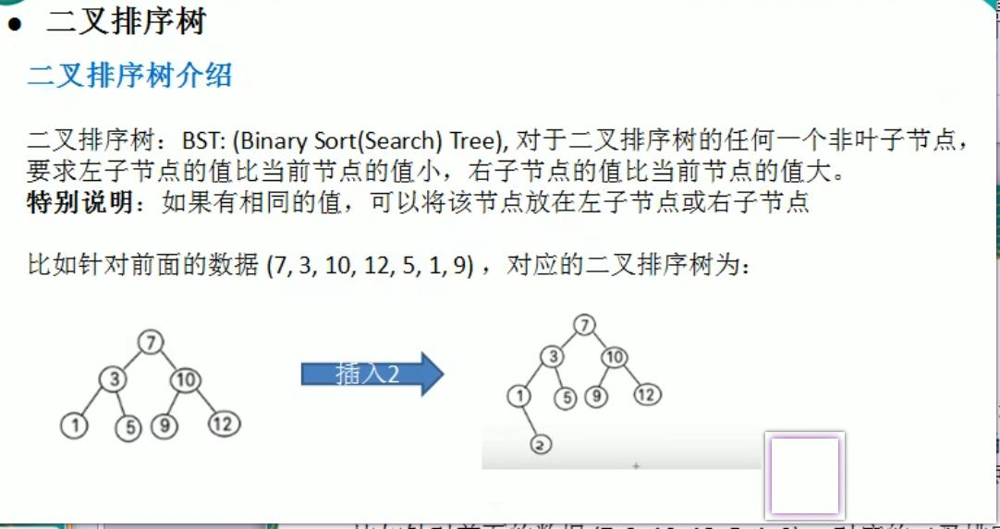</div>


**二叉排序树的删除**

三种情况

*1.删除叶子节点*

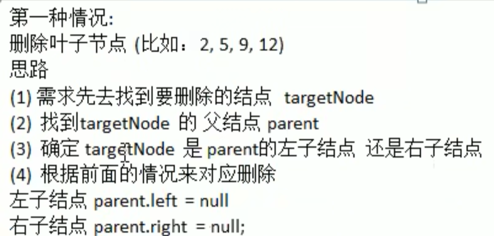

*2.删除只有一棵树的节点*

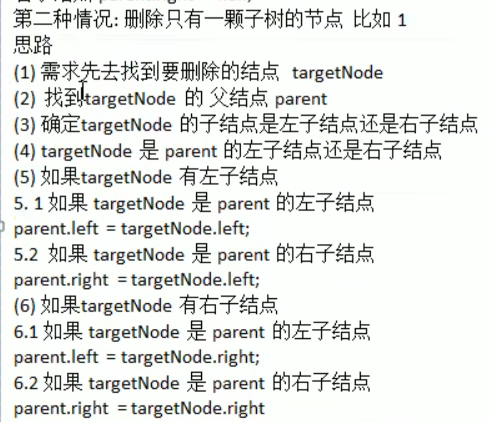

*3.删除有两棵树的节点*

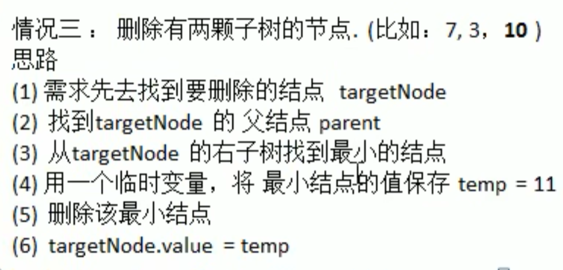

BinarySortTree.class

```java
package _12binarysorttree;

// 二叉排序树
public class BinarySortTree {

    private Node root;

    // 删除节点
    public void delNode(int value) {
        if (root == null) {
            System.out.println("空树");
            return;
        }
        if (root.value == value) {
            // 属于情况3的特殊   
            int tempVal = root.delMinRightNode();
            root.value = tempVal;
            return;
        }

        Node targetNode = root.searchDelNode(value);
        if (targetNode == null) {
            System.out.println("该节点不存在");
            return;
        }
        Node parentNode = root.searchDelParentNode(targetNode);

        // 3.1 删除叶子节点
        if (targetNode.left == null && targetNode.right == null) {
            // 判断要删除的节点时左子节点 还是右子节点
            if (parentNode.left != null && parentNode.left == targetNode) {
                parentNode.left = null;
            } else if (parentNode.right != null && parentNode.right == targetNode) {
                parentNode.right = null;
            }
        } else if (targetNode.left != null && targetNode.right != null) {
            // 3.3 删除有两颗子树的节点
            // 找到targrtNode右子树 最小节点
            int temp =  targetNode.delMinRightNode();;
            targetNode.value = temp;
        } else {
            // 3.2 删除只有一棵树的节点
            // targetNode只有左子节点
            if (targetNode.left != null) {     
                // targetNode是左子节点
                if (parentNode.left != null && parentNode.left == targetNode) {
                    parentNode.left = targetNode.left;
                } else {
                    parentNode.right = targetNode.left;
                }
            } else {  // targetNode只有右子节点
                // targetNode是左子节点
                if (parentNode.left != null && parentNode.left == targetNode) {
                    parentNode.left = targetNode.right;
                } else {
                    parentNode.right = targetNode.right;
                }
            }
        }
    }

    public void add(Node node) {
        if (root == null) {
            this.root = node;
        } else {
            root.add(node);
        }
    }

    // 中序遍历
    public void infixOrder() {
        if (root == null) {
            System.out.println("空树");
        } else {
            root.infixOrder(root);
        }
    }
}

```

Node.class

```java
package _12binarysorttree;

// Node节点
public class Node {
    int value;
    Node left;
    Node right;

    public Node(int value) {
        this.value = value;
    }

    // 删除节点
    // 1.查找要删除的节点
    /**
     * 查找要删除的节点
     * 
     * @param value 希望删除的节点的值
     * @return 找到返回该节
     */
    public Node searchDelNode(int value) {
        if (value == this.value) {
            return this;
        }
        // 向左
        if (this.left != null && value < this.value) {
            return this.left.searchDelNode(value);
        }
        // 向右
        if (this.right != null && value > this.value) {
            return this.right.searchDelNode(value);
        }

        return null;
    }

    // 2.查找要删除节点的父节点
    /**
     * 
     * 
     * @param node 子节点
     * @return 父节点
     */
    public Node searchDelParentNode(Node node) {

        // 判断左边
        if (this.left != null) {
            if (this.left == node) {
                return this;
            }
            if (node.value < this.value) {
                return this.left.searchDelParentNode(node);
            }
        }

        // 判断右边
        if (this.right != null) {
            if (this.right == node) {
                return this;
            }
            if (node.value > this.value) {
                return this.right.searchDelParentNode(node);
            }
        }

        return null;
    }

    /**
     * 查找到该节点右子树的最小节点 删除该节点并且将该节点值返回
     * 
     * @return 被删除的节点的值
     */
    public int delMinRightNode() {
        if (this.right == null) {
            throw new RuntimeException("该节点没有右子节点");
        }
        int res;
        Node temp = this.right;
        if (temp.left == null) {
            this.right = null;
            return temp.value;
        }
        while (temp.left.left != null) {
            temp = temp.left;
        }
        res = temp.left.value;
        temp.left = null;
        return res;
    }

   

    // 添加节点
    // 递归的形式 需要满足二叉排序树的要求
    public void add(Node node) {
        if (node == null) {
            return;
        }

        // 判断传入的节点的值和当前子树的根节点的关系
        if (node.value < this.value) {
            if (this.left == null) {
                this.left = node;
            } else {
                this.left.add(node);
            }
        } else {
            if (this.right == null) {
                this.right = node;
            } else {
                this.right.add(node);
            }
        }
    }

    // 中序遍历
    public void infixOrder(Node node) {
        if (node.left != null) {
            infixOrder(node.left);
        }
        System.out.println(node);
        if (node.right != null) {
            infixOrder(node.right);
        }
    }

    @Override
    public String toString() {
        return "Node [value=" + value + "]";
    }    
}

```


## 13.平衡二叉树


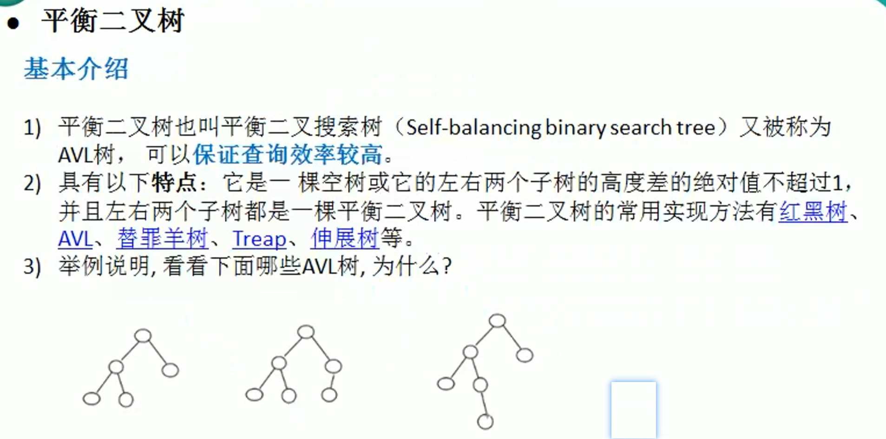


**左旋转**

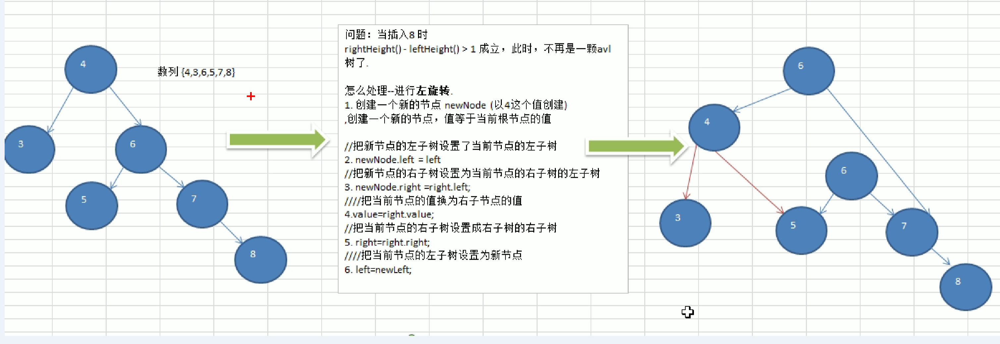

```java
// 左旋方法
    private void leftRotate() {
        // 1.创建新的节点，以当前节点的值
        Node newNode = new Node(value);
        // 2/把新的节点的左子树设置成当前节点左子树
        newNode.left = left;
        // 3.把新的节点的右子树设置成当前节点的右子树的左子树
        newNode.right = right.left;
        // 4.把当前节点的值替换成右子节点的值
        newNode.value = right.value;
        // 5.把当前节点的右子树设置成右子树的右子树
        right = right.right;
        // 把当前节点的左子节点设置成新的节点
        left = newNode;

    }
```


**右旋转**

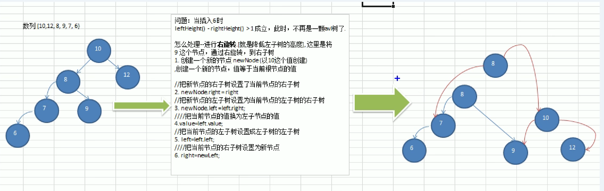

```java
 // 右旋转方法
    private void rightRotate() {
        // 操作新new出来节点 最后要连接到"切割"后的当前节点 
        // 1.以当前节点的值创建新节点
        Node newNode = new Node(value);
        // 2.把新节点的右子树设置成当前节点的右子树
        newNode.right = right;
        // 3.把新节点的左子节点设置成当前节点的左子节点的右子节点
        newNode.left = left.right;

        // 操作当前节点
        // 4.把当前节点的值设为当前节点左子节点的值
        value = left.value;
        // 5.把当前节点的左子节点设为当前节点的左子节点的左子节点
        left = left.left;
        // 6.把当前节点的右子节点设为新节点
        right = newNode;

    }
```


特殊情况

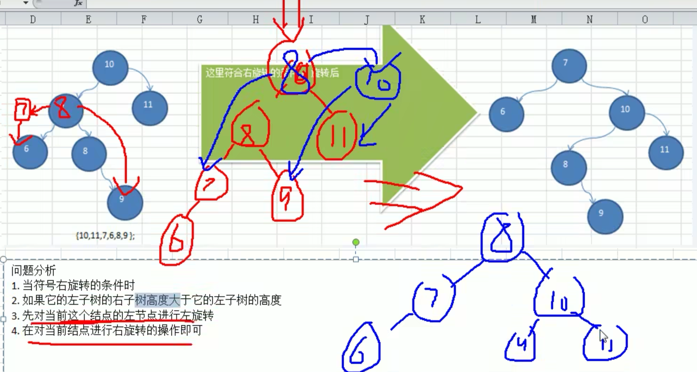


```java
    // 递归的形式 需要满足二叉排序树的要求
    public void add(Node node) {
        if (node == null) {
            return;
        }

        // 判断传入的节点的值和当前子树的根节点的关系
        if (node.value < this.value) {
            if (this.left == null) {
                this.left = node;
            } else {
                this.left.add(node);
            }
        } else {
            if (this.right == null) {
                this.right = node;
            } else {
                this.right.add(node);
            }
        }

        // 若，rightHeight-leftHeight>1 , 左旋转
        if (rightHeight() - leftHeight() > 1) {
   			// what if
            if (right != null && right.leftHeight() > right.rightHeight()) {
                right.rightRotate();
            }
            leftRotate();
        }

        // 若，leftHeight-rightHeight>1 , 右旋转
        if (leftHeight() - rightHeight() > 1) {
            if (left != null && left.rightHeight() > left.leftHeight() ) {
                left.leftRotate();
            }
            rightRotate();
        }
    }
```


### 多路查找树(了解)

**多叉树、2-3树、B树、B+树**

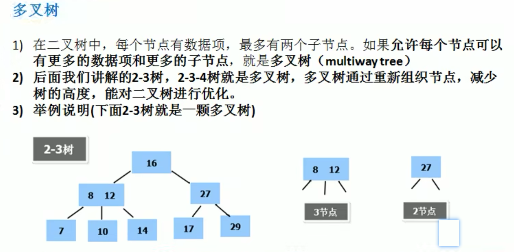


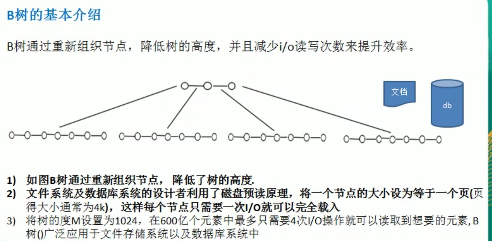


**2-3 树**

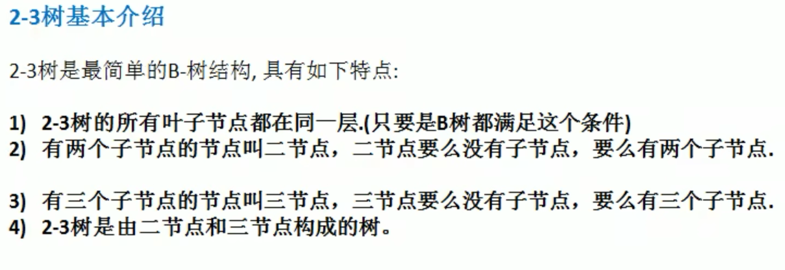


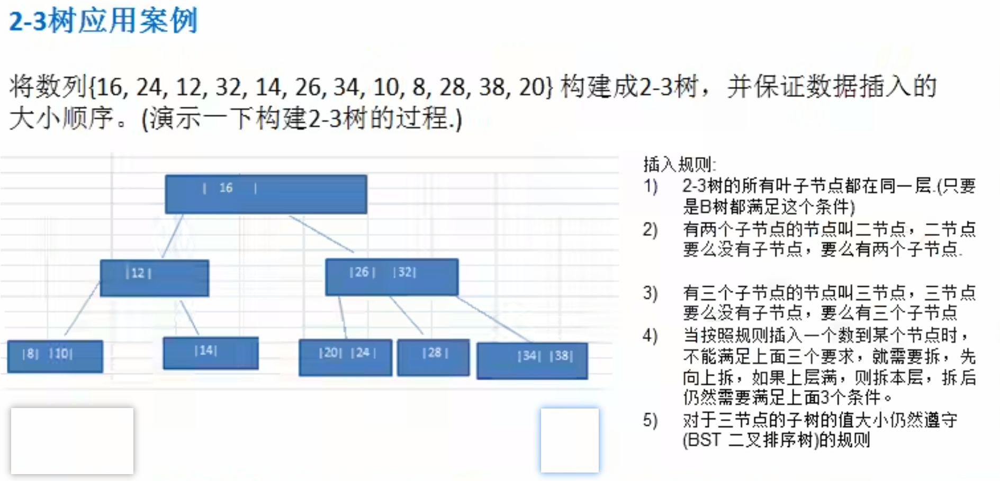


**B树**

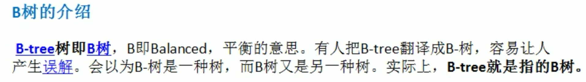

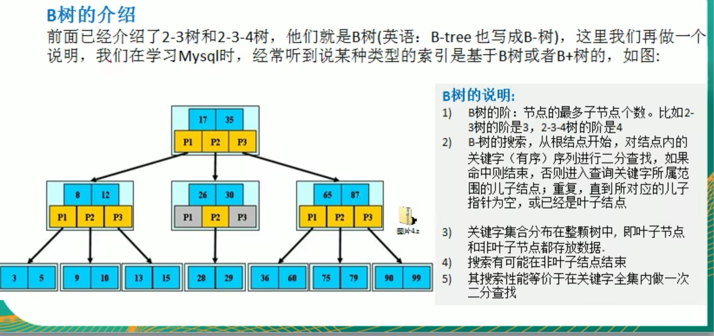


B+树

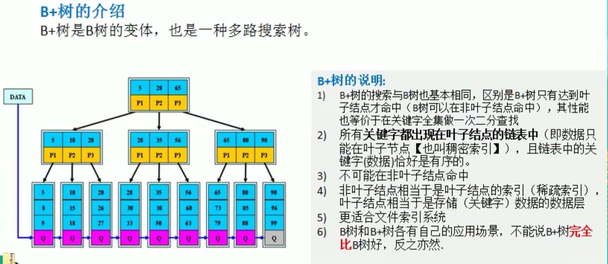

非叶子节点==稀疏索引，叶子节点保存的数据==稠密索引，叶子节点==数据层


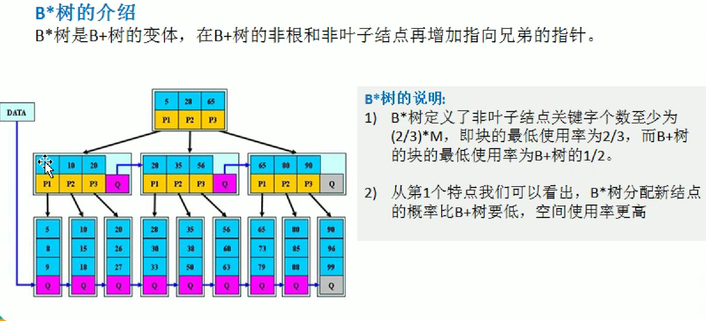


## 14.图

**基本结束**

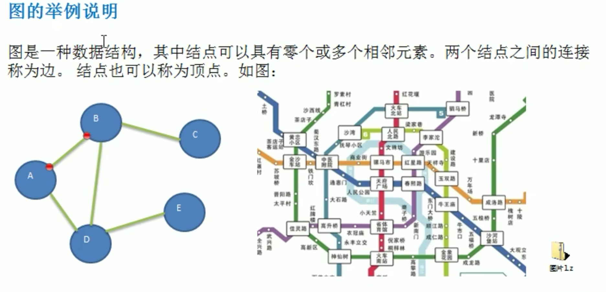

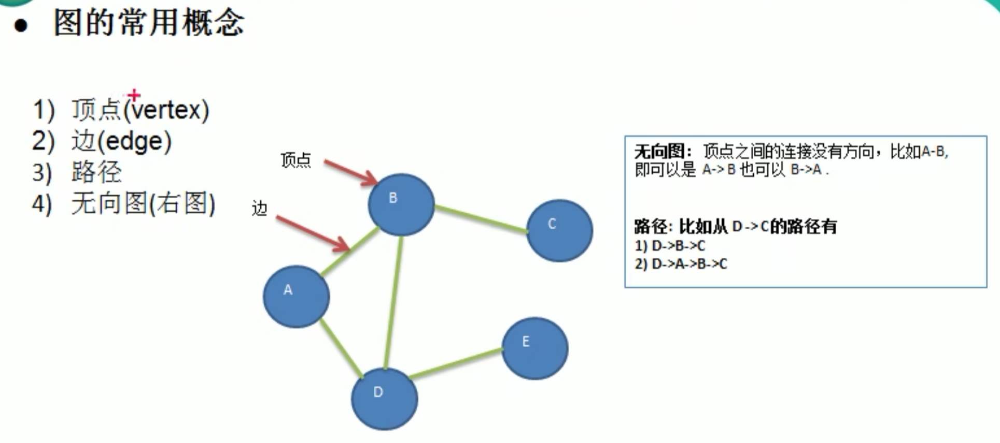

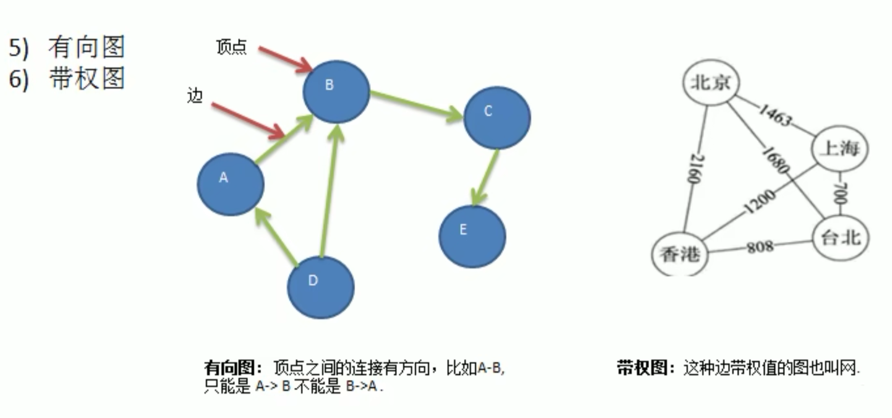


**表示方式**

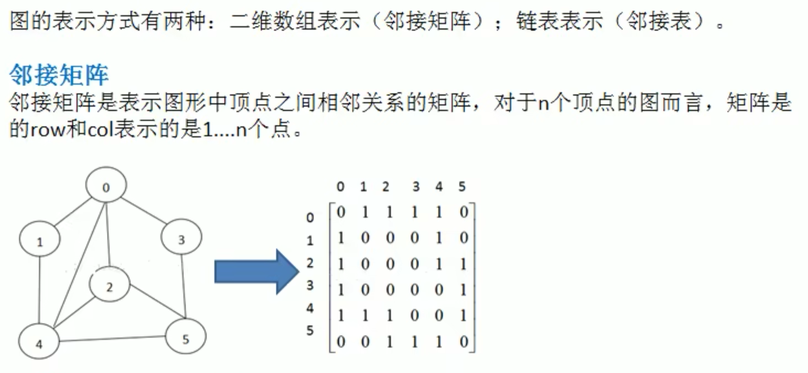

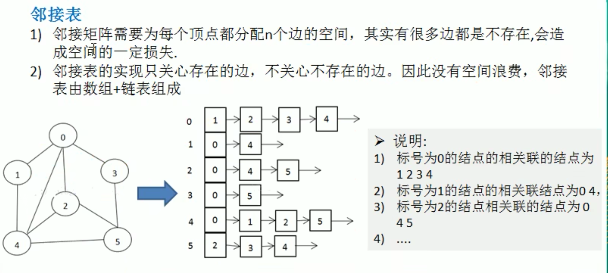


快速入门案例

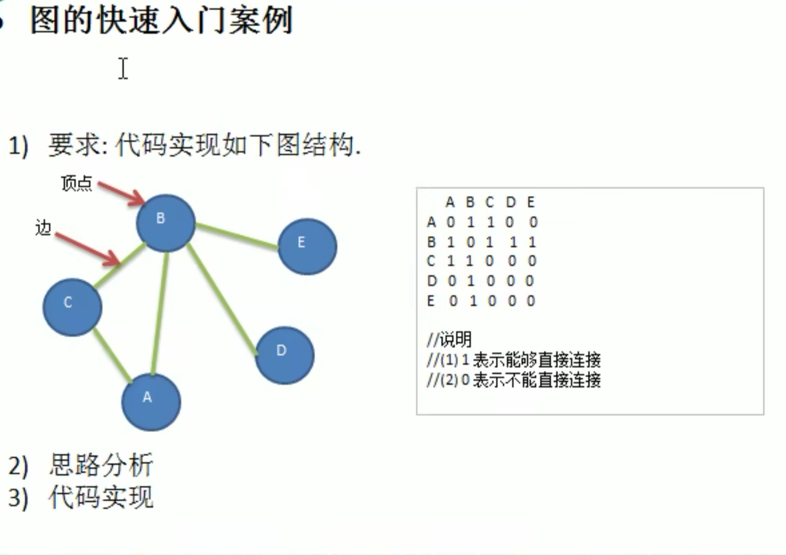

```java
package _14graph;

import java.util.ArrayList;
import java.util.Arrays;
import java.util.List;

public class Graph {
    // 存储顶点
    private List<String> vertexList;
    // 存储图对应的邻接矩阵
    private int[][] edges;
    // 边数
    private int numofEdges;

    public static void main(String[] args) {
        // 测试
        int n = 5; // 顶点个数
        String vertexs[] = { "A", "B", "C", "D", "E" };
        // 创建图对象
        Graph graph = new Graph(n);
        // 添加顶点
        for (String vertex : vertexs) {
            graph.insertVertex(vertex);
        }

        // 添加边
        // A-B A-C B-C B-D B-E
        graph.insertEdge(0, 1, 1);
        graph.insertEdge(0, 2, 1);
        graph.insertEdge(1, 2, 1);
        graph.insertEdge(1, 3, 1);
        graph.insertEdge(1, 4, 1);

        graph.showGraph();

    }

    // 构造函数 n 顶点数
    public Graph(int n) {
        // 初始化矩阵和vertexList
        edges = new int[n][n];
        vertexList = new ArrayList<>();
        numofEdges = 0;
    }

    // 显示图对应的举证
    public void showGraph() {
        Arrays.stream(edges)
                .forEach(link -> System.out.println(Arrays.toString(link)));
    }

    // 常用方法
    // 返回节点个数
    public int getNumOfVertex() {
        return vertexList.size();
    }

    // 边数
    public int getNumofEdges() {
        return numofEdges;
    }

    // 返回结点index对应 数据
    public String getVertexByIndex(int i) {
        return vertexList.get(i);
    }

    // 返回权值
    public int getWeight(int v1, int v2) {
        return edges[v1][v2];
    }

    // 插入节点
    public void insertVertex(String vertex) {
        vertexList.add(vertex);
    }

    /**
     * 添加边
     * 
     * @param v1     A->0 B->1 ....
     * @param v2     A->0 B->1 ....
     * @param weight 权值
     */
    public void insertEdge(int v1, int v2, int weight) {
        edges[v1][v2] = weight;
        edges[v2][v1] = weight;
        numofEdges++;
    }

}
```


#### **图的遍历**

**DFS 深度优先遍历 **

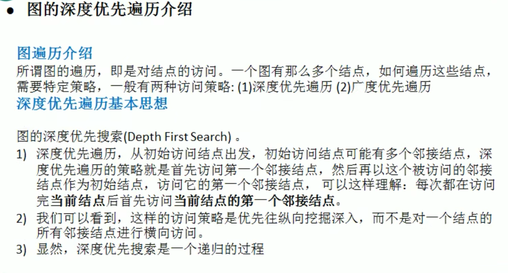

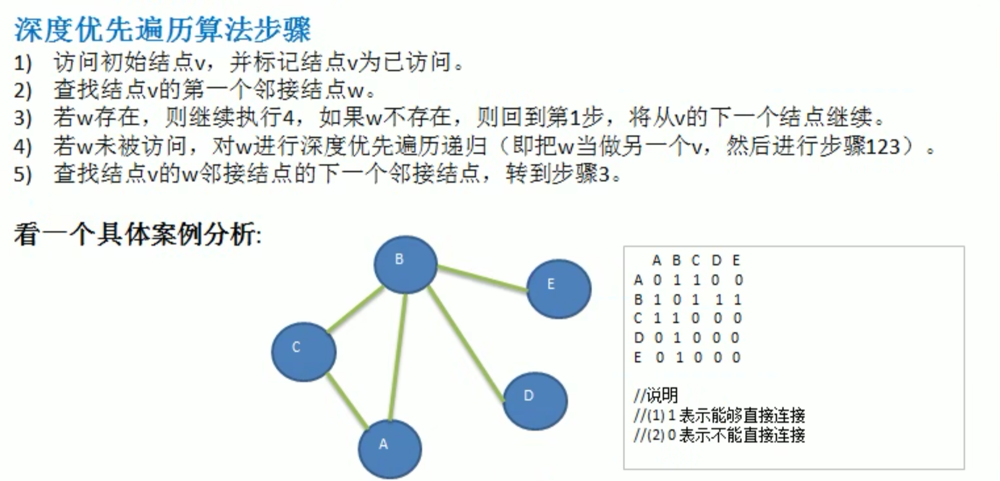

```java
   // 深度优先遍历
    // 第一次是0
    private void dfs(int i) {
        // 1.访问该节点输出
        System.out.print(getVertexByIndex(i) + "->");
        // 标记已访问
        isVisited[i] = true;

        // 2.查找邻接节点
        int w = getFirstNeighbor(i);
        while (w != -1) {
            if (!isVisited[w]) {
                dfs(w);
            }
            w = getNextNeighbor(i, w);
        }
    }

    // 遍历所有的节点
    public void dfs() {
        isVisited = new boolean[edges.length];
        for (int i = 0; i < getNumOfVertex(); i++) {
            if (!isVisited[i]) {
                dfs(i);
            }
        }
    }
```


**广度优先遍历BFS**

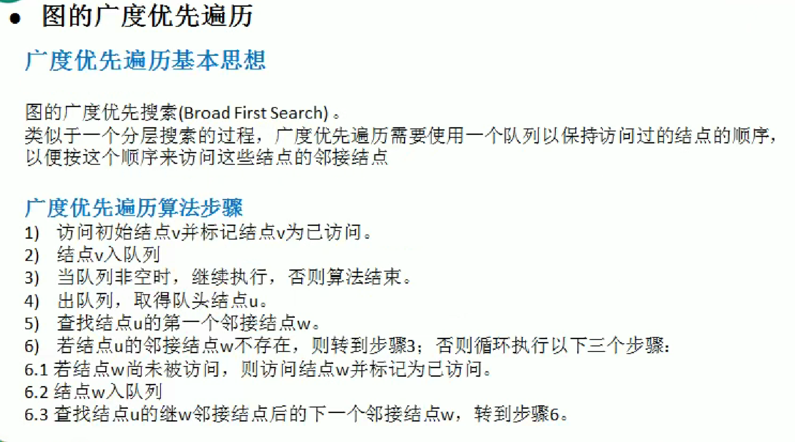

```JAVA
    // 广度优先遍历
    private void bfs(int i) {
        // 1.访问该节点输出
        System.out.print(getVertexByIndex(i) + "->");
        isVisited[i] = true;
        queue.add(i);

        while (!queue.isEmpty()) {
            int u = queue.poll();
            int w = getFirstNeighbor(u);

            while (w != -1) {
                if (!isVisited[w]) {
                    isVisited[w] = true;
                    System.out.print(getVertexByIndex(w) + "->");
                    queue.add(w);
                }
                w = getNextNeighbor(u, w);
            }

        }

    }

    private void bfs() {
        isVisited = new boolean[edges.length];
        for (int i = 0; i < getNumOfVertex(); i++) {
            if (!isVisited[i]) {
                bfs(i);
            }
        }
    }
```

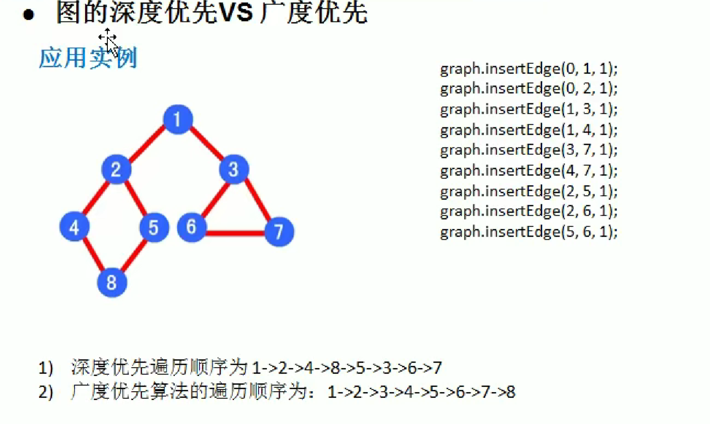

