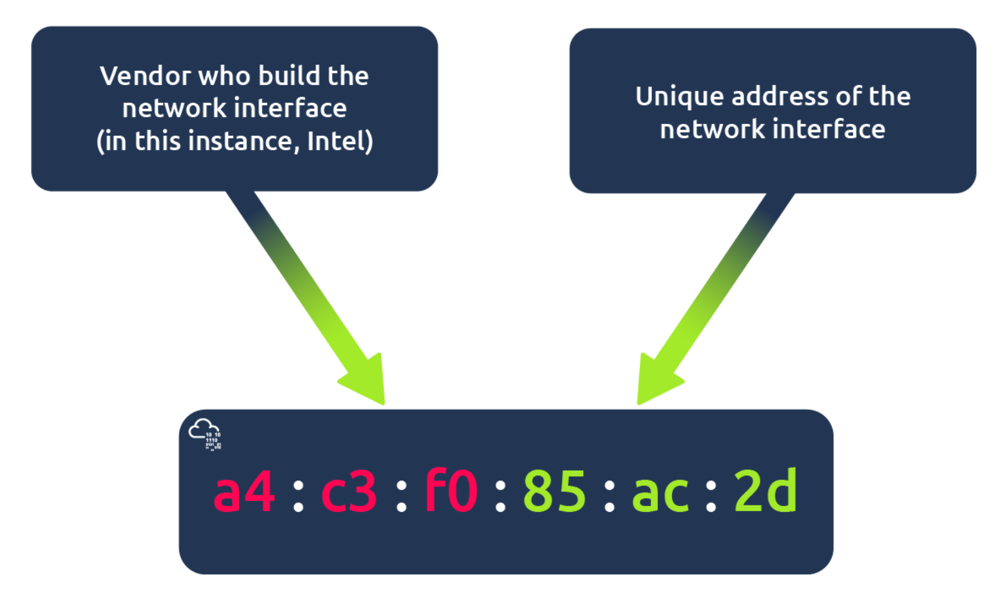

# network

key term for devices that are connected together

Networks are simply things connected. For example, your friendship circle: you are all connected because of similar interests, hobbies, skills and sorts.

<div align=left></div>

## Identifying Devices on a Network

- An IP Address
- A Media Access Control (MAC) Address -- think of this as being similar to a serial number.

### IP Addresses(Internet Protocol)

 used as a way of identifying a host on a network for a period of time, where that IP address can then be associated with another device without the IP address changing.

 An IP address is a set of numbers that are divided into four octets. The value of each octet will summarise to be the IP address of the device on the network. This number is calculated through a technique known as IP addressing & subnetting. What's important to understand here is that IP addresses can change from device to device but cannot be active simultaneously more than once within the same network.

 <div align=left></div>

#### **1. 公共IP（Public IP）**

- **定义**：全球唯一的IP地址，由互联网管理机构（如ICANN）统一分配，可直接访问互联网。
- **特点**：
  - 全球唯一性，不会重复。
  - 可被互联网上的其他设备直接访问（如访问网站、远程连接）。
  - 通常由互联网服务提供商（ISP）分配给用户或企业。
- **用途**：
  - 服务器、网站托管、云服务等需要对外提供服务的场景。
  - 家庭或企业网络的出口（如路由器的WAN口地址）。
- **示例**：`203.0.113.45`（IPv4）、`2001:0db8:85a3::8a2e:0370:7334`（IPv6）。

#### **2. 私有IP（Private IP）**

- **定义**：在本地网络内部使用的IP地址，不可直接访问互联网，需通过NAT（网络地址转换）转换为公共IP。
- **特点**：
  - 非全球唯一，同一地址可在不同局域网中重复使用。
  - 仅在局域网内可见，无法被互联网直接访问。
  - 节省公共IP资源，提高网络安全性。
- **用途**：
  - 家庭、企业内部设备（如电脑、手机、打印机等）。
  - 减少对公共IP的需求，降低网络配置复杂度。
- **IPv4私有地址范围**：
  - `10.0.0.0/8`（10.0.0.0到10.255.255.255）
  - `172.16.0.0/12`（172.16.0.0到172.31.255.255）
  - `192.168.0.0/16`（192.168.0.0到192.168.255.255）
- **IPv6私有地址**：ULA（Unique Local Address），如`fc00::/7`。

#### **3. 核心区别**

| **对比项**       | **公共IP**                | **私有IP**                |
|------------------|---------------------------|---------------------------|
| **唯一性**       | 全球唯一                  | 局域网内唯一              |
| **可访问性**     | 直接访问互联网            | 需通过NAT转换            |
| **分配方式**     | ISP或ICANN分配            | 本地路由器自动分配（如DHCP）|
| **用途**         | 对外服务、互联网连接      | 内部设备通信              |
| **安全性**       | 直接暴露于互联网          | 隐藏在NAT后，相对安全     |

#### **4. 如何查看IP地址？**

- **公共IP**：访问网站（如`whatismyip.com`）或路由器管理界面。
- **私有IP**：在设备的网络设置中查看（如Windows的“IP配置”、手机的“Wi-Fi详情”）。

**总结**

公共IP是互联网的“门牌号码”，用于全球通信；私有IP是家庭/企业内部的“房间号”，通过NAT技术共享一个公共IP上网。两者协同工作，既保证了互联网的正常运行，又解决了IP地址短缺和网络安全问题。

#### **5. IPv6**

IPv6 is a new iteration of the Internet Protocol addressing scheme to help tackle this issue. Although it is seemingly more daunting, it boasts a few benefits:

- Supports up to 2^128 of IP addresses (340 trillion-plus), resolving the issues faced with IPv4
- More efficient due to new methodologies

<div align=left></div>

#### **6. MAC Address**

Devices on a network will all have a physical network interface, which is a microchip board found on the device's motherboard. This network interface is assigned a unique address at the factory it was built at, called a MAC (Media Access Control ) address. The MAC address is a twelve-character hexadecimal number (a base sixteen numbering system used in computing to represent numbers) split into two's and separated by a colon. These colons are considered separators. For example, a4:c3:f0:85:ac:2d. The first six characters represent the company that made the network interface, and the last six is a unique number.

<div align=left></div>

## Ping(ICMP)

Ping is one of the most fundamental network tools available to us. Ping uses ICMP (Internet Control Message Protocol) packets to determine the performance of a connection between devices, for example, if the connection exists or is reliable.

ICMP（Internet Control Message Protocol）是互联网控制消息协议，属于TCP/IP协议栈的核心协议之一，主要用于在IP网络中传递控制和错误消息。以下是关于ICMP的关键信息：

### **主要功能**

1. **错误报告**  
   - 当IP数据包无法到达目标时，发送错误消息（如目标不可达、超时等）。
2. **诊断功能**  
   - **Ping**：通过ICMP回显请求（类型8）和应答（类型0）测试网络连通性。
   - **Traceroute**：利用ICMP超时消息（类型11）跟踪数据包路径。
3. **网络信息查询**  
   - 提供主机或路由器的状态信息（如地址掩码请求、时间戳请求）。

### **常见ICMP消息类型**

| 类型代码 | 消息类型           | 用途描述                     |
|----------|--------------------|------------------------------|
| 0        | 回显应答（Echo Reply） | 响应Ping请求                 |
| 8        | 回显请求（Echo Request） | 发起Ping测试                 |
| 3        | 目标不可达（Destination Unreachable） | 数据包无法到达目标           |
| 11       | 超时（Time Exceeded） | 数据包生存时间（TTL）耗尽    |

### **典型应用场景**

1. **网络诊断**  
   - 使用`ping`命令验证主机是否可达。
   - 使用`traceroute`或`tracert`追踪网络路径。
2. **故障排查**  
   - 通过目标不可达消息（类型3）定位路由或防火墙问题。
3. **监控网络状态**  
   - 检测网络延迟、丢包率等指标。

### **如何测试ICMP？**

1. **Ping命令**  

   ```bash
   ping example.com  # 发送ICMP回显请求
   ```

2. **Traceroute命令**  

   ```bash
   traceroute example.com  # 在Linux/macOS中使用
   tracert example.com    # 在Windows中使用
   ```

### **注意事项**

- **可靠性**：ICMP不保证消息的可靠传输，可能因网络拥塞或防火墙规则被丢弃。
- **安全性**：某些网络环境会禁用ICMP（如限制Ping），导致诊断工具失效。
- **替代方案**：若ICMP被屏蔽，可尝试使用TCP/UDP端口探测（如`telnet`或`nmap`）。

如果需要更具体的操作示例或问题分析，可以进一步说明场景哦！ (^_^)

## LAN

LAN（Local Area Network，局域网）是一种覆盖范围较小的计算机网络，通常局限于家庭、办公室、学校或园区内。以下是关于LAN的关键信息：

### **核心特点**

1. **覆盖范围**  
   - 通常在几公里以内（如家庭、一栋楼或一个园区）。
2. **高传输速率**  
   - 支持10Mbps至10Gbps甚至更高的传输速度（如光纤网络）。
3. **低延迟**  
   - 数据传输延迟较低，适合实时应用（如视频会议、在线游戏）。
4. **私有性**  
   - 多为私有网络，通过路由器或防火墙与外部网络（如互联网）隔离。

### **优势**

1. **成本效益**
   - 使用共享资源（如打印机、存储设备）降低成本。
2. **易于管理**
   - 集中化管理设备和用户权限。
3. **高安全性**
   - 通过防火墙和访问控制列表（ACL）保护内部网络。

### **LAN的组成**

1. **硬件设备**  
   - **交换机/集线器**：连接多台设备，实现数据交换。
   - **路由器**：连接LAN与外部网络（如互联网），分配IP地址。
   - **网线/无线接入点（AP）**：提供有线或无线连接。
   - **终端设备**：计算机、手机、打印机、智能家居设备等。
2. **协议与技术**  
   - **以太网**：主流有线LAN技术（如IEEE 802.3）。
   - **Wi-Fi**：无线LAN技术（如IEEE 802.11a/b/g/n/ac/ax）。
   - **TCP/IP**：基础通信协议，负责IP地址分配和数据传输。

### **常见LAN类型**

1. **家庭LAN**  
   - 由无线路由器、电脑、手机、智能家电等组成，通过DHCP自动分配IP地址。
2. **企业LAN**  
   - 采用分层架构（核心层、汇聚层、接入层），支持VLAN划分、QoS（服务质量）管理。
3. **无线LAN（WLAN）**  
   - 通过无线AP覆盖区域，适合移动办公或临时网络搭建。

### **典型应用场景**

1. **资源共享**  
   - 文件共享、打印机共享、存储设备共享。
2. **内部通信**  
   - 局域网内的即时通讯、视频会议。
3. **监控与控制**  
   - 智能家居设备控制、企业安防监控系统。
4. **高带宽应用**  
   - 流媒体传输、在线协作、云计算服务。

### **LAN配置示例**

1. **家庭LAN设置**  
   - 连接路由器，通过管理界面（如`192.168.1.1`）配置Wi-Fi名称和密码。
   - 启用DHCP功能，自动分配IP地址（如`192.168.1.x`）。
2. **企业LAN配置**  
   - 使用交换机划分VLAN隔离不同部门（如财务、研发）。
   - 部署防火墙或VPN设备保障网络安全。

### **常见问题与解决**

1. **IP地址冲突**  
   - 手动分配静态IP或重启DHCP服务器。
2. **无线信号弱**  
   - 调整AP位置、更换高增益天线或添加信号放大器。
3. **网络延迟高**  
   - 检查带宽占用、优化路由策略或升级网络设备。
   
### **限制**

1. 覆盖范围有限
   - 仅适用于小范围区域，扩展到广域网（WAN）需要额外设备。
2. 依赖性高
   - 中心设备（如路由器或交换机）故障可能导致整个网络中断。

### **相关工具与命令**

1. **Windows**  
   - `ipconfig`：查看IP地址和网络配置。
   - `ping`：测试设备连通性（如`ping 192.168.1.1`）。
   - `arp -a`：查看局域网内的MAC地址与IP映射。
2. **Linux/macOS**  
   - `ifconfig`或`ip addr`：查看网络接口信息。
   - `traceroute`：追踪数据包路径。
   - `nmap`：扫描局域网内的活动设备（如`nmap -sn 192.168.1.0/24`）。
