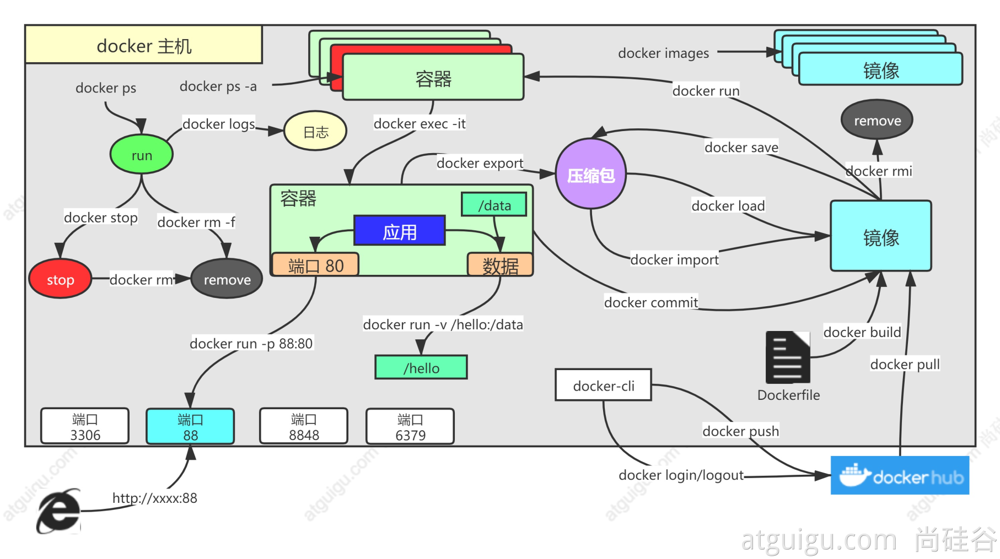

# DevOps_java

## 1.云平台核心

公有云、私有云


**vpc(私有网络、专有网络)**


## 2.Docker

### 1.解决的问题

1. 统一标准
   - 应用构建
   - 应用分享
   - 应用运行
   - 容器化
2. 资源隔离
   - cpu、memory资源隔离与限制
   - 访问设备隔离与限制
   - 网络隔离与限制
   - 用户、用户组隔离限制
   - ......

### 2.架构


```zsh
● Docker_Host：
  ○ 安装Docker的主机
● Docker Daemon：
  ○ 运行在Docker主机上的Docker后台进程
● Client：
  ○ 操作Docker主机的客户端（命令行、UI等）
● Registry：
  ○ 镜像仓库
  ○ Docker Hub
● Images：
  ○ 镜像，带环境打包好的程序，可以直接启动运行
● Containers：
  ○ 容器，由镜像启动起来正在运行中的程序

交互逻辑
装好Docker，然后去 软件市场 寻找镜像，下载并运行，查看容器状态日志等排错
```

### 3.安装

```zsh
#按官网来 https://docs.docker.com/engine/install/
#需要改数据源

#ubuntu
gpg证书
curl -fsSL https://mirrors.aliyun.com/docker-ce/linux/ubuntu/gpg | apt-key add -
阿里云镜像源地址
add-apt-repository "deb [arch=amd64] https://mirrors.aliyun.com/docker-ce/linux/ubuntu $(lsb_release -cs) stable"

#centos
http://mirrors.aliyun.com/docker-ce/linux/centos/docker-ce.repo


```

### 4.命令实战-**创建java应用**



**创建java应用**

1. 在IDEA工具里面搞定微服务jar包

2. 编写Dockerfile

```do
FROM openjdk:8-jdk-slim
LABEL maintainer=weason

COPY *.jar /app.jar

ENTRYPOINT ["java", "-jar", "/app.jar"]
```

3. 构建镜像

```zsh
docker build -t java-app:1.0 .
```

4. 运行容器

```zsh
# 运行redis
docker run -d --name myredis -p 6379:6379 redis --requirepass "jiayou666"
# 运行java程序 
docker run -d -p 8080:8080 java-app:1.0
```

# 