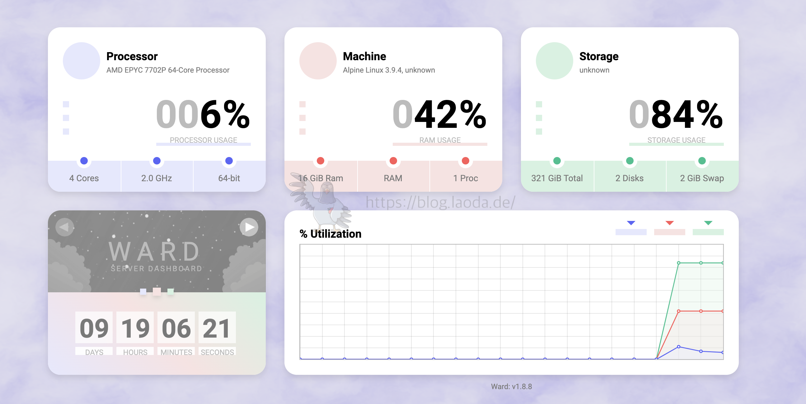

# docker app

## 1.ward
### 简介
Ward 是一个使用 Java 开发的简单而简约的服务器监控工具。Ward 支持自适应设计系统，它还支持深色主题，它只显示服务器的主要信息。Ward 在所有流行的操作系统上运行良好，因为它使用 OSHI。

项目地址：https://github.com/B-Software/Ward

效果如下：


### Docker搭建
```zsh
sudo pacman -Syu ## 更新软件源

mkdir -p ~/data/docker_data/Ward  ## 在docker_data文件夹下创建Ward文件夹

cd ~/data/docker_data/Ward  ## 进入文件夹

git clone https://github.com/AntonyLeons/Ward.git   ## 在创建的文件夹下克隆项目并构建镜像
cd Ward 
docker build . --tag ward

```

运行
```zsh
docker run -d --name ward -p 4000:4000 \
-p 自定义端口号:自定义端口号 \
--privileged=true \
--restart always \
ward:latest

```

配置
```zsh
docker exec -it ward /bin/sh
nano setup.ini

docker stop ward
docker rm -f ward 

```

## 2.code server

```zsh
# 使用最后一行无需直接以下的拉取命令
docker pull codercom/code-server:4.0.1
docker pull codercom/code-server:latest

# 运行容器
sudo docker run -d -p 8080:8080 -v "${HOME}/.config/Code:/home/coder/.config" -v "${HOME}/workspace:/home/coder/project" -u "$(id -u):$(id -g)" -e "DOCKER_USER=$USER" codercom/code-server:latest


sudo docker ps
sudo docker logs <容器ID或名称>


# 进入容器获取密码
sudo docker exec -it <容器ID或名称> bash
cat .config/code-server/config.yaml


```
参数说明：
• -d 参数表示后台运行容器。
• -p 8080:8080 将容器内的 8080 端口映射到主机的8080端口。
• -v “${HOME}/.config:/home/coder/.config” 将主机上的 VS Code 配置目录挂载到容器内，这样你的配置和插件就可以持久化了。
• -v “${HOME}/workspace:/home/coder/project” 将当前工作目录挂载到容器内，以便在容器中编辑项目文件。
• -u “$(id -u):$(id -g)” 以当前用户的 UID 和 GID 运行容器，这可以避免权限问题。
• -e “DOCKER_USER=$USER” 设置环境变量 DOCKER_USER 为当前用户，有些镜像可能会用到这个


## 3.v2raya

```zsh
# docker 启动
docker run -d \
--name v2raya \
--network=host \
-e V2RAYA_ADDRESS=0.0.0.0:2017 \
-v $HOME/data/docker_data/v2raya/lib/modules:/lib/modules:ro \
-v $HOME/data/docker_data/v2raya/etc/resolv.conf:/etc/resolv.conf \
-v $HOME/data/docker_data/v2raya/etc/v2raya:/etc/v2raya \
--restart=always \
--privileged \
mzz2017/v2raya
```

```zsh
docker run -d \
  --restart=always \
  --privileged \
  --network=host \
  --name v2raya \
  -p 4430:443 \
  -e V2RAYA_LOG_FILE=/tmp/v2raya.log \
  -e V2RAYA_V2RAY_BIN=/usr/local/bin/v2ray \
  -e V2RAYA_NFTABLES_SUPPORT=off \
  -e IPTABLES_MODE=legacy \
  -v $HOME/data/docker_data/v2raya/lib/modules:/lib/modules:ro \
  -v $HOME/data/docker_data/v2raya/etc/resolv.conf:/etc/resolv.conf \
  -v $HOME/data/docker_data/v2raya/etc/v2raya:/etc/v2raya \
  mzz2017/v2raya
```

plane

```zsh
https://v2rayshare.com/
```


## 4.yesplaymusic

```bash
# 来去镜像
docker pull  fogforest/yesplaymusic
junlongzzz/yesplaymusic

# 创建目录
mkdir -p $HOME/data/docker_data/yesplaymusic  && cd $HOME/data/docker_data/yesplaymusic 

# 跟新启动方式
docker update --restart=unless-stopped YesPlayMusic
```

docker-compose.yaml
```yaml
version: '3'
services:
  YesPlayMusic:
    image: junlongzzz/yesplaymusic
    container_name: YesPlayMusic
    volumes:
      - /etc/localtime:/etc/localtime:ro
      # - /etc/timezone:/etc/timezone:ro
    ports:
      - 7950:80
    environment:
      - NODE_TLS_REJECT_UNAUTHORIZED=1
    # restart: always
```

## 5.kasmweb/chrome

```bash
docker run --rm -it --shm-size=512m -p 6901:6901 -e VNC_PW=password kasmweb/chromium:x86_64-1.15.0-rolling

b
User : kasm_user
Password: password
```
>The container is now accessible via a browser : https://IP_OF_SERVER:6901


## 6.mongodb

```zsh
# 拉去镜像
docker pull mongo

# 运行
docker run -d --restart=unless-stopped --name mongo -v $HOME/data/docker_data/mongodb/data:/data/db -p 27017:27017 mongo --serviceExecutor adaptive

```

docker-compose.yaml
```yaml
services:

  mongo:
    container_name: mongo
    image: mongo
    restart: unless-stopped
    environment:
      MONGO_INITDB_ROOT_USERNAME: root
      MONGO_INITDB_ROOT_PASSWORD: 54321
    volumes:
      - $HOME/data/docker_data/mongodb/data:/data/db
    ports:
      - 27017:27017
```

```bash
# 进入容器
# 如果MongoDB6.0及以上使用：
docker exec -it mongo /bin/mongosh
# 如果是6.0以下的版本使用：
docker exec -it mongo /bin/mongo 

# createUser之前先use admin切换一下
use admin

# 创建用户并赋予root权限
db.createUser(
	{
		user:"root",
		pwd:"123456",
		roles:[{role:"root",db:"admin"}]
	}
);
 
# 尝试使用上面创建的用户信息进行连接。
db.auth('root', '123456');

```
```bash
# 通过bash
docker exec -it mongodb bash
 
# 登录容器
mongosh admin -u root -p 123456     
# -u 后面的是创建容器指定的账号   
#-p 后面跟的是创建容器指定的密码
```

其他命令
```bash
# 更新用户角色，修改用户权限，不会覆盖原权限信息，只新增权限：
db.updateUser("admin",{roles:[{role:"readWrite",db:"admin"}]})
 
# 更新用户密码
db.changeUserPassword("admin","123456")
 
# 删除用户
db.dropUser({'admin'})
 
# 查看所有用户
show users
 
# 查看数据库（非admin数据库的用户不能使用数据库命令）
show dbs

```

