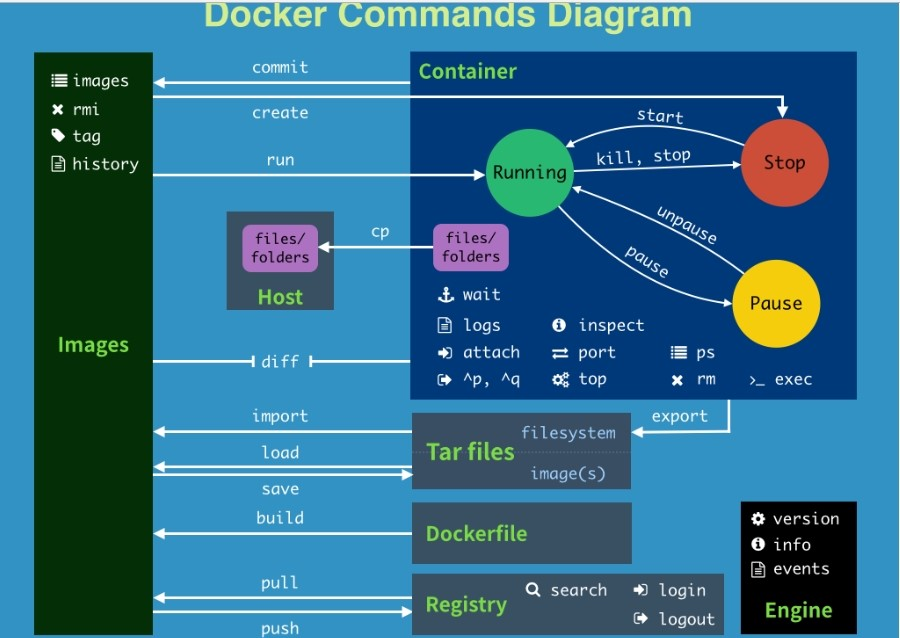

# docker基础

## 1.基本知识

### 1.1docker三要素

image(镜像)、容器(container)、仓库(repository)


## 2.Docker常用命令



### 2.1帮助启动类命令

```zsh
#1.启动docker
systemctl start docker

#2.停止docker
systemctl stop docker

#3.重启docker
systemctl restart docker

#4.查看docker状态
systemctl status docker

#5.开机启动
systemctl enable docker

#6.查看docker概要信息
docker info

#7.查看docker总体帮助文档
docker --help

#8.看docker命令帮助文档 
docker 具体命令 --help
```


### 2.2镜像命令


```bash
#1.列出本地主机上的镜像
docker images

#2.查询某个镜像
docker search  [OPTIONS] 镜像名字  eg: docker search --limit 5 redis

#3.拉取镜像
docker pull 镜像名字:latest

#4.上传镜像
docker tag mydocker:0.2 weasontang/mydocker:0.2
docker push weasontang/mydocker:0.2

#5.查看镜像/容器/数据卷所占的空间
docker system df

#6.删除镜像
docker rmi 某个XXX镜像名字ID 
#删除多个
docker rmi -f 镜像名1:TAG 镜像名2:TAG
#删除全部
docker rmi -f $(docker images -qa)

```


### 2.3容器命令

```zsh
#1.新建+启动容器
docker run [OPTIONS] IMAGE [COMMAND] [ARG...]
OPTIONS说明（常用）：有些是一个减号，有些是两个减号
 
--name="容器新名字"       为容器指定一个名称；
-d: 后台运行容器并返回容器ID，也即启动守护式容器(后台运行)；
 
-i：以交互模式运行容器，通常与 -t 同时使用；
-t：为容器重新分配一个伪输入终端，通常与 -i 同时使用；
也即启动交互式容器(前台有伪终端，等待交互)；
 
-P: 随机端口映射，大写P
-p: 指定端口映射，小写p 

#启动交互式容器(前台命令行) 交互式模式运行容器
docker run -it ubuntu /bin/bash
·	docker run -it --name=WUbuntu ubuntu bash
#启动守护式容器(后台服务器)
docker run -d 容器名
·	docker run -d redis:6.0.8

#2.列出当前所有正在运行的容器
docker ps [OPTIONS]
OPTIONS说明（常用）：
 -a :列出当前所有正在运行的容器+历史上运行过的
-l :显示最近创建的容器。
-n：显示最近n个创建的容器。
-q :静默模式，只显示容器编号。

#3.退出容器
方式一:  run进去容器，exit退出，容器停止
方式二： run进去容器，ctrl+p+q退出，容器不停止

#4.启动已停止运行的容器
docker start 容器ID或者容器名

#5.重启容器
docker restart 容器ID或者容器名

#6.停止容器
docker stop 容器ID或者容器名

#6.强制停止容器
docker kill 容器ID或容器名

#7.删除已停止的容器
docker rm 容器ID

#8.一次性删除多个容器实例
·	docker rm -f $(docker ps -a -q)
·	docker ps -a -q | xargs docker rm

#9.查看容器日志
docker logs 容器ID

#10.查看容器内运行的进程
docker top 容器ID

#11.查看容器内部细节
docker inspect 容器ID

important
#12.进入正在运行的容器并以命令行交互
#方式一 exec
docker exec -it 容器ID bashShell
eg: docker exec -it 8bfe65748355 /bin/bash
#方式二 attach
docker attach 容器ID
#区别
·	exec 是在容器中打开新的终端，并且可以启动新的进程 用exit退出，不会导致容器的停止。
·	attach 直接进入容器启动命令的终端，不会启动新的进程 用exit退出，会导致容器的停止。
一般用-d后台启动的程序，再用exec进入对应容器实例

#13.拷贝文件cp
#从容器内拷贝文件到主机上
docker cp  容器ID:容器内路径 目的主机路径
eg: docker cp 6a45dee3ec26:/tmp/hello.txt /home/weason/Documents

#把外面的内容拷贝到容器里面
docker cp  /data/conf/nginx.conf  5eff66eec7e1:/etc/nginx/nginx.conf

#14.导入和导出容器
1.export和import
#export 导出容器的内容留作为一个tar归档文件[对应import命令]
docker export 容器ID > 文件名.tar
eg: docker export 6a45dee3ec26 > qwe.tar

#import 从tar包中的内容创建一个新的文件系统再导入为镜像[对应export]
cat 文件名.tar | docker import - 镜像用户/镜像名:镜像版本号
eg: cat qwe.tar | docker import - weason/weabuntu:2.2

2.save和load
# 将镜像保存成压缩包
docker save -o abc.tar guignginx:v1.0
# 别的机器加载这个镜像
docker load -i abc.tar

3.区别：
① docker export 保存的是容器（container)，docker save 保存的是镜像（image）。docker export 比 docker save 保存的包要小，原因是 save 保存的是一个分层的文件系统，export 导出的只是一层文件系统。

② docker import、load 载入的时候，两者都会恢复为镜像。docker import 可以对镜像指定新名称及版本号，docker load 无法对镜像重命名。
```


## 3.Docker镜像

**镜像：**是一种轻量级、可执行的独立软件包，它包含运行某个软件所需的所有内容，我们把应用程序和配置依赖打包好形成一个可交付的运行环境(包括代码、运行时需要的库、环境变量和配置文件等)，这个打包好的运行环境就是image镜像文件。


### **3.1Docker镜像commit操作案例**

```zsh
#docker commit提交容器副本使之成为一个新的镜像
Options:
  -a, --author string    Author (e.g., "John Hannibal Smith <hannibal@a-team.com>")
  -c, --change list      Apply Dockerfile instruction to the created image
  -m, --message string   Commit message
  -p, --pause            Pause container during commit (default true)
docker commit -m="提交的描述信息" -a="作者" 容器ID 要创建的目标镜像名:[标签名]
eg: docker commit -m="add vim" -a="weason" 457b76d9d830 weason/weabuntu:0.1
```


## 4.Docker容器数据卷

​		卷就是目录或文件，存在于一个或多个容器中，由docker挂载到容器，但不属于联合文件系统，因此能够绕过Union File System 提供一些用于持续存储或共享数据的特性

​		卷的设计目的就是**数据持久化**，完全独立于容器的生存周期，因此Docker不会在容器删除时删除其挂载的数据卷

### **特点**

1. 数据卷可在容器之间共享或重用数据
2. 卷中的更改可以直接实时生效
3. 数据卷中的更改不会包含在镜像的更新中
4. 数据卷的生命周期一直持续到没有容器使用它为止

```zsh
#运行一个带有容器卷存储功能的容器实例
docker run -it --privileged=true -v /宿主机绝对路径目录:/容器内目录      镜像名
```

### 数据卷案例

```zsh
#1.宿主vs容器之间映射添加容器卷
docker run -it -v /宿主机目录:/容器内目录 ubuntu /bin/bash
eg: docker run -it --privileged=true -v /home/weason/host_data:/tmp/docker_data --name=u1 ubuntu /bin/bash

# docker run -d \
#   -v <数据目录>:/xunlei/data \
#   -v <默认下载保存目录>:/xunlei/downloads \
#   -p <访问端口>:2345 \
#   --privileged \
#   cnk3x/xunlei

# example
11

# 如果你的docker存储驱动是 overlayfs 或者 btrfs等, 可以不用特权运行
docker run -e XL_CHROOT=/ -v /home/weason/configs/xunlei:/xunlei/data -v /home/weason/Downloads:/xunlei/downloads -p 2345:2345 cnk3x/xunlei


#2.读写规则映射添加说明
·	读写(默认)

·	只读
/容器目录:ro 镜像名     (ro = read only)
eg: docker run -it --privileged=true -v /home/weason/host_data:/tmp/docker_data:ro --name=u1 ubuntu /bin/bash

#3.卷的继承和共享
·	容器1完成和宿主机的映射
docker run -it  --privileged=true -v /mydocker/u:/tmp --name u1 ubuntu
·	容器2继承容器1的卷规则
docker run -it  --privileged=true --volumes-from u1  --name u2 ubuntu

```

## 5.docker常规安装

### 1.搜索镜像

```zsh
docker search tomcat
```


### 2.拉取镜像

```zsh
docker pull tomcat
docker pull billygoo/tomcat8-jdk8   免修改版
```


### 3.查看镜像

```zsh
docker images tomcat
```


### 4.启动镜像

```zsh
docker run -d -p 8080:8080 --name=t1 tomcat
docker exec -it [容器id] /bin/bash

docker run -d -p 8080:8080 --name mytomcat8 billygoo/tomcat8-jdk8 免修改版
```


### 5.停止镜像

```zsh
docker stop [镜像id]
```


### 6.移除镜像

```zsh
docker rmi [镜像id]
```


## 安装mysql

```zsh
#拉取mysql镜像
docker pull mysql:5.7

#查询mysql端口是否被占用
ps -ef|grep mysql
netstat -tunlp | grep 3306

#使用mysql
docker run -p 3306:3306 -e MYSQL_ROOT_PASSWORD=123456 -d mysql:5.7
docker ps
docker exec -it 容器ID /bin/bash
mysql -uroot -p

#mysql里面操作
show databases;
create database db01;
use db01;
create table t1(id int, name varchar(20));
insert into t1 values(1, 'hahah');
select * from t1;

#docker装mysql问题
#1.插入中文报错  docker上默认字符集编码隐患
SHOW VARIABLES LIKE 'character%';
#2.数据备份 敏感数据迁移

#解决步骤
#1.启动时添加容器卷
docker run -d -p 3306:3306 --privileged=true \
-v /home/weason/mysql/log:/var/log/mysql \
-v /home/weason/mysql/data:/var/lib/mysql \
-v /home/weason/mysql/conf:/etc/mysql/conf.d \
-e MYSQL_ROOT_PASSWORD=123456 --name mysql mysql:5.7

#2.在cnf下 新建my.cnf写入
[client]
default_character_set=utf8
[mysqld]
collation_server = utf8_general_ci
character_set_server = utf8

#3.重启mysql
docker restart mysql


```


## 安装redis

```zsh
#拉取镜像
docker pull redis:6.0.8

#启动redis
docker run -d -p 6379:6379 redis:6.0.8
docker ps
docker exec -it 容器ID /bin/bash

#redis实例操作
redis-cli
ping
set k1 v1
get k1

#数据持久化 加容器卷
#1.新建目录 /app/redis
#2.将redis.conf文件模板拷贝进/app/redis目录下

#3.启动redis
docker run  -p 6379:6379 --name myredis --privileged=true \
-v /home/weason/redis/redis.conf:/etc/redis/redis.conf \
-v /home/weason/redis/data:/data \
-d redis:6.0.8 redis-server /etc/redis/redis.conf

docker exec -it myredis /bin/bash
redis-cli
```

