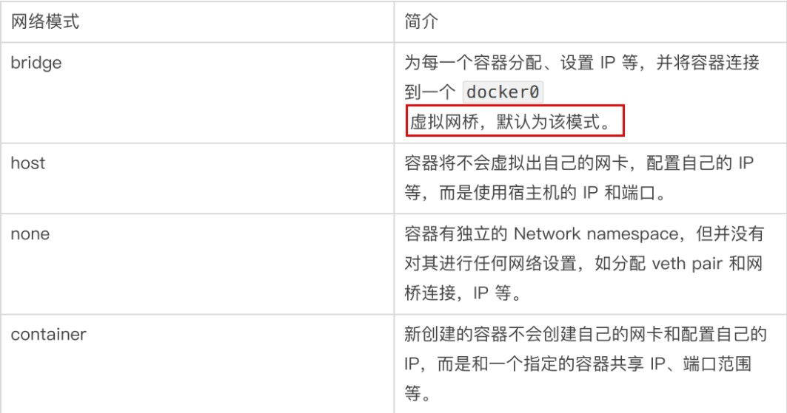
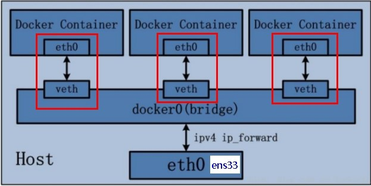
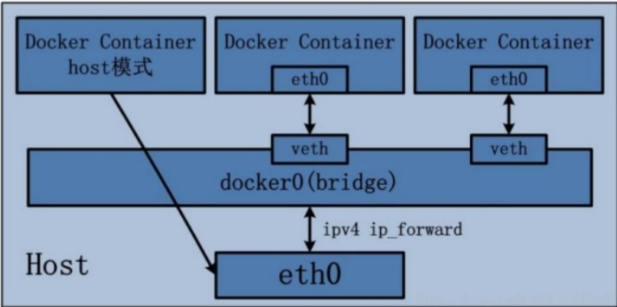
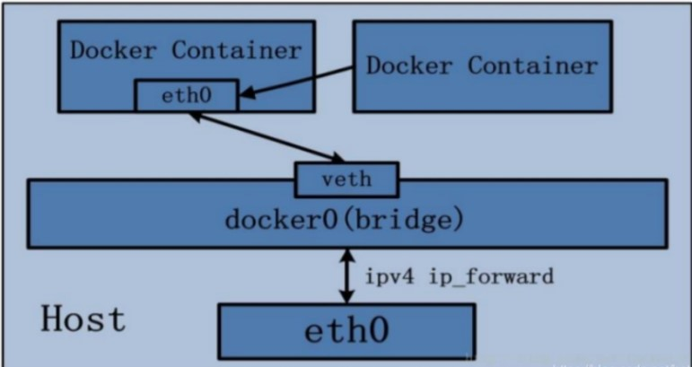

# docker进阶

## 1.分布式存储

### **安装mysql主从复制**

新建主服务器容器实例3307

```zsh
#1.新建主服务器容器实例3307
docker run -p 3307:3306 --name mysql-master \
-v /mydata/mysql-master/log:/var/log/mysql \
-v /mydata/mysql-master/data:/var/lib/mysql \
-v /mydata/mysql-master/conf:/etc/mysql \
-e MYSQL_ROOT_PASSWORD=root \
-d mysql:5.7
#2.进入/mydata/mysql-master/conf目录下新建my.cnf
vim my.cnf
    [mysqld]
    ## 设置server_id，同一局域网中需要唯一
    server_id=101 
    ## 指定不需要同步的数据库名称
    binlog-ignore-db=mysql  
    ## 开启二进制日志功能
    log-bin=mall-mysql-bin  
    ## 设置二进制日志使用内存大小（事务）
    binlog_cache_size=1M  
    ## 设置使用的二进制日志格式（mixed,statement,row）
    binlog_format=mixed  
    ## 二进制日志过期清理时间。默认值为0，表示不自动清理。
    expire_logs_days=7  
    ## 跳过主从复制中遇到的所有错误或指定类型的错误，避免slave端复制中断。
    ## 如：1062错误是指一些主键重复，1032错误是因为主从数据库数据不一致
    slave_skip_errors=1062

#3.修改完配置后重启master实例
docker restart mysql-master

#4.进入mysql-master容器
·	docker exec -it mysql-master /bin/bash
·	mysql -uroot -proot
·	master容器实例内创建数据同步用户
·	CREATE USER 'slave'@'%' IDENTIFIED BY '123456';
·	GRANT REPLICATION SLAVE, REPLICATION CLIENT ON *.* TO 'slave'@'%';

```

 新建从服务器容器实例3308

```zsh
#1.新建从服务器容器实例3308
docker run -p 3308:3306 --name mysql-slave \
-v /mydata/mysql-slave/log:/var/log/mysql \
-v /mydata/mysql-slave/data:/var/lib/mysql \
-v /mydata/mysql-slave/conf:/etc/mysql \
-e MYSQL_ROOT_PASSWORD=root  \
-d mysql:5.7


#2.进入/mydata/mysql-slave/conf目录下新建my.cnf
vim my.cnf
    [mysqld]
    ## 设置server_id，同一局域网中需要唯一
    server_id=102
    ## 指定不需要同步的数据库名称
    binlog-ignore-db=mysql  
    ## 开启二进制日志功能，以备Slave作为其它数据库实例的Master时使用
    log-bin=mall-mysql-slave1-bin  
    ## 设置二进制日志使用内存大小（事务）
    binlog_cache_size=1M  
    ## 设置使用的二进制日志格式（mixed,statement,row）
    binlog_format=mixed  
    ## 二进制日志过期清理时间。默认值为0，表示不自动清理。
    expire_logs_days=7  
    ## 跳过主从复制中遇到的所有错误或指定类型的错误，避免slave端复制中断。
    ## 如：1062错误是指一些主键重复，1032错误是因为主从数据库数据不一致
    slave_skip_errors=1062  
    ## relay_log配置中继日志
    relay_log=mall-mysql-relay-bin  
    ## log_slave_updates表示slave将复制事件写进自己的二进制日志
    log_slave_updates=1  
    ## slave设置为只读（具有super权限的用户除外）
    read_only=1

#3.修改完配置后重启slave实例
docker restart mysql-slave

#4.在主数据库中查看主从同步状态
·	show master status;
·	进入mysql-slave容器
·	docker exec -it mysql-slave /bin/bash
·	mysql -uroot -proot
#5.在从数据库中配置主从复制
change master to master_host='宿主机ip', master_user='slave', master_password='123456', master_port=3307, master_log_file='mall-mysql-bin.000001', master_log_pos=617, master_connect_retry=30;

·	主从复制命令参数说明
master_host：主数据库的IP地址；
master_port：主数据库的运行端口；
master_user：在主数据库创建的用于同步数据的用户账号；
master_password：在主数据库创建的用于同步数据的用户密码；
master_log_file：指定从数据库要复制数据的日志文件，通过查看主数据的状态，获取File参数；
master_log_pos：指定从数据库从哪个位置开始复制数据，通过查看主数据的状态，获取Position参数；
master_connect_retry：连接失败重试的时间间隔，单位为秒。

#5.在从数据库中查看主从同步状态
show slave status \G;

#6.在从数据库中查看主从同步状态
show slave status \G

#7.在从数据库中开启主从同步
start slave;

#8.查看从数据库状态发现已经同步在从数据库中开启主从同步
show slave status \G;

·	主从复制测试
·	主机新建库-使用库-新建表-插入数据，ok
·	从机使用库-查看记录，ok

```

### **安装redis集群**


## 2.Dockerfile解析

### 1.概述

Dockerfile是用来构建Docker镜像的文本文件，是由一条条构建镜像所需的指令和参数构成的脚本。


 **官网**  https://docs.docker.com/engine/reference/builder/

构建三步骤

```txt
1.编写Dockerfile文件
2.docker build命令构建镜像
3.docker run依镜像运行容器实例
```

### 2.Dockerfile构建过程解析

**Dockerfile内容基础知识**

1. 每条保留字指令都必须为**大写字母**且后面要跟随至少一个参数
2. 指令按照从上到下，顺序执行
3. #表示注释
4. 每条指令都会创建一个新的镜像层并对镜像进行提交

**Docker执行Dockerfile的大致流程**

1. docker从基础镜像运行一个容器
1. 执行一条指令并对容器作出修改
1. 执行类似docker commit的操作提交一个新的镜像层
1. docker再基于刚提交的镜像运行一个新容器
1. 执行Dockerfile中的下一条指令直到所有指令都执行完成

### 3.Dockerfile常用保留字指令

#### 1.FROM

```txt
基础镜像，当前新镜像是基于哪个镜像的，指定一个已经存在的镜像作为模板，第一条必须是from
```

#### 2.MAINTAINER

```txt
镜像维护者的姓名和邮箱地址
```

#### 3.RUN

```zsh
容器构建时需要运行的命令 RUN是在docker build时运行

#1.shell格式 <命令行命令>等同于,在终端操作的shell命令
RUN <命令行命令> 
eg: RUN yum -y install vim

#2.exec格式
RUN ["可执行文件", "参数1", "参数2"]
eg: RUN ["./test.php", "dev", "offline"] 等价于 RUN ./test.php dev offline
```

#### 4.EXPOSE

```zsh
#当前容器对外暴露出的端口
EXPOSE <port> [<port>/<protocol>...]
EXPOSE 80/tcp
EXPOSE 80/udp
```

#### 5.WORKDIR

```zsh
#指定在创建容器后，终端默认登陆的进来工作目录，一个落脚点
WORKDIR /path/to/workdir
```

#### 6.USER

```txt
指定该镜像以什么样的用户取执行，如果都不指定，默认是root
```

#### 7.ENV

```txt
用来在构建镜像过程中设置环境变量

ENV MY_PATH /usr/mytest
这个环境变量可以在后续的任何RUN指令中使用，这就如同在命令前面指定了环境变量前缀一样；
也可以在其它指令中直接使用这些环境变量，
 
比如：WORKDIR $MY_PATH
```

#### 8.ADD

```txt
将宿主机目录下的文件拷贝进镜像且会自动处理URL和解压tar压缩包
```

#### 9.COPY

```zsh
类似ADD,拷贝文件和目录到镜像中。将从构建上下文目录中<源路径>的文件/目录复制到新的一层的镜像内的<目标路径>位置

COPY src dest
COPY ["src", "dest"]
<src 源路径>: 源文件或者源目录
<dest 目标路径>: 容器内的指定路径，该路径不用事先建好，路径不存在的话，会自动创建。
```

#### 10.VOLUME

```zsh
容器数据卷，用于数据保存和持久化工作
VOLUME ["/data"]
eg: VOLUME [ "/root/.config", "/root/repos", "/root/.vscode-server/extensions", "/root/go/bin", "/var/lib/docker", "/root/.local/share/pnpm", "/usr/local/rvm/gems", "/root/.ssh" ]

#注意
VOLUME指令只是起到了声明了容器中的目录作为匿名卷，但是并没有将匿名卷绑定到宿主机指定目录的功能。
当我们生成镜像的Dockerfile中以Volume声明了匿名卷，并且我们以这个镜像run了一个容器的时候，docker会在安装目录下的指定目录下面生成一个目录来绑定容器的匿名卷（这个指定目录不同版本的docker会有所不同），我当前的目录为：/var/lib/docker/volumes/{容器ID}

```

#### 11.CMD

```zsh
指定容器启动后的要干的事情 CMD是在docker run时运行
CMD容器启动命令
CMD指令的格式和RUN相似，也是两种格式
shell 格式：CMD <命令>
exec 格式：CMD["可执行文件", "参数1", "参数2"...]
参数列表格式：CMD["参数1", "参数2" ...]。 在指定了 ENTRYPOINT 指令后，用CMD指定具体的参数。

#第三形式 参数列表格式 在指定了 ENTRYPOINT 指令后，用 CMD 指定具体的参数
CMD ["param1","param2"] (as default parameters to ENTRYPOINT)


```

注意：

- Dockerfile中可以有多个CMD指令，**但只有最后一个生效，CMD会被docker run之后的参数替换**

#### 12.ENTRYPOINT

```zsh
也是用来指定一个容器启动时要运行的命令
类似于CMD指令，但是 ENTRYPOINT 不会被docker run 后面的命令覆盖，而且这些命令行参数会被当作参数送给ENTRYPOINT指令指定的程序
```

命令格式：

```zsh
#exec form
ENTRYPOINT ["<executeable>","<param1>","<param2>",...]

#shell form
ENTRYPOINT command param1 param2
```

ENTRYPOINT可以和CMD一起用，一般是**变参**才会使用 CMD ，这里的 CMD 等于是在给 ENTRYPOINT 传参。

当指定了ENTRYPOINT后，CMD的含义就发生了变化，不再是直接运行其命令而是将CMD的内容作为参数传递给ENTRYPOINT指令，他两个组合会变成

```zsh
<ENTRYPOINT> "<CMD>"
```


案例：通过Dockerfile 构建 nginx:test 镜像：

```zsh
#案例：通过Dockerfile 构建 nginx:test 镜像：

FROM nginx
ENTRYPOINT ["nginx", "-c"] #定参
CMD ["/etc/nginx/nginx.conf"] #变参
```

| 是否传参         | 按照Dockerfile编写执行          | 传参运行                                       |
| ---------------- | ------------------------------- | ---------------------------------------------- |
| Docker命令       | docker run   nginx:test         | docker run   nginx:test -c /etc/nginx/new.conf |
| 衍生出的实际命令 | nginx -c  /etc/nginx/nginx.conf | nginx -c  /etc/nginx/new.conf                  |

 

·     优点

·     在执行docker run的时候可以指定 ENTRYPOINT 运行所需的参数。

·     注意

·     如果 Dockerfile 中如果存在多个 ENTRYPOINT 指令，仅最后一个生效。


### 4.案例

自定义镜像mycentosjava8

1.编写Dockerfile文件

```dockerfile
FROM centos:centos7
MAINTAINER weason<weason@126.com>

ENV MYPATH /usr/local
WORKDIR $MYPATH

#安装vim编辑器
RUN yum -y install vim
#安装ifconfig命令查看网络IP
RUN yum -y install net-tools
#安装java8及lib库
RUN yum -y install glibc.i686
RUN mkdir /usr/local/java
#ADD 是相对路径jar,把jdk-8u171-linux-x64.tar.gz添加到容器中,安装包必须要和Dockerfile文件在同一位置
ADD jdk-8u171-linux-x64.tar.gz /usr/local/java/
#配置java环境变量
ENV JAVA_HOME /usr/local/java/jdk1.8.0_171
ENV JRE_HOME $JAVA_HOME/jre
ENV CLASSPATH $JAVA_HOME/lib/dt.jar:$JAVA_HOME/lib/tools.jar:$JRE_HOME/lib:$CLASSPATH
ENV PATH $JAVA_HOME/bin:$PATH

EXPOSE 80

CMD echo $MYPATH
CMD echo "success--------------ok"
CMD /bin/bash
```


2.构建镜像

```zsh
#构建
docker build -t 新镜像名字:TAG .
eg: docker build -t centosjava8:1.0 .

```

3.运行

```zsh
docker run -it centosjava8:1.0 /bin/bash
```


### 5.联合文件系统

```txt
UnionFS（联合文件系统）：Union文件系统（UnionFS）是一种分层、轻量级并且高性能的文件系统，它支持对文件系统的修改作为一次提交来一层层的叠加，同时可以将不同目录挂载到同一个虚拟文件系统下(unite several directories into a single virtual filesystem)。Union 文件系统是 Docker 镜像的基础。镜像可以通过分层来进行继承，基于基础镜像（没有父镜像），可以制作各种具体的应用镜像。
  
特性：一次同时加载多个文件系统，但从外面看起来，只能看到一个文件系统，联合加载会把各层文件系统叠加起来，这样最终的文件系统会包含所有底层的文件和目录

```

### 6.虚悬镜像(dangling images)

```zsh
#查看
docker image ls -f dangling=true

#删除
docker image prune

```


## 3.Docker微服务实战

1.在IDEA工具里面搞定微服务jar包

2.编写Dockerfile

```dockerfile
# 基础镜像使用java
FROM java:8
# 作者
MAINTAINER zzyy
# VOLUME 指定临时文件目录为/tmp，在主机/var/lib/docker目录下创建了一个临时文件并链接到容器的/tmp
VOLUME /tmp
# 将jar包添加到容器中并更名为zzyy_docker.jar
ADD docker_boot-0.0.1-SNAPSHOT.jar zzyy_docker.jar
# 运行jar包
RUN bash -c 'touch /zzyy_docker.jar'
ENTRYPOINT ["java","-jar","/zzyy_docker.jar"]
#暴露6001端口作为微服务
EXPOSE 6001

```

3.构建镜像

```zsh
docker build -t weason_docker:1.6 .
```

4.运行容器

```zsh
docker run -d -p 6001:6001 weason_docker:1.6
```


## 4.Docker网络

### 1.常用基本命令

```zsh
#1.查看网络
docker network ls

#2.查看网络数据源
docker network inspect [OPTIONS] NETWORK

#3.删除网络
docker network rm [OPTIONS] NETWORK

#4.创建网络
docker network create [OPTIONS] NETWORK
```


### 2.网络模式



·     bridge模式：使用--network bridge指定，默认使用docker0

·     host模式：使用--network host指定

·     none模式：使用--network none指定

·     container模式：使用--network container:NAME或者容器ID指定


#### 1.桥接模式

**简介**

```txt
Docker 服务默认会创建一个 docker0 网桥（其上有一个 docker0 内部接口），该桥接网络的名称为docker0，它在内核层连通了其他的物理或虚拟网卡，这就将所有容器和本地主机都放到同一个物理网络。Docker 默认指定了 docker0 接口 的 IP 地址和子网掩码，让主机和容器之间可以通过网桥相互通信。
```


**说明**

```txt
1 Docker使用Linux桥接，在宿主机虚拟一个Docker容器网桥(docker0)，Docker启动一个容器时会根据Docker网桥的网段分配给容器一个IP地址，称为Container-IP，同时Docker网桥是每个容器的默认网关。因为在同一宿主机内的容器都接入同一个网桥，这样容器之间就能够通过容器的Container-IP直接通信。
 
2 docker run 的时候，没有指定network的话默认使用的网桥模式就是bridge，使用的就是docker0。在宿主机ifconfig,就可以看到docker0和自己create的network(后面讲)eth0，eth1，eth2……代表网卡一，网卡二，网卡三……，lo代表127.0.0.1，即localhost，inet addr用来表示网卡的IP地址

3 网桥docker0创建一对对等虚拟设备接口一个叫veth，另一个叫eth0，成对匹配。
   3.1 整个宿主机的网桥模式都是docker0，类似一个交换机有一堆接口，每个接口叫veth，在本地主机和容器内分别创建一个虚拟接口，并让他们彼此联通（这样一对接口叫veth pair）；
   3.2 每个容器实例内部也有一块网卡，每个接口叫eth0；
   3.3 docker0上面的每个veth匹配某个容器实例内部的eth0，两两配对，一一匹配。

```




#### 2.host模式

**简介**

```zsh
直接使用宿主机的 IP 地址与外界进行通信，不再需要额外进行NAT 转换。

#警告启动命令
eg: docker run -d -p 8083:8080 --network host --name tom3 billygoo/tomcat8-jdk8 

问题：
     docke启动时总是遇见标题中的警告
原因：
    docker启动时指定--network=host或-net=host，如果还指定了-p映射端口，那这个时候就会有此
并且通过-p设置的参数将不会起到任何作用，端口号会以主机端口号为主，重复时则递增。

#解决:
解决的办法就是使用docker的其他网络模式，例如--network=bridge，这样就可以解决问题，或者直接无视。

#正确启动命令
docker run -d --network host --name tom3 billygoo/tomcat8-jdk8
```

说明

```txt
容器将不会获得一个独立的Network Namespace， 而是和宿主机共用一个Network Namespace。容器将不会虚拟出自己的网卡而是使用宿主机的IP和端口。
```




#### 3.none

**简介**

```zsh
在none模式下，并不为Docker容器进行任何网络配置。 
也就是说，这个Docker容器没有网卡、IP、路由等信息，只有一个lo
需要我们自己为Docker容器添加网卡、配置IP等。

·	禁用网络功能，只有lo标识(就是127.0.0.1表示本地回环)

#启动
docker run -d -p 8084:8080 --network none --name tomcat84 billygoo/tomcat8-jdk8
```


#### 4.container模式

**简介**

```zsh
新建的容器和已经存在的一个容器共享一个网络ip配置而不是和宿主机共享。新创建的容器不会创建自己的网卡，配置自己的IP，而是和一个指定的容器共享IP、端口范围等。同样，两个容器除了网络方面，其他的如文件系统、进程列表等还是隔离的。
```




#### 5.自定义网络模式

**解决问题**

```zsh
服务器的ip可能会变
需要按服务器去连接
```

**操作**

```zsh
#1.创建网络
docker network create weason_network

#2.启动容器
docker run -d -p 8081:8080 --network weason_network --name tom1 billygoo/tomcat8-jdk8 

docker run -d -p 8082:8080 --network weason_network --name tom2 billygoo/tomcat8-jdk8

#3.进入容器 ping测试
~ docker exec -it tom2 bash
root@3eb1c68114cf:/usr/local/tomcat# ping tom1
```

·     问题结论

·     自定义网络本身就维护好了主机名和ip的对应关系（ip和域名都能通）

·     自定义网络本身就维护好了主机名和ip的对应关系（ip和域名都能通）

·     自定义网络本身就维护好了主机名和ip的对应关系（ip和域名都能通）


## 5 .Docker-compose容器编排

### 1.**简介**

```zsh
Compose是Docker 公司推出的一个工具软件，可以管理多个Docker容器组成一个应用。 多服务部署的工具
需要定义一个YAML格式的配置文件 docker-compose.yml,写好多个容器之间的调用关系。然后,只要一个命令就能同时启动/关闭这些容器。

Docker-Compose是Docker官方的开源项目， 负责实现对Docker容器集群的快速编排

#文档
https://docs.docker.com/compose/

#安装
https://docs.docker.com/compose/install/
```


### 2.核心概念

**一文件 两要素**

```zsh
#一文件
docker-compose.yml

#两要素
服务(service): 一个个应用容器实例，比如订单微服务、库存微服务、mysql容器、nginx容器或者redis容器

工程(project): 由一组关联的应用容器组成的一个完整业务单元，在 docker-compose.yml 文件中定义。
```

**Compose使用的三个步骤**

```zsh
·	编写Dockerfile定义各个微服务应用并构建出对应的镜像文件
·	使用 docker-compose.yml 定义一个完整业务单元，安排好整体应用中的各个容器服务。
·	最后，执行docker-compose up命令 来启动并运行整个应用程序，完成一键部署上线
```


### 3.Compose常用命令

```zsh
Compose常用命令
docker-compose -h                           # 查看帮助
docker-compose up                           # 启动所有docker-compose服务
docker-compose up -d                        # 启动所有docker-compose服务并后台运行
docker-compose down                         # 停止并删除容器、网络、卷、镜像。
docker-compose exec  yml里面的服务id                 # 进入容器实例内部  docker-compose exec docker-compose.yml文件中写的服务id /bin/bash
docker-compose ps                      # 展示当前docker-compose编排过的运行的所有容器
docker-compose top                     # 展示当前docker-compose编排过的容器进程
 
docker-compose logs  yml里面的服务id     # 查看容器输出日志
docker-compose config     # 检查配置
docker-compose config -q  # 检查配置，有问题才有输出
docker-compose restart   # 重启服务
docker-compose start     # 启动服务
docker-compose stop      # 停止服务

```


## 6.Docker轻量级可视化工具Portainer

### 1.简介

```zsh
Portainer 是一款轻量级的应用，它提供了图形化界面，用于方便地管理Docker环境，包括单机环境和集群环境。

#官网
·	https://www.portainer.io/
·	https://docs.portainer.io/v/ce-2.9/start/install/server/docker/linux

```


### 2.安装

```zsh
docker run -d -p 8000:8000 -p 9000:9000 --name portainer     --restart=always     -v /var/run/docker.sock:/var/run/docker.sock     -v portainer_data:/data     portainer/portainer
```


## 7.Docker容器监控之CIG( CAdvisor+InfluxDB+Granfana)

### 0.**原生命令**

```zsh

docker stats

通过docker stats命令可以很方便的看到当前宿主机上所有容器的CPU,内存以及网络流量等数据，一般小公司够用了。。。。
 
但是， 
docker stats统计结果只能是当前宿主机的全部容器，数据资料是实时的，没有地方存储、没有健康指标过线预警等功能

```


### 1.CAdvisor

CAdvisor是一个容器资源监控工具 ,Cadvisor部署方便，使用简单，是Docker容器监控的原生态工具 , 包括容器的内存, cpu,网络IO,磁盘等监控, 同事提供了一个WEB页面用于查看容器的实时运行状态 . CAdvisor默认存储两分钟的数据 , 而且只是针对单物理机.不过CAdvisor提供了很多数据集成的接口 , 支持InfluxDB , Redis , Kafka , Elasticsearch等集成,可以加上对应配置将监控数据发送至这些数据库存储起来 .

```zsh
CAdvisor功能主要有两点:
·	展示Host和容器两个层次的监控数据
·	展示历史变化数据(两分钟时效)

```

### 2.InflucDB

 CAdvisor默认只在本机保存最近2分钟的数据，为了持久化存储数据和统一收集展示监控数据，需要将数据存储到InfluxDB中。InfluxDB是一个时序数据库，专门用于存储时序相关数据，很适合存储CAdvisor的数据。而且，CAdvisor本身已经提供了InfluxDB的集成方法，在启动容器时指定配置即可。

  InfluxDB是一个当下比较流行的时序数据库，InfluxDB使用 Go 语言编写，无需外部依赖，安装配置非常方便，适合构建大型分布式系统的监控系统。

```zsh
主要功能：
·	基于时间序列，支持与时间有关的相关函数（如最大，最小，求和等）
·	可度量性：你可以实时对大量数据进行计算
·	基于事件：它支持任意的事件数据
```
### 3.Grafana

通过CAdvisor搜集容器的监控数据，存储到InfluxDB中，接下来就剩数据可视化的问题了。毕竟，一个可视化的图表可以很方便快速的看到容器的一些问题。图表展示我选择的是Grafana。

 Grafana是一个开源的数据监控分析可视化平台，支持多种数据源配置(支持的数据源包括InfluxDB，MySQL，Elasticsearch，OpenTSDB，Graphite等)和丰富的插件及模板功能，支持图表权限控制和报警。

```zsh
主要功能
·	灵活丰富的图形化选项
·	可以混合多种风格
·	支持白天和夜间模式
·	多个数据源
```


### **4.容器监控搭建**

使用Docker-compose容器编排, 来进行整体搭建 。

**步骤**

```zsh
#0.安装Compose plugin
https://docs.docker.com/compose/install/

#1.新建yaml文件
mkdir cig
vim docker-compose.yml

#2.检查语法
docker compose config -

#3.启动
docker compose up
```


**docker-compose.yml内容**

```zsh
version: '3.1'
 
volumes:
  grafana_data: {}
 
services:
 influxdb:
  image: tutum/influxdb:0.9
  restart: always
  environment:
    - PRE_CREATE_DB=cadvisor
  ports:
    - "8083:8083"
    - "8086:8086"
  volumes:
    - ./data/influxdb:/data
 
 cadvisor:
  image: google/cadvisor
  links:
    - influxdb:influxsrv
  command: -storage_driver=influxdb -storage_driver_db=cadvisor -storage_driver_host=influxsrv:8086
  restart: always
  ports:
    - "8080:8080"
  volumes:
    - /:/rootfs:ro
    - /var/run:/var/run:rw
    - /sys:/sys:ro
    - /var/lib/docker/:/var/lib/docker:ro
 
 grafana:
  user: "104"
  image: grafana/grafana
  user: "104"
  restart: always
  links:
    - influxdb:influxsrv
  ports:
    - "3000:3000"
  volumes:
    - grafana_data:/var/lib/grafana
  environment:
    - HTTP_USER=admin
    - HTTP_PASS=admin
    - INFLUXDB_HOST=influxsrv
    - INFLUXDB_PORT=8086
    - INFLUXDB_NAME=cadvisor
    - INFLUXDB_USER=root
    - INFLUXDB_PASS=root

```

