# go基础

## 0.概述

### 1.什么是 程序

程序:就是完成某个功能指令的集合。

### 2.特点

- 简介

   Go语言保证了既能到达**静态编译语言的安全和性能**，又达到了**动态语言开发维护的高效率**，使用一个表达式来形容Go语言： **Go = C + Python**,说明Go语言既有C静态语言程序的运行速度，又能达到Python动态语言的快速开发。

  1. 从C语言继承了很多理念，包括表达式语法，控制结构，基础数据类型，调用参数传值，指针等等，也保留了和C语言一样的编译执行方式及弱化的指针

     ```go
     //Go语言的指针使用特点
     func testPtr(num*int) {
         *num = 20
     }
     ```

  2. 引入包的概念,用于组织程序结构，Go语言的一个文件都要归属于一个包，而不能单独存在。

  3. 垃圾回收机制，内存自动回收，不需要开发人员管理

  4. 天然并发（重点特点）

     (1). 从语言层面支持并发实现简单

     (2). goroutine, 轻量级线程可实现大并发处理，搞笑利用多核。

     (3). 基于CPS并发模型(Communication Sequential Process)实现

  5. 吸收了管道通信机制，形成Go语言特有的管道channel 通过channel可以实现不同的goroute之间的相互通信
  
  6. 函数可以返回多个值
  
     ```go
     //写一个函数，实现同时返回 和、差
     // go 函数支持返回多个值
     func getSumAndSub(n1 int,n2 int) (int, int) {
         sum := n1 + n2
         sub := n1 - n2
         return sum ,sub
     }
     ```

  7. 新的创新：比如切片slice,延时执行defer等
  
      

### 3.语法注意事项

1. 源文件以："go" 为扩展名。
2. 程序的执行入口是main()函数。
3. 严格区分大小写。
4. 方法由一条条语句构成，每个语句后不需要分号(Go语言会在每行后自动加分号)，这也体现出其简洁性。
5. Go编辑器是一行行进行编译的，因此我们一行就写一条语句，不能把多条语句写在同一行，否则会报错。
6. 定义的变量或者import的包如果没有使用到，代码不能编译通过。
7. 大括号是成对出现的，缺一不可。

### 4.快速开发入门

1.开发的步骤

目录结构 goproject > src > go_code >project01

```go
package main
import "fmt"
func main() {
    fmt.println("hello world")
}
```

编译 go build hello.go

执行 hello.exe

2.执行流程  

```txt
源码 -> 二进制可执行文件
在编译时，编译器会将程序运行依赖的库文件包含在可执行文件中，所以，可执行文件变大了很多。
```

### 5.转义字符(escape char)

1.  \t  ：表示一个制表符，通常使用它可以排版。
2. \n  ：换行符
3.  \\\  ：一个\
4.  \\"  :  一个"
5.  \r  ：一个回车

### 6.注释

1. 行注释 //  VSCode快捷键： ctrl+/

2. 块注释(多行注释) /**/    VSCode快捷键：shift+alt+a 
    注意：块注释不可以嵌套块注释

  ### 7.规范的代码风格

1. 正确的注释和注释风格

   ​	1）go 官方推荐使用行注释来注释整个方法和语句

   ​	2）看go源码

2. 正确的缩进和空白

   ​	1) tab 或 shfit + tab

   ​	2) gofmt -w main.go

3. 运算符两边习惯性加一个空格

4. 大括号的问题

   ​	1）Go 设计者思想： 一个问题尽量只有一个解决方法

5. 一行最多不要超过80行，超过请换行展示,尽量保持格式优雅


##  1.变量、常量、指针、类型、标识符

### 1.变量

1. 引入：一个程序就是一个世界 不论是使用哪种高级程序语言编写程序,变量都是程序的基本组成单位
2. 变量的介绍: 变量相当于内存中一个数据存储空间的表示

```go
var age int = 18
```

3. 变量的使用步骤

   ```txt
   1.声明
   2.赋值
   3.使用
   ```


4. go 变量使用的三中方式
   1. 指定变量类型，声明后若不赋值，使用默认值
   2. 根据自行判定变量类型(类型推导)
   3.  :=   
   4. 多变量声明
   5. 在该区域变量的值可以在同一类型范围内不断变化
   6. 变量在同一个作用域内不能重名
   7. 变量 = 变量名 + 值 + 数据类型 （变量三要素）
   8. Go语言变量如果没有初始值，编译器会使用默认值，比如 int 默认为0 Stringz默认为空串，小数默认为0

#### 变量类型

#### 1.基本数据类型

1. 数值型

   1). 整数类型

   ​	有符号：int、int8、int16、int32(rune)、int64

   ​	无符号：unit、unit8(byte)、unit16、unit32、unit64

   2). 浮点类型

   ​	float32、float64

2. 字符型

    没有专门的字符型，使用byte来保存单个字母字符

3. 布尔型

    bool

4. 字符型

   ​	string

#### 2.派生/复杂数据类型

1. 指针(Pointer)
2. 数组
3. 结构体(struct)
4. 管道(Channel)
5. 函数(也是一种类型)
6. 切片(slice)
7. 接口(interface)
8. map


**1、整型的使用细节**

1. Go 各整数类型分：有符号和无符号，Int unit 的大小和系统无关。

2. Go 的整型默认声明为int型

3. 如何在程序查看某个变量的字节大小和数据类型

   ​	

   ```go
   import (
       "fmt"
       "unsafe"
   )
   
   //查看某个变量占用字节大小和数据类型
   fmt.Printf(unsafe.Sizeof(a))
   //查看某个变量的数据类型
   fmt.Printf("a的类型 %T", a)
   ```

4. Go程序中整型变量使用时，遵循保小不保大的原则，即：在保证程序正确运行下，尽量使用空间小的数据类型  如：年龄

5. bit:计算机中最小存储单位

   byte计算机中基本存储单元  1byte = 8 bit

**2、浮点使用细节**

1. Go 浮点类型有固定的范围和字段长度，不受具体OS(操作系统)的影响

2. Go 浮点型默认声明为float64类型

3. 浮点型常量有两种表示形式

   ​	十进制数形式： 如: 5.12  .512(必须有小数点)

   ​	科学计数法形式： 如：5.1234e2 = 5 .12*10的二次方   

4. 通常情况下，应该使用float64，因为它比float32更精确

5. float32的精度只能提供大约6个十进制数（表示后科学计数法后，小数点后6位）的精度，即有效数字为7位

6. float64的精度能提供大约15个十进制数（表示后科学计数法后，小数点后15位）的精度

#### 3.字符类型

​	Go 中没有专门的字符类型，如果要存储单个字符（字母），一般使用byte来保存

​	字符串就是一串固定长度的字符连接起来的字符序列。Go的字符是由单个字节连接起来的。也就是说对于传统的字符串是由字符组成的，而Go的字符串不同，它是由字节组成的。

*使用细节*

	1. 字符常量是用单引号(' ')括起来的单个字符。
	2. Go 中允许使用转义字符 \ 来将其后的字符转变为特殊字符型常量。
	3. Go 的字符使用 UTF-8 编码  英文字母-1个字节  汉字-3个字节
	4. 在Go中，字符本质是一个整数，直接输出时，是该字符对应的UTF-8编码的码值。
	5. 可以直接给某个变量赋一个数字。然后按格式化输出时%c,会输出该数字对应的unicode字符
	6. 字符类型是可以进行运算的，相当于一个整数，因为它都对应有Unicode码

**本质探讨**

1. 字符型 存储到 计算机中，需要将字符对应的码值（整数）找出来

   ​	存储：字符 ---> 对应码值 ---> 二进制 ---> 存储

   ​	读取：二进制 ---> 码值 ---> 字符 ---> 读取 

2. 字符和码值的对应关系是通过字符编码表决定的（规定好了的）

3. Go 的编码都同一成了UTF-8， 非常方便，很统一，再也没有编码乱码的困扰了

#### 4.布尔类型

注意事项

```go
package main
import (
	"fmt"
    "unsafe"
)

//演示golang中bool类型使用
func main() {
    var b = fasle
    fmt.Println("b=", b)
    //注意事项
    //1. bool类型占用存储空间是1个字节
    fmt.Println("b 的占用空间 =",unsafe.Sizeof(b))
    //2. bool类型只能取true 或者 false
    
}
```


#### 5.字符串类型

**基本介绍**

​	字符串就是一串固定长度的字符连接起来的字符序列。Go 的字符串是有单个字节连接起来的。Go 的字符串的字节使用UTF-8 编码标识Unicode 文本

*使用注意事项和细节*

1. Go 的字符串的字节使用UTF-8 编码标识Unicode 文本，这样Go 统一使用UTF-8 编码，中文乱码问题不会再困扰程序员。

2. 字符串一旦赋值了，字符串就不能修改了：  在Go中字符串是不可变的。

3. 字符串的两种表示形式

   ​	1）. 双引号，会识别转义字符

   ​	2）. 反引号，以字符串的原生形式输出，包括换行和特殊字符，可以实现防止攻击、输出源代码等效果

4. 字符串拼接方式
5. 当一行字符串太长时，需要使用到多行字符串，需要把 + 放上面 

#### 6.基本数据类型的默认值

Go 中又叫 零值

```txt
数据类型	默认值
整型		  0
浮点型		 0
字符串		 ""
布尔类型	false
```

#### 7.基本数据类型的相互转换

**介绍**

​	Go 和 java/c不同， Go在不同类型的变量之间赋值时需要显式转换。也就是说Go中数据类型不能自动转换

**基本语法**

表达式 T(V)  将值 V 转换为类型 T

T：就是数据类型，比如说 int32，int64，float32 等等

V: 就是需要转换的变量

*细节说明*

1. Go中，数据类型的转换可以是从  表示范围小 --> 表示范围大，也可以 范围大--> 范围小
2. 被转换的是变量存储的数据(即值)，变量本身的数据类型并没有变化
3. 在转换中，比如将 int64 转成 int8 ，编译时不会报错，只是转换的结果是按溢出处理，和我们希望的结果不一样。因此在转换时，需要考虑范围。

 **基本数据类型和string 的转换**

在程序开发中，我们经常将 将两者相互转换

*注意事项*

​	在将 string 类型转换成 基本数据类型时，要确保string 类型能转成有效的数据，比如说 我们可以把"123",转成一个整数，但是不能把"hello" 转成一个整数，如果这样做，Go 直接将其转成**默认值**0  

### 2.常量

#### 1.基本介绍

```txt
常量使用const修改
常量在定义的时候，必须初始化
常量不能修改
常量只能修饰bool、数值类型(int、float系列)、string类型
```

#### 2.语法

```go
const identifier [type] = value

//3.go中没有常量名 必须大写的规范
//4.仍然通过首字母的大小写来控制常量的访问范围
```

#### 3.示例

```go
//iota是一个预定义的标识符，代表顺序按行增加的无符号整数，每个const声明单元（被括号括起来）相互独立，分别从0开始。
const (
    Invalid Kind = iota
    Bool
    Int
    Int8
    Int16
    Int32
    Int64
    Uint
    Uint8
    Uint16
    Uint32
    Uint64
    Uintptr
    Float32
    Float64
    Complex64
    Complex128
    Array
    Chan
    Func
    Interface
    Map
    Ptr
    Slice
    String
    Struct
    UnsafePointer
)
```

### 3.指针

**基本介绍**

1.  基本数据类型，变量存的就是值，也就是值类型
2.  获取变量地址，使用：&
3.  指针类型，指针变量存的是一个地址，这个地址指向的空间存的才是值
4. 获取指针类型所指向的值，使用：*

*使用细节*

1. 值类型，都有对应的指针类型，形式为 *数据类型，比如 int 的对应的指针就是 *int，float32对应的指针类型就是 *float32,依此类推
2. 值类型包括：基本数据类型 int 系列，float 系列，bool，string，数组和结构体struct


### 4.值类型和引用类型

**常见的值类型和引用类型**

1. 值类型：基本数据类型 int系列，float系列，bool，string，数组和结构体struct
2. 引用类型：指针、slice切片、map、管道channel、interface 等都是引用类型

*值类型和引用类型的使用特点*

1. 值类型：变量直接存储值，内存通常在栈中分配
2. 引用类型：变量存储的是一个地址，这个地址对应的空间才真正存储数据（值），内存通常在堆上分配，当没有任何变量引用这个地址时，该地址对应的数据空间就成为一个垃圾，由GC来回收

### 5.标识符的命名规范

**标识符概念**

1. Go 对各种变量、方法、函数等命名时使用的字符序列称为标识符
2. 凡是自己可以起名字的地方都叫标识符

**标识符的命名规则**

1. 由26个英文字母大小写，0-9，_ 组成
2. 不能以数字开头
3. Go 中严格区分大小写
4. 标识符中不能包含空格
5. 下划线 “_” 本身在Go 中是一个特殊的标识符，称为空标识符。可以代表任何其它的标识符，但是它对应的值会被忽略。所以仅能作为占位符使用，不能作为标识符使用
6. 不能以系统保留关键字作为标识符（一共25个），比如 break, if ...

*标识符命名注意事项*

 	1. 包名： 保持 package 的名字和目录保持一致，尽量采取有意义的包名，简短，有意义，不要和标准库冲突
 	2. 变量名、函数名、常量名 采用驼峰法
 	3. 变量名、函数名、常量首字母大写 为 exported 可以被其它包访问   小写 为 unexported 

**系统保留关键字和预定义标识符**

1. go中保留关键字 有25个  为了简化代码编译过程中对代码的解析
2. 预定义标识符分为 基础数据类型 和 系统内嵌函数

## 2.运算符

运算符是一种特殊的符号，用以表示数据的**运算**、**赋值**和**比较**等

	1. 算数运算符
	2. 赋值运算符
	3. 比较运算符
	4. 逻辑运算符
	5. 位运算符
	6. 其它运算符

### 1.算数运算符

对数值类型的变量进行运算

**使用细节**

1. 对于除号 "/" ，他的整数和小数是有区别的：整数之间做除法时，只保留整数部分而舍弃小数部分。 例如: x := 19 /5 ，结果是 3
2. 当对一个数取模时，可以等价 a%b = a  - a/b*b ，这样我们可以看到 取模的一个本质运算
3. Go 的自增和自减只能当做一个独立语言使用时，不能这样使用  a = i++
4. Go的 ++  和 --  只能写在变量后面，不能写在变量前面，即： 只有 i++ i-- 没有 ++i  --i
5. Go 的设计者去掉 c/java 中的 自增自减 的容易混淆的写法，让 Go 更加简洁，统一。(强制性的)

### 2.关系运算符(比较运算符)

	1. 关系运算符的结果都是bool型，也就是要么是true，要么是false
	2. 关系表达式 经常用在 if结构 的条件中或循环结构的条件中

**使用细节**

1. 关系运算符的结果都是bool型，也就是要么是true，要么是false

2. 关系运算符组成的表达式，我们称为关系表达式： a > b

3. 比较运算符 "=="  不能写成 "="

   

### 3.逻辑运算符

&& || !  用于连接多个条件（一般来说就是关系表达式），最终的结果也是一个bool值

**注意事项和使用细节**

1. && 也叫短路与： 如果第一个条件为false,则第二个条件不会判断，最总结果为false

2. || 也叫短路或： 如果第一个条件为true，则第二个条件不会判断，最总结果为true

   

### 4.赋值运算符

赋值运算符就是将某个运算后的值，赋给指定的变量

**赋值运算符的特点**

1. 运算顺序从右往左
2. 赋值运算符的左边 只能是变量，右边可以是变量、表达式、常量值
3. 复合赋值值运算符  += ....

### 5.位运算符

#### 原码、反码、补码

对于有符号的而言

1. 二进制的最高位是符号位: 0表示正数 1表示负数
2. 正数的原码、反码、补码都一样
3. 负数的反码  它的原码符号位不变，其它取反
4. 负数的补码  它的反码+1
5. 0的反码、补码都是0
6. 在计算机运算的时候。都是以**补码**的方式来运算的

#### Go中三个位运算

按位与 &  ： 两位全为 1，结果为 1,否则为 0

按位或 |  ： 两位有一个为 1，结果为 1,否则为 0

按位异或 ^  ： 两位一个为0，一个为1，结果为 1,否则为 0

#### Go中两个移位运算

\>> 右移 ： 低位溢出，符号位不变，并用符号位补高位

\<< 左移 ：符号位不变，低位补0


### 6.其它运算符

&  返回变量存储地址

\*   指针变量

### 7.iota

```go
//iota 希腊字母	 ι ℩
//go中 iota 默认为0，每行加1
//iota可以减少hard code(写死的代码)
//只能用在const()中
package main

import "fmt"

func main() {
	const (
		e1 = 1 << iota
		e2
		e3
		e5
	)
	fmt.Println(e1, e2, e3, e5)
}

```


## 3.程序流程控制

​	在程序中，程序运行的流程控制决定程序是如何执行的，是我们必须掌握的，主要有三大流程控制语句 **顺序控制**、**分支控制**、**循环控制**

### 1.顺序控制

程序从上到下逐行执行，中间没有任何判断和跳转。


### 2.分支控制

#### 1). 单分支  

```go
if 条件表达式 {
	执行代码块
}
// 细节说明
// Go 的if还有一个强大的地方就是条件判断语句里面允许声明一个变量，这个变量的作用域只能在该条件逻辑块内，其它地方就不起作用了
```

#### 2). 双分支  

```go
if 条件表达式 {
    执行代码块1
} else {
    执行代码块2
}
//说明 ：
//1. {} 必须
//2. else 在}后不能换行 
//3. 双分支只会执行其中的一个分支
```

#### 3). 多分支  

```go
if 条件表达式1 {
    执行代码块1
} else if 条件表达式2 {
    执行代码块2
}
....
  else {
  	执行代码块n  
}

//说明：
//1. else  不是必须的
//2. 多分支只能有一个执行入口
```

#### 4). 嵌套分支  

​	在一个分支结构中又完整的嵌套了另一个完整的分支结构，里面的分子结构称为内层分支外面的分支结构称为外层分支。

```go
if 条件表达式 {
    if 条件表达式 {
        
    } else {
        
    }
}

//说明：
//嵌套分支不宜过多，建议控制在3层内
```

#### 5).switch分支结构

1. switch 语句用于基于不同条件执行不同动作，每一个 case 分支都是唯一的，从上到下逐一测试，直到匹配为止
2. 匹配项后面也不需要再加break

```go
switch 表达式 {
    case 表达式1,表达式2,...:
        语句块1
    case 表达式3,表达式4,...:
        语句块2
    ....
    default:
    	语句块
 }	
// 使用的注意事项和细节
// 1. switch/case 后是一个表达式(即：常量值、变量、一个有返回值的函数等都可以)
// 2. case后的各个表达式的值的数据类型，必须和 switch 的表达式数据类型一致
// 3. case后面可以带多个表达式，使用逗号间隔。比如 case 表达式 1,表达式2...
// 4. case后面的表达式如果是常量值(字面量)，则要求不能重复
// 5. case后面不需要带break,程序匹配到一个case后就会执行对应的代码块，然后退出switch,如果一个都匹配不到，则执行 default
// 6. default 语句不是必须的
// 7. switch 后也可以不带表达式，类似 if--else 扽之来使用
// 8. switch 后也可以直接声明/定义一个变量，分号结束，不推荐
// 9. switch 穿透-fallthrough, 如果在 case 语句块后增加 fallthrough,则会继续执行下一个 case, 也叫 switch 穿透
// 10. Type Switch: switch 语句还可以被用于type-switch 来判断某个 interface 变量中实际指向的变量类型
```

#### switch 和 if 的比较

总结了什么情况下使用switch,什么情况下使用if

1. 如果判断的具体数值不多，而且符合整数、浮点数、字符、字符串这几种类型。建议使用switch语句，简洁高效。
2. 其他情况: 对区间判断和结果为bool类型的判断，使用if, if的使用范围更广。


### 3.for循环控制

​	让你的代码可以循环的执行

```go
for 循环变量初始化; 循环条件; 循环变量迭代 {
    循环操作(语句)
}
//example
for i := 0; i <= 10; i++ {
	fmt.Printf("i的值：%d\n", i)
}

// 注意事项和使用说明
// 1. 循环条件是返回一个布尔值的表达式

// 2. for循环的第二种使用方式
for 循环条件判断 {
	//循环执行语句
}
// example
j := 0
for j <= 10 {
    fmt.Printf("j的值：%d\n", j)
    j++
}

// 3.for循环的第三种使用方式
for {
  //循环执行语句   
}
// example
k := 1
for {
    if k < 10 {
        fmt.Printf("k的值 %d\n",k)
    } else {
        break
    }
    k++
}

//4.Go 提供 for-range 的方式，，可以方便遍历字符串和数组

// 细节讨论
// 传统方式遍历含汉字字符串会乱码，因为utf-8汉字占3个字节
// 1. str  转 []rune  切片
// 2. for-range
```


### 4.多重循环控制

#### 基本介绍

​	1). 将一个循环放在另一个循环体内，就形成了嵌套循环。在外边的for称为外层循环在里面的 for 循环称为内层循环。  【建议一般使用两层，最多不要超过3层】

​	2). 实质上，嵌套循环就是把内层循环当成外层循环的循环体。当只有内层循环的循环条件为false时，才会完全跳出内层循环，才可结束外层的当次循环，开始下一次的循环。

​	3). 外层循环次数为 m 次，内层为 n 次，则内层循环体实际上需要执行 m*n 次


### 5.跳转控制语句

#### 1). break

​	break 语句用于终止某个语句块的执行，用于中断当前 for 循环或跳出 switch 语句

```go
{
    ....
    break
    ....
}

// 注意事项和使用细节
// 1.break 语句出现在多层嵌套的语句块中时，可以通过标签指明要终止的是哪一层语句块

```


#### 2). continue

​	continue 语句用于结束本次循环，继续执行下一次循环
​	continue 语句出现在多层嵌套的循环语句体中时，可以通过标签指明要跳过的是哪一层循环，这个和前面的break 标签的使用的规则一样

```go
{
    ....
    continue
    ....
    
}
```


#### 3). goto

 	1. Go 的 goto 语句可以无条件地转移到程序指定的行
 	2. goto 语句通常与条件语句配合使用。可用来实现条件转移，跳出循环体等功能。
 	3. 在Go 程序中一般不主张使用 goto 语句，以免造成程序流程的混乱，使理解和调试程序都产生困难

```go
goto label
....
label: statement
```


#### 4). return

​	return 使用在方法或者函数中，表示跳出所在的方法或函数

```go
//说明
// 1. 如果 return 是在普通的函数，则表示跳出该函数，即不再执行函数中 return 后面代码，也可以理解成终止函数
// 2. 如果 return 是在 main 函数， 表示终止函数，也就是说终止程序。
```


## 4.函数、包和调用机制、错误处理

### 0.函数的基本概念

​	为完成某一功能的程序指令(语句)的集合，称为函数。

​	在 Go 中，函数分为：自定义函数、系统函数（查看 Go 编程手册）

```go
func 函数名 (形参列表) (返回值列表) {
    执行语句
    return 返回值列表
}

// 1.形参列表：表示函数的输入
// 2.函数中的语句：表示为了实现某一功能的代码块
// 3.函数可以有返回值，也可以没有
```

### 1.包的引出

​	包的本质实际上就是创建不同的文件夹，来存放程序文件

#### **1).包的基本概念**

​	说明： go 的每一个文件都是属于一个包的，也就是说 go 是以包的形式来管理文件和项目目录结构的

#### **2).包的三大作用**

1. 区分相同名字的函数、变量等标识符
2. 当程序文件很多时，可以很好的管理项目
3. 控制函数、变量等访问范围，即作用域

#### **3).包的相关说明**

》 打包基本语法

​	package 包名

》 引入包的基本语法

​	Import "包的路径"

####  **4). 包使用的注意事项和细节讨论**

1. 在给一个文件打包时，该包对应一个文件夹，比如 utils 文件夹对应的包名就是utils，文件的包名通常和文件所在的文件夹名一致，一般为小写字母。

2. 当一个文件要使用其它包函数或变量时，需要先引入对应的包

   》 引入方式1：import "包名"

   》 引入方式2：

   ​	import （

   ​		"包名"

   ​		"包名"

   ​	）

   》package  指令在 文件第一行，然后是 import 指令。

   》在 import 包时，路径从 $GOPATH 的 src 下开始，不用带 src ，编译器会自动从 src 下开始引入

3. 为了让其它报的文件，可以访问到本包的函数，则该 函数名的首字母需要大写，类似于其它语言的public, 这样才能跨包访问。
4. 在访问其它包函数，变量时，其语法是 包名.函数名 ，
5. 如果包名较长， Go 支持给包取别名， 注意细节： 取别名后，原来的包名就不能使用了
6. 在同一包下，不能有相同的函数名（也不能有相同的全局变量名），否则报重复定义
7. 如果要编译成一个可执行程序文件，就需要将这个包声明为 main, 即 package main ，这个就是一个语法规范， 如果写一个库， 包名可以自定义


### 2.函数的调用机制

#### 1). 函数-调用过程

栈区：基本数据类型一般说分配到栈区，编译器存在一个逃逸分析

堆区：引用数据类型一般说分配到堆区，编译器存在一个逃逸分析

代码区：代码存放在这里

1. 在调用一个函数时，会给该函数在栈区分配一个新的空间，编译器会通过自身的处理让这个新的空间和其它的栈空间区分开来

2. 在每个函数对应的栈中，数据空间是独立的，不会混淆

3. 当一个函数调用完毕（执行完毕）后，程序会销毁这个函数对应的栈空间

   

#### 2).return语句

基本语法：

```go
//Go函数支持返回多个值，这一点是其它编程语言没有的
func 函数名 (形参列表) (返回值类型列表) {
    语句...
    return 返回值列表
}

// 1.如果返回多个值时，在接收时，希望忽略某个返回值，则使用 _ 符号表示占位忽略
// 2.如果返回值只有一个, (返回值类型列表) 可以 不写 ()
```


#### 3).函数-递归调用

基本介绍：一个函数在函数体内又调用了本身，我们称为递归调用

**函数递归需要遵守的重要原则**：

1. 执行一个函数时，就创建一个新的受保护的独立空间(新函数栈)
2. 函数的局部变量是独立的，不会互相影响
3. 递归必须向退出递归的条件逼近，否则就是无限递归，死龟了
4. 当一个函数执行完毕，或者遇到 return，就会返回，遵守谁调用，就将结果返回给谁，同时当函数执行完毕或者返回时，该函数本身也会被系统销毁

#### 4).函数使用的注意事项和细节讨论

1. 函数的形参列表可以是多个，返回值列表也可以是多个。
2. 形参列表和返回值列表的数据类型可以是值类型和引用类型。
3. 函数的命名遵循标识符命名规范，首字母不能是数字,首字母大写该函数可以被本包文件和其它包文件使用，类似public ,首字母小写，只能被本包文件使用，其它包文件不能使用，类似private
4. 函数中的变量是局部的，函数外不能生效
5. 基本数据类型和数组默认都是值传递的，即进行值拷贝。在函数内修改，不会影响到原来值。
6. 如果希望函数内的变量能修改函数外的变量(指的是默认以值传递的方式的数据类型)，可以传入变量的地址&，函数内以指针的方式操作变量。
7. Go函数不支持函数重载
8. 在Go中，函数也是一种数据类型，可以赋值给一个变量，则该变量就是一个函数类型的变量，通过该变量可以对函数调用
9. 函数既然是一种数据类型，因此在Go中，函数可以作为形参，并且调用
10. 为了简化数据类型定义，Go支持自定义数据类型
11. 支持对函数返回值命名
12. 使用 _ 标识符，忽略返回值
13. Go支持可变参数

### 3.init函数

基本介绍：**每一个源文件都可以包含一个init函数**，该函数会在main函数执行前，被 GO 运行框架调用，也就是说 init 会在 main 函数前被调用。

#### init函数的注意事项和细节

1. 如果一个文件同时包含全局变量定义，init函数和main函数，则执行的流程 

   ​	**全局变量定义 -> init函数 -> main函数**

2. init函数最主要的作用，就是完成一些初始化的工作

3. 细节说明：面试题 如果main.go 和 utils.go 都含有 变量定义，init 函数时，执行流程

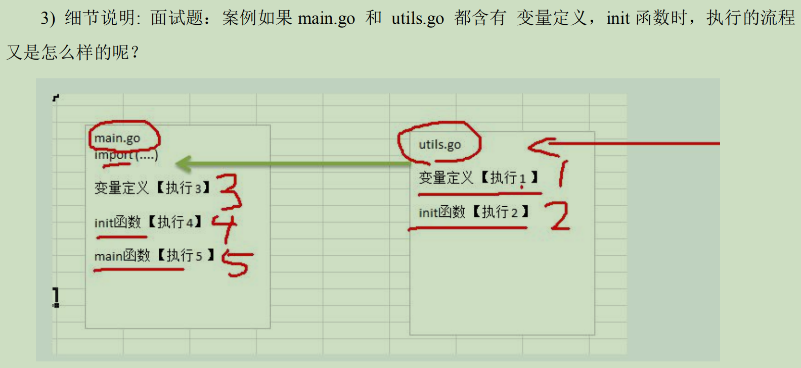


### 4.匿名函数

介绍：Go支持匿名函数，匿名函数就是没有名字的函数，如果我们某个函数只是希望使用一次可以考虑使用匿名函数，匿名函数也可以实现多次调用。

#### 匿名函数使用方式

1. 在定义匿名函数时直接使用

   ```go
   //这种方式匿名函数只能使用一次
   res1 := func (n1 int, n2 int) int {
         return n1 + n2
   }(10, 20)
   fmt.Println("res1=", res1)
   
   ```

   

2. 将匿名函数赋给一个变量(函数变量)，再通过该变量来调用匿名函数

   ```go
   //方式二：赋给变量
   a := func (n1 int, n2 int) int {
       return n1 - n2
   }
   res2 := a(10,40)
   fmt.Println("res2=", res2)
   ```

#### 全局匿名函数

将匿名函数赋值给一个全局变量，这个匿名函数就成为全局匿名函数，可以在程序中有效

```go
package main
import "fmt"
var (
   globalAnonymousFunc = func(n1 int, n2 int) int {
      return n1 * n2
   }
)
func main() {
   res3 := globalAnonymousFunc(7,9)
   fmt.Println("res3=", res3)
}
```


### 5.闭包

#### 概念

介绍：闭包就是**一个函数**和与**其相关的引用环境**组合的一个**整体**(实体)

```go
package main

import (
   "fmt"
)

func AddUpper() func (int) int {
   var n int = 10
   var str = "hello"
   return func (x int) int {
      n = n + x
      str += string(x+64)
      fmt.Println("str=", str)
      return n
   }
}

func main() {
   //使用前面的代码
   f := AddUpper()
   fmt.Println(f(1)) //str= helloA 11
   fmt.Println(f(2)) //str= helloAB 13
   fmt.Println(f(3)) //helloABC 16
    
    f2 := AddUpper()
   fmt.Println(f2(1)) //str= helloA 11
    
    //1.AddUpper 是一个函数，返回的数据类型是 func(int) int
    //2.闭包说明 返回的是一个匿名函数，但是这个匿名函数引用到函数外的n,因此这个匿名函数就和n形成一个整体，构成闭包
    //3.可以这样理解:闭包就是类，n是字段，函数是操作。函数和它使用到的n构成闭包
    //4.当我们反复的调用f函数时，因为n是初始化一次，因此每调用一次就进行累计
    //5.我们要搞清楚闭包的关键，就是要分析出返回的函数它引用到哪些变量，因为函数和它引用到的变量共同构成闭包
}
```


#### 最佳实践

需求：编写一个函数，具体要求如下

```txt
//1.编写一个函数 makeSuffix(suffix string) 可以接收一个文件后缀名(比如.jpg),并返回一个闭包
//2.调用闭包，可以传入一个文件名，如果该文件名没有指定的后缀，则返回 文件名.jpg。反之，则返回原文件名
//3.要求使用闭包的方式完成
//4.strings.HasSuffix, 返回一个bool值 判断是否有指定的后缀
```

```go
package main

import (
   "strings"
   "fmt"
)

func makeSuffix(suffix string) func(string) string {
   return func (fileName string) string {
      if strings.HasSuffix(fileName,suffix) {
         return fileName
      } 
      return fileName + suffix
      
   }
}

func main() {
   f := makeSuffix(".jpg")
   fmt.Println("dogName = ",f("dog.jpg"))
   fmt.Println("catName = ",f("cat"))
}
//总结和说明
//1.返回的匿名函数和 makeSuffix(suffix string) 的 入参 suffix变量 组成了一个闭包，因为返回的匿名函数引用到了suffix
//2.使用闭包的好处，如果使用传统方法，需要每次都传入suffix,而使用闭包传入一次suffix可以反复使用。可以把匿名函数引用到的变量(suffix)保留下来，复用。 传统的方法函数调用一次它的栈就销毁了。
```


### 6.错误处理

#### 1.引出

```go
package main
import (
   "fmt"
)
func test() int{
   n1 := 10
   n2 := 0
   res := n1/n2
   return res
}
func main() {
   res := test()	
   fmt.Printf("res=%v", res)
}
//总结
//1.在默认情况下，当发生错误后(panic),程序就会退出（崩溃）
//2.如果我们希望：发生错误后，可以捕获到错误，并进行处理，保证程序可以继续执行。
//还可以在捕获错误后，给管理员一个提示(邮件，短信...)
```

#### 2.基本说明

1. Go 追求简洁优雅，所以，Go 语言不支持传统的 try...catch...finally 这种处理
2. Go 中引入的处理方式为：**defer**，**panic**，**recover**
3. 这几个异常的使用场景可以这么简单描述：Go中可以抛出一个panic 的异常，然后在defer中通过recover捕获这个异常，然后正常处理。
4. 进行错误处理后，程序不会轻易挂掉，如果加入预警代码，就可以让程序更加的健壮。

#### 3.使用defer + recover处理错误

```go
package main
import (
   "fmt"
)
func test() int{
   //使用defer + recover 来捕获并处理异常
   defer func() {
      //recover()内置函数，可以捕获异常
      err := recover() 
      if err != nil {
         fmt.Println("err=", err)
             //发送邮件给管理员
         fmt.Println("发送邮件给admin!qq.com")
      }
   }()
   n1 := 10
   n2 := 0
   res := n1/n2
   return res
}
func main() {
   res := test()
   fmt.Printf("res=%v\n", res)
   fmt.Println("main()下面的代码..")
}
```


#### 4.自定义错误

Go 程序中，也支持自定义错误，使用errors.New 和 panic 内置函数

1. errors.New("错误说明")，会返回一个 error 类型的值，表示一个错误
2. panic 内置函数，接收一个interface{} 类型的值(也就是任何值了)作为参数。可以接收error类型的变量，**输出错误信息，并退出程序**。

```go
package main
import (
   "fmt"
   "errors"
)
//函数：取读取配置文件 init.conf的信息
//如果文件名传入不正确，我们就返回一个自定义的错误
func readConf(name string) (err error) {
   if name == "config.ini" {
      //读取
      return nil
   } else {
      //返回一个自定义错误
      return errors.New("读取文件错误..")
   }
}
func testRead() {
   err := readConf("config.int")
   if err != nil {
      panic(err)
   }
   fmt.Println("testRead后面的代码")
}
func main() {
   testRead();
   fmt.Println("main()下面的代码..")
}
```

## 5.函数续 defer、参数传递方式

### 7. defer

#### 7.1. 为什么需要defer

​	在函数中，程序员经常需要创建资源(比如：数据库连接、文件句柄、锁等)，为了在函数执行完毕后，及时的释放资源，Go的设计者提供defer(延时机制)。

#### 7.2 defer的注意事项和细节

1. 当go 执行到一个defer 时，不会立即执行defer后的语句，而是将defer 后的语句压入到一个栈中，然后继续执行函数下一个语句。
2. 当函数执行完毕后，再从defer 栈中，依次从栈顶取出语句执行(注：遵守栈 先入后出的机制)
3. **在defer 将语句放入到栈时，也会将相关的值拷贝同时入栈**

#### 7.3 最佳实践

defer 最主要的价值是在，当函数执行完毕后，可以及时的释放函数创建的资源。

```go
func test01() {
    //关闭文件资源
    file = openFile(文件名)
    defer file.close()
}

func test02() {
    //释放数据库资源
    connect = openDatabase()
    defer connect.close()
}

//说明
//1.在go 编程中的通常做法时，创建资源后，比如(打开了文件，获取数据库的连接或锁资源等),可以执行 defer file.Close() defer connect.Close()
//2.在 defer 后，可以继续使用创建的资源
//3. 当函数执行完毕后，系统会依次从defer 栈中，取出语句，关闭资源
```


### 8.函数参数传递方式

#### 1.基本介绍

值类型参数默认值传递，引用类型参数默认引用传递

#### 2.两种传递方式

1. 值传递
2. 引用传递

```txt
其实，不管是值传递还是引用传递，传递给函数的都是变量的副本，不同的是,值传递的是值的拷贝，引用传递的是地址的拷贝，一般来说,地址拷贝效率高，因为数据量较小。
```

#### 3.值类型和引用类型

1. **值类型**：基本数据类型 int 系列，float 系列，bool，string、数组和结构体
2. **引用类型**：指针、slice、切片、map、管道chan、interface 等都是引用类型

#### 4.值传递和引用传递使用特点

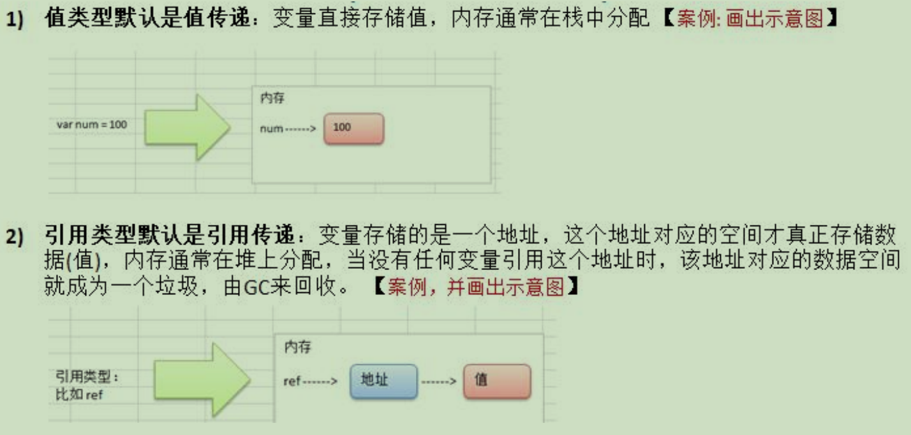

3. 如果希望函数内的变量能修改函数外的变量，可以传入变量的地址&，函数内以指针的方式操作变量。从效果上看类似引用。

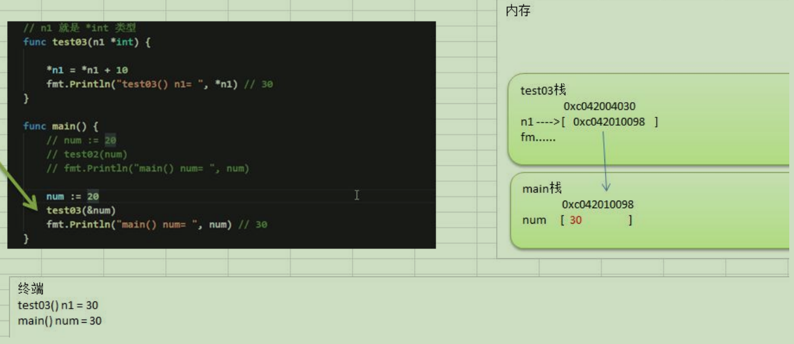


### 9.变量作用域

1. 函数内部声明/定义的变量叫局部变量，**作用域仅限于函数内部**
2. 函数外部声明/定义的变量叫全局变量，作用域在整个包都有效，如果其首字母大写，则作用域在整个程序有效
3. 如果变量是在一个代码块，比如 for/if 中，那么这个变量的作用域就在该代码块


### 10.字符串常用的系统函数

```go
package main

import (
   "fmt"
   "strconv"
   "strings"
)

func main() {

   str := "hello嗨" 
   //1.统计字符串的长度，按字节 len(str) 
   fmt.Println("str len=",len(str)) //8 按字节返回

   //2.字符串遍历，同时处理有中文的问题 r := []rune(str)
   strArr := []rune(str)
   for i := 0; i < len(strArr); i++ {
      fmt.Printf("字符=%c\n",strArr[i])
   }

   //3.字符串转整数：func Atoi(s string) (i int, err error)
   n3, err := strconv.Atoi("233")
   if err != nil {
      fmt.Println("转换错误", err)
   } else {
      fmt.Println("转成的结果是：",n3)
   }

   //4.整数转字符串 func Itoa(i int) string
   str4 := strconv.Itoa(233)
   fmt.Printf("str4值：%v,类型：%T", str4, str4)

   //5.字符串转  []byte: var bytes = []byte("hello go") 
   var bytes = []byte("hello world")
   fmt.Printf("bytes=%v\n", bytes)

   //6.[]byte转 字符串：str = string([]byte{22,23,33})
   str6 := string([]byte{97, 98, 99})
   fmt.Printf("str6=%v\n", str6)

   //7. 10进制转 2,8,16 进制func FormatInt(i int64, base int) string
   str7 := strconv.FormatInt(77,2)
   fmt.Printf("77对应的二进制是%v\n",str7) 
   str7 = strconv.FormatInt(77,16)
   fmt.Printf("77对应十六进制是%v\n",str7) 

   //8.判断字符串s是否包含子串substr：func Contains(s, substr string) bool
   if strings.Contains("watermelo","water") {
      fmt.Println("watermelo has water")
   }

   //9.统计一个字符串有几个指定的子串：func Count(s, sep string) int
   num := strings.Count("banana","an")
   fmt.Printf("an个数%v\n", num)

   //10.不区分大小写的字符串比较(==区分字母大小写)：func EqualFold(s, t string) bool
   b1 := strings.EqualFold("abc","ABC")
   b2 := ("abc" == "ABC")
   fmt.Printf("b1 is %v, b2 is %v\n", b1, b2)

   //11.返回子串在字符串第一次出现的index,如果没有返回-1:func Index(s, sep string) int
   idx := strings.Index("ACC_qaq","qaq")
   fmt.Printf("idx=%v\n", idx)

   //12.返回子串在字符串最后一次出现的index,如果没有返回-1：func LastIndex(s, sep string) int
   lastIdx := strings.LastIndex("watemelo","me")
   fmt.Printf("lastIdx=%v\n",lastIdx)

   //13.将指定的子串替换成另外一个子串 n指替换个数,-1全替换：func Replace(s, old, new string, n int) string  
   str13 := "hello go go"
   str13New := strings.Replace(str13,"go","world",-1)
   fmt.Printf("新字符串：%v\n", str13New)

   //14.按照指定的某个字符，为分割标识，将一个字符串拆分成字符串数组：func Split(s, sep string) []string
   str14Arr := strings.Split("banana","a")
   fmt.Printf("strArr=%v 类型： %T\n", str14Arr, str14Arr)

   //15.将字符串的字母进行大小写的转换：func ToLower(s string) string func | ToUpper(s string) string
   fmt.Println(strings.ToLower("GG")) 
   fmt.Println(strings.ToUpper("Gg"))

   //16.将字符串左右两边的空格去掉：func TrimSpace(s string) string
   fmt.Println(strings.TrimSpace(" wo yao xue go "))
   
   //17.返回将s前后端所有cutset包含的utf-8码值都去掉的字符串：func Trim(s string, cutset string) string
   fmt.Println(strings.Trim("!hello!","h!"))
   
   //18.返回将s前端所有cutset包含的utf-8码值都去掉的字符串：func TrimLeft(s string, cutset string) string
   fmt.Println(strings.TrimLeft("!hello!","!"))

   //19.返回将s后端所有cutset包含的utf-8码值都去掉的字符串：func TrimRight(s string, cutset string) string
   fmt.Println(strings.TrimRight("!hello!","!o"))

   //20.判断字符串是否以指定的字符串开头：func HasPrefix(s, prefix string) bool
   b20 := strings.HasPrefix("http://192.168.0.1","http")
   fmt.Printf("b20 is %v, type is %T\n",b20 ,b20)

   //21.判断字符串是否以指定字符串结束：func HasSuffix(s, suffix string) bool
   if strings.HasSuffix("main.go","go") {
      fmt.Println("main.go suffix is go")
   }
}
```

### 11.时间和日期相关函数

import "time"

time包提供了时间的显示和测量用的函数。日历的计算采用的是公历。

```go
package main

import (
   "fmt"
   "time"
)

func main() {
   //go 中时间和日期相关函数和方法
   //1.获取当前时间 
   now := time.Now()
   fmt.Printf("now值：%v,类型：%T\n", now, now)
   //now值：2022-03-07 22:25:39.5714043 +0800 CST m=+0.003574401,类型：time.Time

   //2.通过now获取 年月日 时分秒
   fmt.Printf("年=%v\n",now.Year())
   fmt.Printf("月=%v\n",now.Month())
   fmt.Printf("日=%v\n",now.Day())
   fmt.Printf("时=%v\n",now.Hour())
   fmt.Printf("分=%v\n",now.Minute())
   fmt.Printf("秒=%v\n",now.Second())

   //3.格式化日期时间
   //方式一：使用Printf 或者 Sprintf
   dateStr := fmt.Sprintf("当前时间：%d-%d-%d %d:%d:%d\n",now.Year(), 
   now.Month(), now.Day(), now.Hour(), now.Minute(), now.Second())
   fmt.Printf("dateStr=%v",dateStr)
   //方式二：Format根据layout指定的格式返回t代表的时间点的格式化文本表示
   //func (t Time) Format(layout string) string 各个数字固定
   fmt.Printf(now.Format("2006/01/02 15:04:05"))
   fmt.Println()
   fmt.Printf(now.Format("04")) //打印当前分钟
   fmt.Println()

   //4.时间常量和休眠
   //需求，每隔一秒钟打印一个数字，10退出
   for i := 0; i <= 10 ; i++ {
      fmt.Println("i = ", i)
      time.Sleep(1000 * time.Millisecond)
   }

   //5.获取当前unix时间戳 和 unixnano时间戳
   //func (t Time) Unix() int64 
   //func (t Time) UnixNano() int64 
   //作用：获取随机数
   fmt.Printf("unix时间戳=%v\n", now.Unix())
   fmt.Printf("unixnano时间戳=%v\n", now.UnixNano())

}
```

**时间常量type Duration)**

```go
type Duration int64
```

Duration类型代表两个时间点之间经过的时间，以纳秒为单位。可表示的最长时间段大约290年。

```go
const (
    Nanosecond  Duration = 1
    Microsecond          = 1000 * Nanosecond
    Millisecond          = 1000 * Microsecond
    Second               = 1000 * Millisecond
    Minute               = 60 * Second
    Hour                 = 60 * Minute
)
```


### 12 内置函数

Go设计者为了编程方便，提供了一些函数供我们直接使用。我们称这些函数为Go的内置函数。

#### 1.len

```
func len(v Type) int
```

内建函数len返回 v 的长度，这取决于具体类型：

```
数组：v中元素的数量
数组指针：*v中元素的数量（v为nil时panic）
切片、映射：v中元素的数量；若v为nil，len(v)即为零
字符串：v中字节的数量
通道：通道缓存中队列（未读取）元素的数量；若v为 nil，len(v)即为零
```

#### 2.new

```go
package main
import (
   "fmt"
)
func main() {
   num1 := 100
   fmt.Printf("num1的类型%T, num1的值=%v, num1的地址%v\n",
      num1, num1, num1)
   //2.内建函数new分配内存。其第一个实参为类型，而非值。
   //其返回值为指向该类型的新分配的零值的指针。
   //func new(Type) *Type
   num2 := new(int)
   *num2 = 77
   //num2的类型*int, num2的值=0xc0000aa058(系统分配),
   // num2的地址0xc0000ce020(系统分配), num2指向的值=77
   fmt.Printf("num2的类型%T, num2的值=%v, num2的地址%v, num2指向的值=%v\n",
      num2, num2, &num2, *num2)
}
```

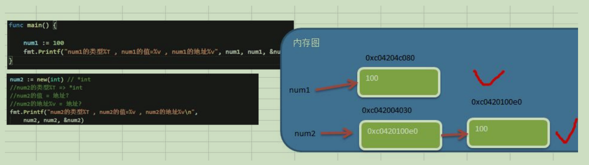

#### 3.make

```
func make(Type, size IntegerType) Type
```

内建函数make分配并初始化一个类型为切片、映射、或通道的对象。其第一个实参为类型，而非值。make的返回类型与其参数相同，而非指向它的指针。其具体结果取决于具体的类型：

```
切片：size指定了其长度。该切片的容量等于其长度。切片支持第二个整数实参可用来指定不同的容量；
     它必须不小于其长度，因此 make([]int, 0, 10) 会分配一个长度为0，容量为10的切片。
映射：初始分配的创建取决于size，但产生的映射长度为0。size可以省略，这种情况下就会分配一个
     小的起始大小。
通道：通道的缓存根据指定的缓存容量初始化。若 size为零或被省略，该信道即为无缓存的。
```


## 6.数组和切片

介绍：数组可以存放多个同一类型数据。数组也是一种数据类型，**在Go中数组是值类型**。

### 1.数组定义和内存布局

**数组的定义**

```go
var 数组名 [数组大小]数据类型
var a[7]int
赋初值 a[0] = 1  ...

//四种初始化方式
var arr1 [3]int = [3]int{1, 2, 4}

var arr2 = [3]int{3, 6, 9}

var arr3 = [...]int{2,3,3}

var arr4 = [...]int{1: 233, 0: 777, 4: 666}
```

**数组在内存布局**

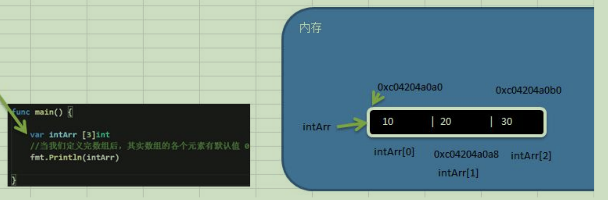

1. 数组的地址可以通过数组名来获取 &intArr
2. 数组的第一个元素的地址，就是数组的首地址
3. 数组的各个元素的地址间隔是依据数组的类型决定，比如 int64 ->8  int32->4

### 2.数组遍历

1. 常规
2. for-range 结构遍历

```go
for index, value := range array {
    ...
}

//1.第一个返回值 index 是数组索引
//2.第二个value是该索引位置的值
//3.它们都是仅在for循环内部可见的局部变量
//4.遍历数组元素的时候，如果不想使用索引index, 可以直接把索引index标为下划线
//5.index 和 value 的名称不是固定的，即程序员可以自行指定， 一般命名为 index 和value

```

### 3.数组使用注意事项和细节

1. 数组是多个**相同类型**数据的组合，一个数组一旦声明/定义了，其长度是固定的，不能动态变化

2. var arr []int   这时 arr 是切片

3. 数组中的元素可以是任何数据类型，包括值类型和引用类型， 但是不能混用。

4. 数组创建后， 如果没有赋值，有默认值(零值)

5. 使用数组的步骤 1.声明数组并开辟空间 2.给数组各个元素赋值(默认零值) 3.使用数组

6. 数组索引从0开始

7. 数组索引必须在指定范围内使用，否则报 panic: 数组越界

8. Go 的数组属值类型，在默认情况下是值传递，因此会进行值拷贝。**数组间不会相互影响**

9. **如果想在其它函数中，取修改原来的数组，可以使用引用传递(指针方式)**

10. 长度是数组类型的一部分，在传递函数参数时 需要考虑数组的长度

    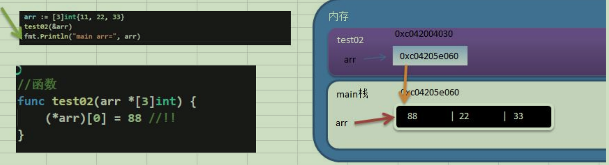

    

### 2.切片

**1.切片的基本介绍**

1. 切片的英文 slice

2. 切片是数组的一个引用，因此**切片是引用数据类型**，在进行传递时，遵守引用传递的机制。

3. 切片的使用和数组类似，遍历切片、访问切片的元素和求切片长度len(slice)都一样

4. 切片的长度是可以变化的，因此切片是一个**可以动态变化数组**。

5. 切片定义的基本语法：

    var 切片名 []类型

**2.切片的内存布局分析**

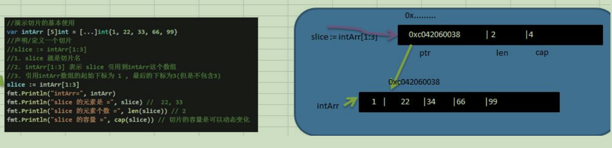

1. slice是一个引用类型

2. slice从底层上来说，是一个数据结构(struct结构体)

   ```go
   type slice struct {
       ptr *[2]int
       len int
       cap int
   }
   ```


**3.切片创建的3种方式**

1. 定义一个切片，然后让切片去引用一个已经创建好的数组

   ```go
   var intArr = [...]int{7, 22, 11, 66, 88,99}
   slice := intArr[1:3]
   fmt.Println("intArr=", intArr)
   fmt.Println("slice 的元素是 =", slice)
   fmt.Println("slice 的元素个数 =", len(slice))
   fmt.Println("slice 的容量 =", cap(slice))
   ```

2. 通过make来创建切片

   ```go
   基本语法：var 切片名 []type = make([]type, len, [cap])  
   cap：指定切片容量，可选，如果分配了cap,则要求cap >= len
   
   var slice []float64 = make([]float64, 5, 10)
   slice[1] = 10
   slice[4] = 20
   fmt.Println(slice)
   fmt.Println("slice的size=", len(slice))
   fmt.Println("slice的cap=", cap(slice))
   //1.通过 make 方式创建切片可以指定切片的大小和容量
   //2.如果没有给切片的各个元素赋值，那么就会使用默认值
   //3.通过make方式创建的切片对应的数组是由 make 底层维护，对外不可见, 即只能通过slice访问各个元素
   ```

   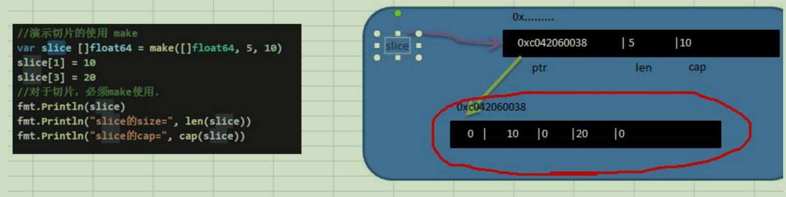

   ```txt
   方式1和方式2的区别
   ①方式1是直接引用数组，这个数组是事先存在的，程序员是可见的。
   ②方式2是通过make来创建切片，make也会创建一个数组，是由切片在底层进行维护，程序员是看不见的。
   ```

   

3. 定义一个切片，直接就指定具体数组，使用原理类似make的方式

```go
//第三种方式
var sliceStr []string = []string{"水星","金星","地球","火星"}
fmt.Println(sliceStr)
fmt.Println("sliceStr的size=", len(sliceStr)) //4
fmt.Println("sliceStr的cap=", cap(sliceStr)) //4
```

**4.切片遍历的方式**

```go
package main
import (
   "fmt"
)
func main() {
   //方式一：使用常规的for循环遍历切片
   var arr [5]int = [...]int{11, 22, 33, 44, 55}
   slice := arr[1:4]
   for i := 0; i < len(slice); i++ {
      fmt.Printf("slice[%d]=%v\n", i, slice[i])
   }
 
   //方式二：for-range
   for i, v := range slice {
      fmt.Printf("slice[%d]=%v\n", i, v)
   }
}
```


**5.切片注意事项和细节**

1. 切片初始化时 var slice = arr[startIndex:endIndex]  左闭右开

2. 切片初始化时，仍然不能越界。范围在 [0-len(arr)] 之间，但是可以动态增长

3. cap是一个内置函数，用于统计切片的容量，即最大可以存放多少个元素

4. 切片定义完后，还不能使用，因为本身是一个空的，需要让其引用到一个数组，或者 make一个空间供切片来使用

5. 切片可以继续切片

6. 用 append 内置函数，可以对切片进行动态追加

   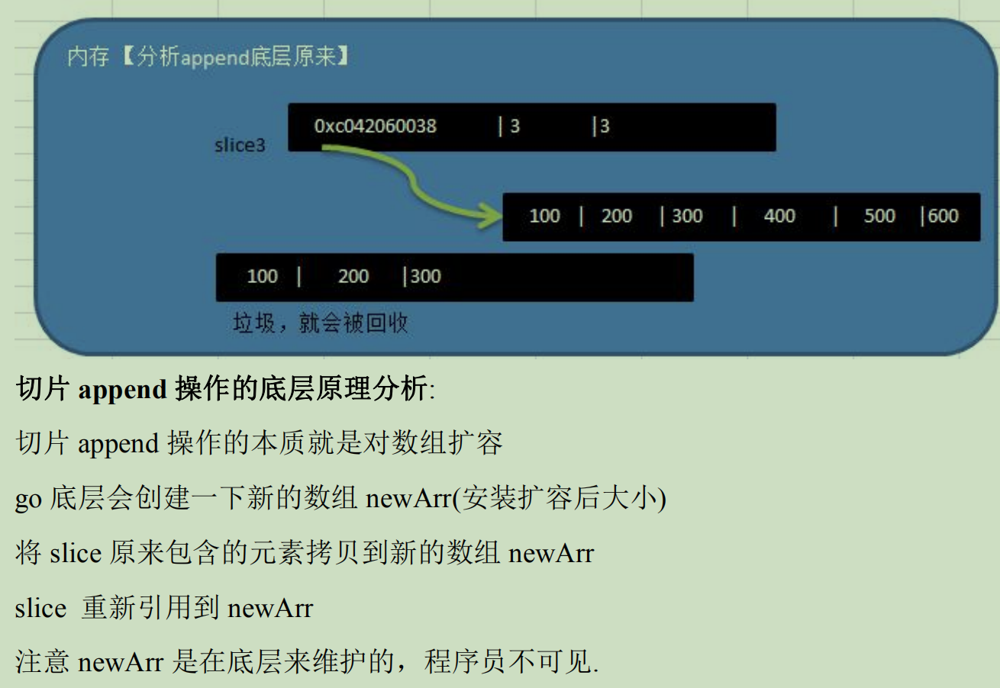

7. 切片的拷贝操作：

   ①copy(slice1, slice0) 参数的数据类型是切片

   ②slice1和slice0数据空间独立，互不影响

8. 切片是引用类型，在传递时，遵循引用传递机制。

**6.string和slice**

1. string底层是一个byte数组，因此string也可以进行切片处理

2. string和切片在内存的形式

   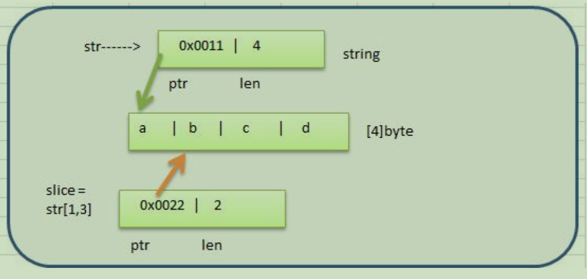

3. string是不可变的，也就说不能通过 str[0] = 'z' 方式来修改字符串 报错(strings are immutable)

4. 如果需要修改字符串，可以先将 string ->（[]byte / 或者 []rune） -> 修改 ->重写转成string

```go
package main 
import (
   "fmt"
)
func main() {
   //string底层是一个byte数组，因此string也可以进行切片处理
   str := "hello@qq.com"
   //使用切片获取到
   slice := str[6:]
   fmt.Println(slice)
//	str[0] = 'w'  报错(strings are immutable)
   slice2 := []byte(str)
   slice2[0] = 'w'
   str = string(slice2)
   fmt.Println("str=", str)
   //[]rune 按按字符处理
   slice3 := []rune(str)
   slice3[0] = '嗨'
   str = string(slice3)
   fmt.Println("str=", str)
}
```


## 7.排序、查找和二维数组

### 1.排序基本介绍

排序是将一组数据，依指定的顺序进行排列的过程。

排序的分类：

1. 内部排序：

   ​	指将需要处理的所有数据都加载到内部存储器中进行排序。

   ​    包括(交换式排序法，选择式排序法和插入式排序法)

2. 外部排序

   ​	数据量过大，无法全部加载到内存中，需要借助外部存储进行排序。

   ​    包括(合并排序法和直接合并排序法)

#### 交换式排序法-冒泡排序(Bubble Sorting)

```go
package main

import (
   "fmt"
)

//冒泡排序
func BubbleSort(arr *[5]int) {
   fmt.Println("排序前arr=", *arr)
   var temp int
   for i := 0; i < len(*arr) - 1; i++ {
      for j := 0; j < len(*arr) - 1 - i; j++ {
         if (*arr)[j] > (*arr)[j + 1] {
            temp = (*arr)[j]
            (*arr)[j] = (*arr)[j + 1]
            (*arr)[j + 1] = temp
         }
      }
   } 
   fmt.Println("排序后arr=", *arr)
}

func main() {
   //定义数组
   arr := [5]int{96,24,58,77,32}
   //调用排序函数
   BubbleSort(&arr)
   fmt.Print("main arr=", arr)
}
```

### 2.查找的介绍

​	在Go中我们常用的查找有两种：1.顺序查找  2.二分查找(该数组式有序)

#### 二分查找

```go
//二分查找
func BinaryFind(arr *[5]int, leftIndex int, rightIndex int, findVal int) {
   if leftIndex > rightIndex {
      fmt.Println("找不到")
      return
   }
   //中间下标
   middle := (leftIndex + rightIndex)/2
   fmt.Println("middle = ", middle)
   if(*arr)[middle] > findVal {
      BinaryFind(arr, leftIndex, middle - 1, findVal)
   } else if(*arr)[middle] < findVal {
      BinaryFind(arr,middle + 1 , rightIndex, findVal)
   } else {
      fmt.Printf("找到了,下标为%v\n", middle)
   }
}

```

### 3.二维数组

#### 1.二维数组内存布局

语法：var 数组名 [行数] [列数]类型

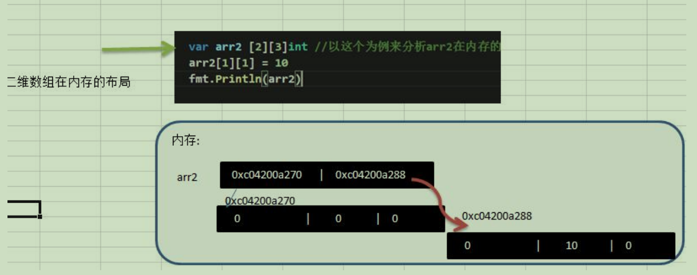

#### 2.使用和遍历方式

```go
package main

import (
   "fmt"
)

func main() {
   //使用方式一：先声明后赋值
   //声明二维数组  
   var arr[4][6]int
   //赋初值
   arr[1][2] = 1
   arr[2][3] = 7

   //使用方式二：直接初始化
   var arr2 [2][3]int = [2][3]int{{1, 2, 3}, {4, 5, 6}}

   //遍历方式一
   for i := 0; i < len(arr); i++ {
      for j := 0; j < len(arr[i]); j++ {
         fmt.Print(arr[i][j], " ")
      }
      fmt.Println()
   }
   //遍历方式二
   for i, row := range arr2 {
      fmt.Printf("第%v行：", i)
      for _, column := range row {
         fmt.Print(column, " ")
      }
      fmt.Println()
   }
}
```


## 8.map

### 1.基本介绍

map 是 key-value 数据结构，又称为字段或者关联数组。类似其它编程语言的集合，在 编程中经常使用。

#### 基本语法

```go
var map 变量名 map[keytype]valuetype
//key 类型：bool, 数字, string, 指针, channel 还可以是只包含前面几个类型的接口， 结构体，数组  
//通常key为int、string 注意:slice、map还有function不可以，因为这几个没法 == 来判断

//valuetype value的类型和key基本一样 通常为：数字(整数，浮点数),string,map,struct
```

#### 声明举例

```go
var a map[string]string
var a map[string]int
var a map[int]string
var a map[string]map[string]string
//注意：声明是不会分配内存的，初始化需要make，分配内存后才能赋值和使用。
```

```go
//map声明
var heroes map[string]string
heroes = make(map[string]string, 10)
heroes["hero01"] = "莱拉"
heroes["hero02"] = "塔卡"
heroes["hero02"] = "隐狐"
fmt.Println(heroes)
//1.map在使用前一定要make
//2.map的key是不能重复,如果重复了，则以最后这个key-value为准
//3.map的value是可以相同的

```

### 2.map的使用

```go
//方式一: 先声明再make
var heroes map[string]string
heroes = make(map[string]string, 10)
heroes["hero01"] = "莱拉"
heroes["hero02"] = "塔卡"
heroes["hero03"] = "格温"
fmt.Println(heroes)

//方式二：声明时make
cities := make(map[string]string, 10)
cities["c01"] = "荆州"
cities["c02"] = "武汉"
cities["c03"] = "上海"
fmt.Println(cities)

//方式三：
languages := map[string]string{
	"lan01" : "English",
	"lan02" : "中文",
}
languages["lan03"] = "Go"
fmt.Println(languages)

//案例演示 value也为map的演示
stuMap := make(map[string]map[string]string)
stuMap["001"] = make(map[string]string,3)
stuMap["001"]["name"] = "杰克"
stuMap["001"]["sex"] = "男"
stuMap["001"]["address"] = "美国"

stuMap["002"] = make(map[string]string,3)
stuMap["002"]["name"] = "罗丝"
stuMap["002"]["sex"] = "女"
stuMap["002"]["address"] = "英国"
fmt.Println(stuMap)
```


### 3.map的增删改查

```go
package main
import (
	"fmt"
)
func main() {
	heroes := make(map[string]string, 10)
	heroes["hero01"] = "莱拉"
	heroes["hero02"] = "史卡夫"
	fmt.Println(heroes)

	//增加和修改
	heroes["hero03"] = "塔卡"	
	fmt.Println(heroes)
	heroes["hero03"] = "隐狐"	
	fmt.Println(heroes)

	//查找
	hero, exist := heroes["hero01"]
	if exist {
		fmt.Printf("hero %v is exist\n", hero)
	} else {
		fmt.Println("hero is not exist")
	}

	//删除
	delete(heroes, "hero02")
	fmt.Println(heroes)
	//如果想一次性删除所有entry,
	//1.遍历逐个删除 
	//2.直接make一个新空间
	heroes = make(map[string]string)
	fmt.Println(heroes)
}
```


### 4.map的遍历

**map的遍历使用for-range的结构遍历**

```go
package main

import (
	"fmt"
)

func main() {
	heroes := make(map[string]string, 10)
	heroes["hero01"] = "莱拉"
	heroes["hero02"] = "史卡夫"
	heroes["hero03"] = "塔卡"
	fmt.Println(heroes)
	//map的长度 len()
	fmt.Printf("有%v个英雄\n", len(heroes))
	for k, v := range heroes {
		fmt.Printf("%v = %v\n", k, v)
	}

	//使用for-range 遍历value为map的map
	stuMap := make(map[string]map[string]string)
	stuMap["001"] = make(map[string]string,3)
	stuMap["001"]["name"] = "杰克"
	stuMap["001"]["sex"] = "男"
	stuMap["001"]["address"] = "美国"

	stuMap["002"] = make(map[string]string,3)
	stuMap["002"]["name"] = "罗丝"
	stuMap["002"]["sex"] = "女"
	stuMap["002"]["address"] = "英国"
	fmt.Println(stuMap)
	for k1, v1 := range stuMap {
		fmt.Println("k1=", k1)
		for k2, v2 := range v1{
			fmt.Printf("\t %v=%v\n", k2, v2)
		}
	}
}
```


### 5.map切片

切片的数据类型如果是map，则我们称为 slice of map, map切片，这样使用则map个数就可以动态变化了。

```go
package main
import (
	"fmt"
)
func main() {
	//长度可以动态变化的map切片

	//1.声明一个map切片
	monsters := make([]map[string]string, 2)
	//2. 增加第一个monster信息
	if monsters[0] == nil {
		monsters[0] = make(map[string]string,2)
		monsters[0]["name"] = "金角"
		monsters[0]["age"] = "567"
	}
	if monsters[1] == nil {
		monsters[1] = make(map[string]string,2)
		monsters[1]["name"] = "银角"
		monsters[1]["age"] = "555"
	}
	//通过内置函数append 动态增加切片
	newMonster := map[string]string{
		"name" : "灰犀牛",
		"age" : "200",
	}
	monsters = append(monsters, newMonster)
	fmt.Println(monsters)
}
```

### 6.map排序

1. go中没有一个专门的方法针对map的key进行排序
2. go中的map默认时无序的，不是按照添加顺序存放的，每次遍历，得到的输出可能不一样
3. go中map的排序，是先将key进行排序，然后根据key值遍历输出即可

```go
package main

import (
	"fmt"
	"sort"
)

func main() {

	//map的排序
	map1 := make(map[int]int)
	map1[1] = 90
	map1[20] = 88
	map1[10] = 11
	map1[3] = 2
	fmt.Println(map1)

	var keys []int
	for k, _ := range map1 {
		keys = append(keys, k)
	}
	fmt.Println("pre-keys", keys)
	sort.Ints(keys)
	fmt.Println("keys", keys)

	for _, k := range keys {
		fmt.Printf("map1[%v]=%v \n", k, map1[k])
	}
}
```

### 7.map使用细节

1. map是引用类型，遵循引用类型传递的机制，在一个函数接收map,修改后， 会直接修改原来的map
2. map的容量达到后，再想给map增加元素，会自动扩容，并不会发生panic,也就是说map能动态的增长 键值对(key-value)
3. map的 value 也经常使用 **struct 类型**，更适合管理复杂的数据(比value是一个map更好)


