# go进阶

## 9.结构体-面向对象编程

### **1.go语言面向对象编程说明**

1. go也支持面向对象编程(OOP)，但是和传统的面向对象编程有区别，并不是纯粹的面向对象语言。所以我们说 go 支持面向对象编程特性是比较准确的。
2. go 没有类(class), go的结构体(struct)和其它编程语言的类(class)有同等的地位，可以理解为go是基于struct来实现OOP特性
3. go面向对象编程非常简洁，去掉了传统OOP语言的继承、方法重载、构造函数和析构函数、隐藏的this指针等等
4. go仍然有面向对象编程的**继承，封装和多态**的特性，只是实现的方法和其它OOP语言不一样,比如继承：go没有extends关键字，继承是通过匿名字段来实现。
5. go面向对象(OOP)很优雅，OOP本身就是语言类型系统(type system)的一部分，通过接口(interface)关联，耦合度低，也非常灵活。go中面向接口编程时非常重要的特性。

### **2.结构体**

#### 1.结构体和结构体变量(实例)的区别和联系

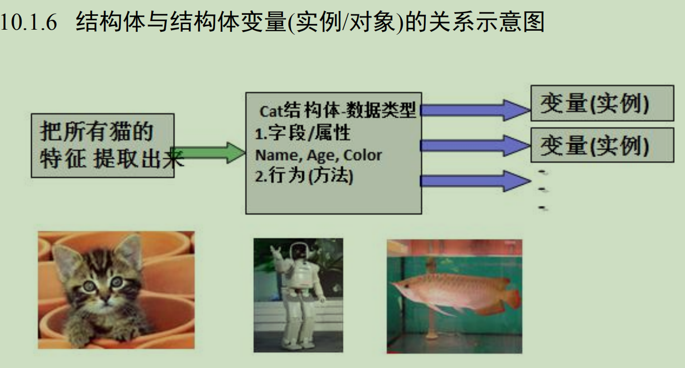

```txt
1.结构体是自定义的数据类型，代表一类事物。
2.结构体变量(实例)是具体的，实际的，代表一个具体变量。
```

#### 2.声明结构体

```go
//基本语法
type 结构体名称 struct {
	field1 type
	field2 type
}
```

#### 3.字段/属性

1. 从概念或叫法上看： 结构体字段 = 属性 =  field
2. 字段是结构体的一个组成部分，一般是**基本数据类型**、**数组**，也可以是**引用类型**。
3. 在创建一个结构体变量后，如果没有给字段赋值，都对应一个零值(默认值)。
4. 如果结构体的字段类型是：指针，slice，和map的零值都是nil,即还没有分配空间。若需要使用这样的字段，需要先make,才能使用
5. 不同结构体变量字段是独立，互不影响，一个结构体变量字段的更改，不影响另一个，**结构体是值类型**

#### 4.创建结构体变量和访问结构体字段

```go
//方式一: 直接声明
var person Person

//方式二：{}
var person Person = Person{}
person := Person{}

//方式三：&
var person *Person = new(Person)

//方式四：{}
var person *Person = &Person{}
```

1. 第三种和第四种方式返回的是 结构体指针
2. 结构体指针访问字段的标准方式应该是：**（*结构体指针）.字段名**
3. 但**go编译器底层**做了一个转化，也支持 **结构体指针.字段名**

#### 5.结构体变量(实例)在内存的布局

**结构体是值类型**

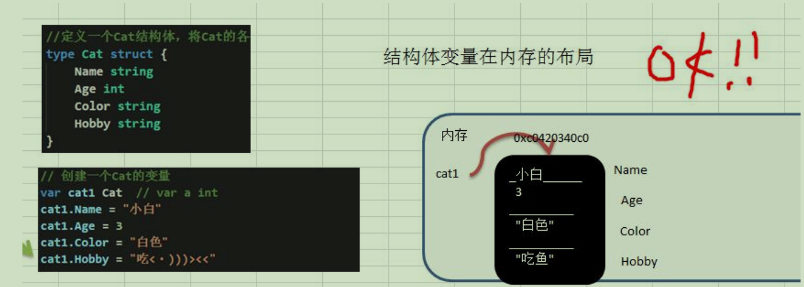

```go
var p1 Person
p1.Age = 10
p1.Name = "小明"
var p2 Person = p1

fmt.Println(p2.Age)
p2.Name = "tom"
fmt.Println("p2.Name=%v p1.Name=%v", p2.Name, p1.Name )
```

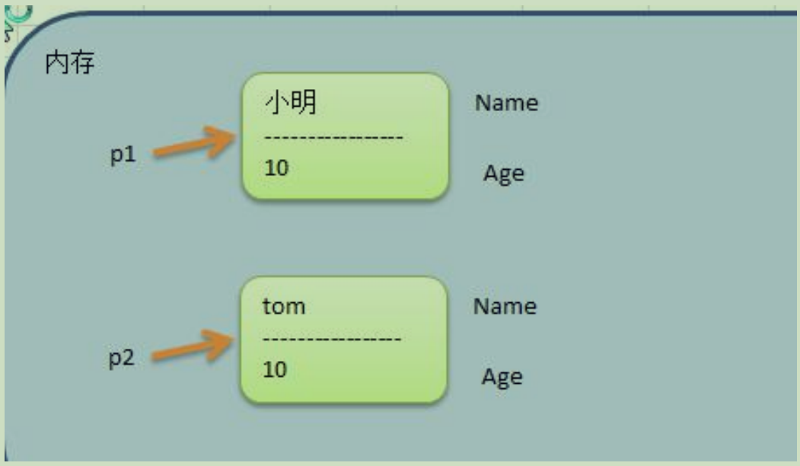

结构体指针

```go
package main

import (
	"fmt"
)

type Person struct{
	Name string
	Age int
}

func main() {

	var p1 Person
	p1.Age = 10
	p1.Name = "小明"

	var p2 *Person = &p1

	fmt.Println((*p2).Age)
	fmt.Println(p2.Age)
	p2.Name = "tom~"
	fmt.Printf("p2.Name=%v p1.Name=%v \n", p2.Name, p1.Name)
	fmt.Printf("p2.Name=%v p1.Name=%v \n", (*p2).Name, p1.Name)
	
	fmt.Printf("p1的地址%p\n", &p1)
	fmt.Printf("p2的地址%p p2的值%p\n", &p2, p2)
}
```

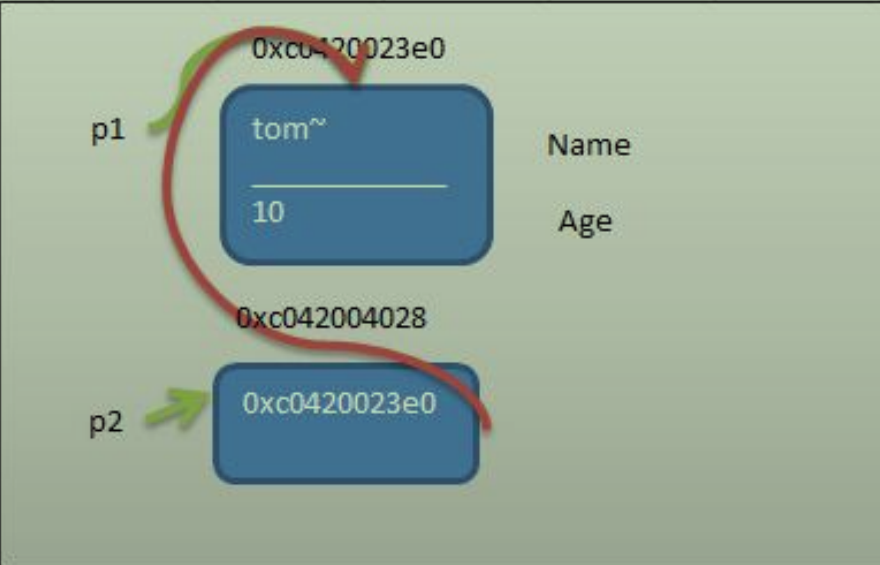

#### 6.结构体的注意事项和使用细节

1. 结构体的所有字段在内存中是连续的
2. 结构体是用户单独定义的类型，和其它类型进行转换时需要有完全相同的字段(名字、个数和类型)
3. 结构体进行type重新定义(相当于取别名)，Go 认为是新的数据类型，但是相互间可强转
4. struct 的每个字段上，可以写上一个 **tag,**该 tag 可以通过反射机制获取，常见的使用场景就是**序列化**和反序列化。

### **3.方法**

**基本介绍**

go中的方法是**作用在指定的数据类型上的**(即：**和指定的数据类型绑定**)，因此**自定义类型**，都可以有方法，而不仅仅是struct

#### 1.方法的声明和调用

```go
package main

import (
	"fmt"
)

type Person struct {
	Name string
}

//给Person类型绑定一份方法
func (person Person) test() {
	person.Name = "one"
	fmt.Println("我的名字是：", p.Name)
}

func main() {

	var p Person 
	p.Name = "zero"
	p.test() //调用方法
	fmt.Println("主函数name: ", p.Name)
}

//1. func (p Person) test() {}  表示Person结构体有一方法，方法名为 test
//2. (p Person) 体现 test 方法是和 Person 类型绑定的
//3. test方法只能通过 Person 类型的变量来调用，而不能直接调用，也不能使用其它类型变量来调用
//4. func (p Person) test() {...} 表示哪个 Person 变量调用, 这个 p 就是它的副本，这点和函数传参非常相似。
```

#### 2.方法的调用和传参机制原理

​	方法的调用和传参机制和函数基本一样，不一样的地方是方法调用时，会将调用方法的变量，当做实参也传递给方法。

```go
package main

import (
	"fmt"
)

type Circle struct {
	radius float64
}

func (circle Circle) area() float64{
	return 3.14 * circle.radius * circle.radius
}

func main() {

	var c Circle
	c.radius = 4.0

	area := c.area()
	fmt.Println("圆c的面积是：", area)
}
// 1.在通过一个变量去调用方法时，其调用机制和函数一样
// 2.不一样的地方，变量调用方法时，该变量本身也会作为一个参数传递到方法(如果变量是值类型，则进行值拷贝，如果变量是引用类型，则进行地址拷贝)
```

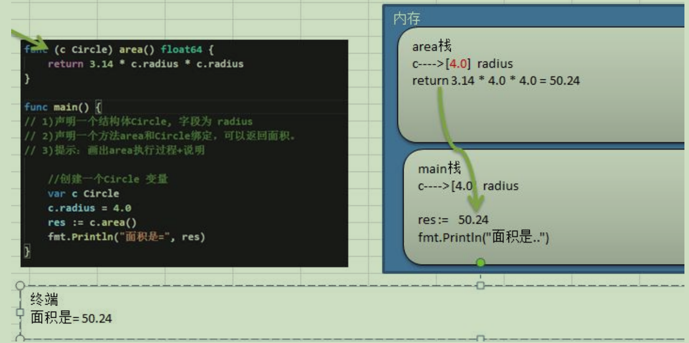

#### 3.方法的声明和定义

```go
func (recevier type) methodName (参数列表) (返回值列表) {
	方法体
	return 返回值
}

//1.参数列表：表示方法输入
//2.recevier type: 表示这个方法和type这个类型进行绑，或者说该方法作用于type类型
//3.receiver type：type 可以是结构体，也可以其它的自定义类型
//4.receiver: 就是type类型的一个变量(实例)， 比如：Person结构体 的一个变量(实例)
//5.返回值列表：表示返回的值，可以多个
//6.方法主体：表示为了实现某一功能代码块
//7.return 语句不是必须的
```

#### 4.方法的注意事项和细节

1. 结构体类型是值类型，在方法调用中，遵循值类型的传递机制，是值拷贝传递方式
2. 如果程序员希望在方法中，修改结构体变量的值，可以通过结构体指针的方式来处理
3. go 中的方法作用在指定的数据类型上的(即：和指定的数据类型绑定)，因此自定义类型，都可以有方法，而不仅仅是struct, 比如 int, float32等都可以有方法
4. 方法的访问范围控制的规则，和函数一样。方法名首字母小写，只能在本包访问，方法首字母大写，可以在本包和其它包访问。
5. 如果一个类型实现了String()这个方法，那么fmt.Println 默认会调用这个变量的 String()进行输出

#### 5.方法和函数区别

1. 调用方式不一样

   函数的调用方式：函数名(实参列表)

   方法的调用方式：变量.方法名(实参列表)

2. 对于普通函数，接收者为值类型时，不能将指针类型的数据直接传递，反之亦然。

3. 对于方法(如struct的方法)，接收者为值类型时，可以直接用指针类型的变量调用方法，反过来也同样可以

总结：

​	1）不管调用形式如何，真正决定是值拷贝还是地址拷贝，看这个方法是和哪个类型绑定。

​	2）如果是和值类型，比如(p Person)，则是值拷贝，如果和指针类型，比如是(p *Person)则是地址拷贝。

### **4.面向对象编程应用实例**

#### 1.步骤

1）声明(定义)结构体，确定结构体名

2）编写结构体的字段

3）编写结构体的方法

### **5.工厂模式**

go的结构体没有构造函数，通常可以使用工厂模式来解决这个问题。

student.go

```go
package model

//定义一个学生结构体
type student struct {
	Name string
	score float64
}

//student结构体首字母小写,因此只能在model中直

//定义一个学生结构体
type student struct {
	Name string
	score float64
}

//student结构体首字母小写,因此只能在model中直接使用
//可以通过工厂模式来解决
func NewStudent(name string, score float64) *student {
	return &student{
		Name : name,
		score : score,
	}
}

//字段首字母小写，同理
func (stu *student) GetScore() float64 {
	return stu.score
}
```

main.go

```go
package main

import (
	"fmt"
	"gocode/chapter10/factory/model"
)

func main() {
	stu := model.NewStudent("kkk", 77.7)
	fmt.Printf("%p\n", stu)
	fmt.Printf("%v\n", &stu)
	fmt.Printf("Name[%v] Score[%v]\n", stu.Name, stu.GetScore())
}
```


## 10.面向对象-抽象、封装、继承、多态


### 1.面向对象编程思想-抽象

介绍：把一类事物的共有的**属性(字段)**和**行为(方法)**提取出来，形成一个**物理模型(结构体)**。这种研究问题的方法称为抽象。

### 2.面向对象编程三大特性-封装

**基本介绍：**go仍然有面向对象编程的继承，封装和多态的特性，只是实现的额方式和其它OOP语言不一样。

**封装介绍：**封装(encapsulation)就是把抽象出的**字段和对字段的操作**封装在一起，数据被保护在内部，程序的其它包只有通过被授权的操作(方法)，才能对字段进行操作。

#### 1.封装的理解和好处

1. 隐藏实现细节
2. 可以对数据进行验证，保证安全合理

#### 2.如何实现封装

1. 对结构体中的属性进行封装
2. 通过方法、包实现封装

#### 3.封装的实现步骤

```go
//1.将结构体、字段(属性)的首字母小写(不能导出了，其它包不能使用，类似private)
//2.给结构体所在包提供一个工厂模式的函数，首字母大写。类似一个构造函数
//3.提供一个首字母大写的Set方法(类似public),用于对属性判断并赋值
func(var 结构体类型名) SetXxx(参数列表) (返回值列表) {
	//加入数据验证的业务逻辑
	var.字段 = 参数
}
//4.提供一个首字母大写的Get方法(类似其它语言的public),用于获取属性的值
func (var 结构体类型名) GetXxx() {
	return var.字段;
}
```

特别说明：在go开发中并没有特别强调封装，这点并不像java，所以不要总是用java的语法特性来看待go,go本身对面向对象的特性做了简化。

**person.go**

```go
package model

import "fmt"

type person struct {
	Name string
	age int
	sal float64
}

//工厂模式函数，相当于构造函数
func NewPerson(name string) *person {
	return &person{
		Name : name,
	}
}

//为了访问age和sal我们编写一对get\set方法
func (p *person) SetAge(age int) {
	if age > 0 && age < 150 {
		p.age = age
	} else {
		fmt.Println("年龄不合理。。。")
	}
}

func (p *person) GetAge() int {
	return p.age
}

func (p *person) SetSal(sal float64) {
	if sal >= 2000 && sal <= 30000 {
		p.sal = sal
	} else {
		fmt.Println("薪水不合理。。。")
	}
}

func (p *person) GetSal() float64 {
	return p.sal
}
```

main.go

```go
package main

import (
	"fmt"
	"gocode/chapter11/encapsulation/model"
)

func main() {
	p := model.NewPerson("jack")
	p.SetAge(23)
	p.SetSal(2333)
	fmt.Println(p)
	fmt.Println(p.Name, "age = ", p.GetAge(), "sal = ", p.GetSal())
}
```

### 3.面向对象编程三大特性-继承

#### 1.基本语法

```go
type Goods struct {
	Name string
	Price int
}

type Book struct {
	Goods //这里就是嵌套匿名结构体 Goods
	Writer string
}
```

#### 2.继承给编程带来的便利

​	1）.代码的复用性提高了

​	2）.代码的扩展性和维护性提高了

#### 3.继承的深入讨论

1. 结构体可以使用嵌套匿名结构体所有的字段和方法。
2. 匿名结构体字段访问可以简化
3. 当**结构体**和**匿名结构体**有相同的字段或者方法时，**编译器采用就近访问原则访问**，如希望访问匿名结构体的字段和方法，可以通过匿名结构体名来区分
4. 结构体嵌入两个(或多个)匿名结构体，如果两个匿名结构体有相同的字段和方法(同时结构体本身没有同名的字段和方法)，在访问时，就必须明确指定匿名结构体名字，否则编译报错。
5. 如果一个struct嵌套了一个有名结构体，这种模式就是**组合**，如果是组合关系，那么在访问组合的结构体的字段或方法时，必须带上结构体的名字
6. 嵌套匿名结构体后，也可以在创建结构体变量(实例)时，直接指定各个匿名结构体字段的值。

#### 4.多重继承

**介绍：**如果一个struct嵌套了多个匿名结构体，那么该结构体可以直接访问嵌套的匿名结构体的字段和方法，从而实现了多重继承

**说明:**

1. 如果嵌入的匿名结构体有相同的字段名或者方法名，则在访问时，需要通过匿名结构体类型名来区分。
2. 为了保证代码的简洁性，建议尽量不要使用多重继承

### 4.接口(interface)

#### 1.基本介绍

​	interface类型可以定义一组方法，但是这些不需要实现。并且**interface不能包括任何变量**。到某个自定义类型(比如结构体Phone)要使用的时候，再根据具体情况把这些方法写出来(实现)。

#### 2.基本语法

```go
type 接口名 interface {
	method1(参数列表) 返回值列表
	method2(参数列表) 返回值列表
}
```

1. 接口里的**所有方法都没有方法体**，即接口的方法都是没有实现的方法。接口体现了程序设计的**多态**和**高内聚低耦合**的思想
2. go中的接口，**不需要显式的实现**。只要一个变量，含有接口类型中的**所有方法**，那么这个变量就实现这个接口。因此go中没有**implement**这样的关键字

#### 3.注意事项和细节

1. 接口本身不能创建实例，但是**可以指向一个实现了该接口的自定义类型的变量**(实例)。
2. 接口中所有的方法都没有方法体，即都是没有实现的方法。
3. 在go中，一个自定义类型需要将某个接口的**所有方法都实现**，我们说这个自定义类型实现了该接口。
4. 一个自定义类型只有实现了某个接口，才能将该自定义类型的实例(变量)赋给接口类型。
5. 只要是自定义数据类型，就可以实现接口，不仅仅是结构体类型。
6. 一个自定义类型可以实现多个接口。
7. go接口中不能有任何变量。
8. 一个接口(比如A接口)可以继承多个别的接口(比如B，C接口)，这时如果要实现A接口，也必须将B,C接口的方法也全部实现。
9. Interface 类型默认是一个指针(引用类型)，如果没有对interface初始化就使用，那么会输入nil.
10. 空接口 interface{} 没有任何方法，**所有类型都实现了空接口**，即我们可以**把任何一个变量赋给空接口**。

#### 4.经典案例

实现对hero结构体的排序：sort.Sort(data Interface)

```go
package main

import (
	"fmt"
	"sort"
	"math/rand"
)

//1.声明Hero结构体
type Hero struct {
	Name string
	Age int
}

//2.声明Hero结构体切片类型
type HeroSlice []Hero

//3.实现Interface 接口
func (hs HeroSlice) Len() int {
	return len(hs)
}

func (hs HeroSlice) Less(i, j int) bool {
	return hs[i].Age < hs[j].Age
}

func (hs HeroSlice) Swap(i, j int) {
	// temp := hs[i]
	// hs[i] = hs[j]
	// hs[j] = temp
	//下面这行代码 <=> 上面三行代码
	hs[i], hs[j] = hs[j], hs[i]
}


func main() {
	//对intslice切片进行排序
	var intslice = []int{22, -1, 10, 7, 99}
	//1.冒泡排序...
	//2.系统提供的方法 func Ints(a []int)
	sort.Ints(intslice)
	fmt.Println(intslice)

	//对结构体切片进行排序
	//1.冒泡排序...
	//2.也可以使用系统提供的方法 func Sort(data Interface)
	
	var heroes HeroSlice
	for i := 0; i < 10; i++ {
		hero := Hero{
			Name : fmt.Sprintf("英雄~%d", i),
			Age : rand.Intn(100),
		}
		//将 hero append到heroes
		heroes = append(heroes, hero)
	}
	for _ , v := range heroes {
		fmt.Println(v)
	}

	//调用sort
	sort.Sort(heroes)
	fmt.Println("排序后。。。")
	for _ , v := range heroes {
		fmt.Println(v)
	}
}
```

### 5.接口和继承

1. 当A结构体继承了B结构体，那么A结构体就自动的继承了B结构体的字段和方法，并且可以直接使用
2. 当A结构体需要扩展功能。同时不希望去破坏继承关系，那么可以去实现某个接口即可，因此我们可以认为:实现接口是对继承机制的补充。

**接口和继承解决的问题不同**

1. 继承的价值主要在于：解决代码的复用性和可维护性。

   接口的价值主要在于：**设计**，设计好各种规范(方法)，让其它自定义类型去实现这些方法。

2. 接口比继承更加灵活 

   继承是满足 is-a 的关系，而接口只需要满足 like-a 的关系

3. 接口在一定程度上实现**代码解耦**

### 6.面向对象编程三大特性-多态

**基本介绍**

​	变量(实例)具有**多种形态**。面向对象的第三大特征，在go中，**多态特征是通过接口实现的**。可以按照统一的接口来调用不同的实现。这时接口变量就呈现不同的形态。

#### 1.接口体现多态的两种形式

1. 多态参数
2. 多态数组

```go
package main

import (
	"fmt"
)

type Usb interface {
	Start()
	Stop()
}

type Phone struct {
	Name string
}

type Camera struct {
	Name string
}

func (phone Phone) Start() {
	fmt.Println("手机开始工作...")
} 

func (camera Camera) Start() {
	fmt.Println("相机开始工作...")
} 

func (phone Phone) Stop() {
	fmt.Println("手机停止工作...")
} 

func (camera Camera) Stop() {
	fmt.Println("相机停止工作...")
} 

type Computer struct {}

func (computer Computer) working(usb Usb) {
	usb.Start()
	usb.Stop()
}

func main() {
	phone := Phone {
		Name : "一加",
	}
	camera := Camera {
		Name : "相机",
	}
	computer := Computer{}
	//1. 多态参数
	computer.working(phone)
	computer.working(camera)

	//2.多态数组
	var usbArr[3]Usb
	usbArr[0] = Phone{"苹果"}
	usbArr[1] = phone
	usbArr[2] = camera
	fmt.Println(usbArr)
}
```

### 7.类型断言

基本介绍

​	类型断言，由于接口是一般类型，不知道具体类型，如果要转成具体类型，就需要使用类型断言。

```go
package main

import (
	"fmt"
)

//循环判断参数类型 x.(type)
func TypeJudge(items... interface{}) {
	for index, x := range items {
		switch x.(type) {
			case bool :
				fmt.Printf("第%v个参数是 bool 类型，值是%v\n", index, x)
			case float32 :
				fmt.Printf("第%v个参数是 float32 类型，值是%v\n", index, x)
			case float64 :
				fmt.Printf("第%v个参数是 float64 类型，值是%v\n", index, x)
			case int, int32, int64 :
				fmt.Printf("第%v个参数是 整数 类型，值是%v\n", index, x)
			case string :
				fmt.Printf("第%v个参数是 string 类型，值是%v\n", index, x)
			case Student :
				fmt.Printf("第%v个参数是 Student 类型，值是%v\n", index, x)
			case *Student :
				fmt.Printf("第%v个参数是 Student指针 类型，值是%v\n", index, x)
			default :
				fmt.Printf("第%v个参数 类型不确定，值是%v\n", index, x)
		}
	}
}

type Student struct {
	Name string
}

func main() {
	var n1 int32 = 77
	var n2 float32 = 1.1
	var n3 float64 = 2.2
	var hero string = "索隆" 
	stu1 := Student{"黄桃"}
	stu2 := &Student{"罐头"}

	TypeJudge(n1, n2, n3, hero, stu1, stu2)
}
```
## 11.文件操作

### 1.**基本介绍**

​	文件就是数据源(保存数据的地方)的一种，比如word文档、txt文档、excel文件...都是文件。文件最主要的作用就是保存数据，它既可以保存一张图片，也可以保存音频、视频...

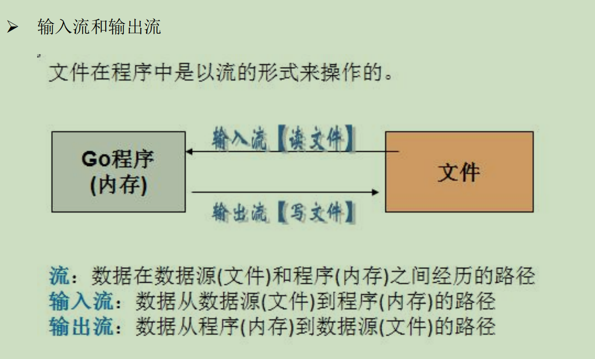

**流**：数据在数据源(文件)和程序(内存)之间经历的路径

**输入流：**数据从数据源(文件)到程序(内存)的路径

**输出流：**数据从程序(内存)到数据源(文件)的路径

### 2.打开和关闭文件

```go
package main
import (
	"fmt"
	"os" //os.File 封装所有文件相关操作，File是一个结构体
)

func main() {

	//打开文件
	//file叫法： 1.file对象 2.file指针 3.file文件句柄
	file, err := os.Open("d:/file/test.txt")
	if err != nil {
		fmt.Println("open file err=", err)
	}

	//输出文件
	fmt.Printf("file=%v", file)
	fmt.Println()

	//关闭文件
	err = file.Close()
	if err != nil {
		fmt.Println("close file err=", err)
	}
}
```

案例

1. 读取文件的内容并显示在终端(带缓冲区的方式)。

```go
package main
import (
	"fmt"
	"os"
	"io"
	"bufio"
)

func main() {

	//打开文件
	//file叫法： 1.file对象 2.file指针 3.file文件句柄
	file, err := os.Open("d:/file/test.txt")
	if err != nil {
		fmt.Println("open file err=", err)
	}

	//当函数退出时，要及时的关闭file
	defer file.Close() //要及时关闭file句柄，否则会有内存泄漏
	
	//创建一个 *Reader,带缓冲
	/*
	const (
		defaultBufSize = 4096 //默认的缓冲区为4096
	)
	*/
	reader := bufio.NewReader(file)
	for {
		//读到一个换行就结束一次
		str, err := reader.ReadString('\n')
		//输出内容
		fmt.Print(str)
		// io.EOF 表示文件末尾
		if err == io.EOF { 
			fmt.Println()
			break
		}
	}
	fmt.Println("文件读取完毕")
}
```

2. 读取文件的内容显式在终端(使用ioutil一次将整个文件读入到内存中)，这种方式**适用于文件不大的情况**。

```go
package main
import (
	"fmt"
	"io/ioutil"
)
func main() {
	//没有显式的open文件，也不需要显式的close文件
	//因为，文件的open和close被封装到ReadFile函数内部
	//使用ioutil.ReadFile一次性将文件读取到位
	file := "d:/file/test.txt"
	content, err := ioutil.ReadFile(file)
	if err != nil {
		fmt.Println("read file err=%v", err)
	}
	//把读取到的内容显式在终端
	fmt.Printf("%v", string(content))
}
```

### 3.写文件操作

#### 1).**基本介绍-os.OpenFile函数**

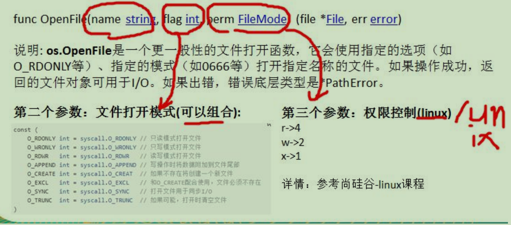

**案例**

1.创建一个新文件，写入5句从 "hello, Gardon"

```go 
package main
import (
	"fmt"
	"bufio"
	"os"
)

func main() {
	//案例1：创建一个新文件，写入5句从 "hello, Gardon"
	filePath := "d:/file/test.txt"
	file, err := os.OpenFile(filePath, os.O_WRONLY | os.O_CREATE, 0666 )
	if err != nil {
		fmt.Printf("open file err=%v\n", err)
	}
	//及时关闭file句柄
	defer file.Close()

	//准备写入的语句
	str := "hello, Gardon\n"
	writer := bufio.NewWriter(file)
	for i := 0; i < 5; i++ {
		writer.WriteString(str)
	}
	//因为writer是带缓存的，需要调用Flush方法
	writer.Flush()
}
```

2.打开一个存在的文件，**覆盖原来的内容**

```go
//案例2：打开一个存在的文件，覆盖原来的内容
file, err := os.OpenFile(filePath, os.O_WRONLY | os.O_TRUNC, 0666 )
```

3.打开一个存在的文件，在原来的内容上**追加内容**

```go
//案例3：打开一个存在的文件，在原来的内容上追加内容
file, err := os.OpenFile(filePath, os.O_WRONLY | os.O_APPEND, 0666 )
```

#### 2).判断文件是否存在

go中判断文件或文件夹是否存在的方法为 os.Stat() 函数：

1. 如果返回的错误为nil，说明文件或文件夹存在
2. 如果返回的错误类型使用 os.IsNotExist()判断为true，说明文件或文件夹不存在
3. 如果返回的错误为其它类型，则不确定是否存在

```go
func PathExists(path string)  (bool, err) {
	_, err := os.Stat(path)
	if err == nil { //文件或文件夹存在
		return true, nil
	}
	if os.IsNotExists(err) {
		return false, nil
	}
	return false, err
}
```

### 4.文件编程应用实例

#### 1.拷贝文件

```go
package main
import (
	"fmt"
	"os"
	"bufio"
	"io"
	
)

//拷贝文件方法
func CopyFile(desFilePath string, srcFilePath string ) (written int64, err error) {
	srcFile, err := os.Open(srcFilePath)
	if err != nil {
		fmt.Printf("open srcFile err=%v\n", err)
	}
	defer srcFile.Close()
	//通过srcFile，获取 Reader
	reader := bufio.NewReader(srcFile)

	//打开desFilePath
	desFile, err := os.OpenFile(desFilePath, os.O_WRONLY | os.O_CREATE, 0666 )
	if err != nil {
		fmt.Printf("open desFile err=%v\n", err)
	}
	defer desFile.Close()
	//通过desFile获取writer
	writer := bufio.NewWriter(desFile)
	
	//关键点：调用io.Copy(dst Writer, src Reader) (written int64, err error)
	return io.Copy(writer, reader)
}


func main() {
	//调用CopyFile方法
	srcFilePath := "d:/图片/pic.jpg"
	desFilePath := "d:/file/copyPic.jpg"
	_, err := CopyFile(desFilePath, srcFilePath)
	if err == nil {
		fmt.Printf("拷贝成功\n")
	} else {
		fmt.Printf("拷贝错误 err=%v\n", err)
	}
}
```

#### 2.统计英文、数字、空格和其他字符数量

```go
package main
import (
	"fmt"
	"os"
	"bufio"
	"io"
	
)

//定义一个结构体，用于保存统计结果
type CharCount struct {
	EnCount int //记录英文个数
	NumCount int //记录数字的个数
	SpaceCount int //记录空格的个数
	OtherCount int //记录其它字符的个数
}

func main() {
	//思路：打开一个文件，创建一个Reader
	//每读取一行，就去统计该行有多少个 英文、数字、空格和其他字符
	//然后将结果保存到一个结构体
	filePath := "d:/file/test.txt"
	file, err := os.Open(filePath)
	if err != nil {
		fmt.Printf("open file err=%v\n", err)
	}
	defer file.Close()
	//定义一个CharCount 实例
	var charCount CharCount
	//创建一个Reader
	reader := bufio.NewReader(file)

	//开始循环读取file内容
	for {
		str, err := reader.ReadString('\n')
		if err == io.EOF {
			break
		}
		//遍历 str, 进行统计
		for _, v := range str {
			switch {
				case v >= 'a' && v <= 'z' :
						fallthrough //穿透
				case v >= 'A' && v <= 'Z' :
					charCount.EnCount++
				case v == ' ' || v== '\t' :
					charCount.SpaceCount++
				case v >= '0' && v <= '9' :
					charCount.NumCount++
				default :
					charCount.OtherCount++
			}
		}
	}
	//输出统计的结果
	fmt.Printf("英文字符的个数=%v\n 数字的个数=%v\n 空格的个数=%v\n 其它字符的个数=%v\n",
	charCount.EnCount, charCount.NumCount, charCount.SpaceCount, charCount.OtherCount)
}
```

### 5.命令行参数

#### 1.**os.Args**

#### os.Args 是一个string切片，用来存储所有的命令行参数

```go
package main
import (
	"fmt"
	"os"
)

func main() {
	fmt.Println("命令行的参数有", len(os.Args))
	//遍历os.Args切片, 就可以得到所有的命令行输入参数值
	for i, v := range os.Args {
		fmt.Printf("args[%v]=%v\n", i, v)
	}
}
```

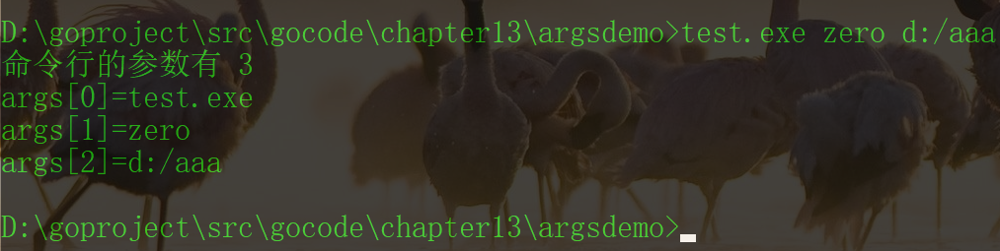

#### 2.flag包用来解析命令行参数

可以以key-value 的形式获取指定的参数值，而且参数顺序可以随意

```go
package main
import (
	"fmt"
	"flag"
)

func main() {

	//定义几个变量，用于接收命令行的参数值
	var user string
	var pwd string
	var host string
	var port int

	//&user 就是接收用户命令行中输入的 -u 后面的参数值
	//"u", 就是 -u 指定参数
	//"", 默认值
	//"用户名，默认为空" 说明
	flag.StringVar(&user, "u", "", "用户名,默认为空")
	flag.StringVar(&pwd, "pwd", "", "密码,默认为空")
	flag.StringVar(&host, "h", "localhost", "主机名,默认为localhost")
	flag.IntVar(&port, "port", 3306, "端口号,默认为3306")

	//必须要执行的操作  转换
	flag.Parse()

	//输出结果
	fmt.Printf("user=%v pwd=%v host=%v port=%v",
		user, pwd, host, port)
}
```

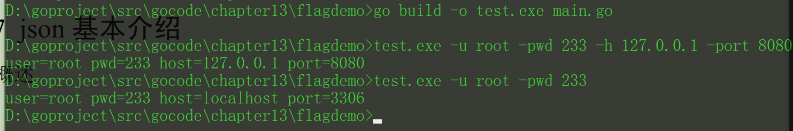

### 6.**JSON**

#### 1.基本介绍

JSON(JavaScript Object Notation)是一种轻量级的数据交换格式。易于人阅读和编写。同时也易于机器解析和生成。 key-value

JSON易于机器解析和生成，并有效地提升网络传输效率，通常程序在网络传输时会先将数据(结构体、map等)序列化成json字符串，到接收方得到json字符串时，在**反序列化**恢复成原来的数据类型(结构体、map等)。这种方式已然成为各个语言的标准。

在js语言中，一切都是对象。因此，**任何的数据类型都可以通过json来表示**，例如字符串、数字、对象、数组、map\结构体等。

json键值对是用来保存数据的一种形式

```json
// 键值对组合 键名卸载前面并用双引号"" 包裹，使用冒号:分隔，然后紧接着值
{"name":"weason","age":28}
{"address":["北京","上海"]}
[{"name":"tom","age":22,"address":["北京","上海"]}
,{"name":"mary","age":21,"address":["北京","上海"]}]
```

#### 2.json数据在线解析

https://www.json.cn/ 

#### 3.json序列化

json序列化是指，将有key-value结构的数据类型(比如**结构体、map、切片**)序列化成json字符串的操作。

```go
package main
import (
	"fmt"
	"encoding/json"
)

//结构体
type Monster struct {
	Name string `json:"name"`
	Age int	`json:"age"`
	Birthday string
	Sal float64
	Skill string
}
//将结构体monster序列化
func serializeStruct() {
	//演示
	monster := Monster{
		Name : "孙悟空",
		Age : 500,
		Birthday : "未知",
		Sal : 2333,
		Skill : "养马",	
	}
	//将monster 序列化
	data, err := json.Marshal(&monster)
	if err != nil {
		fmt.Printf("序列化错误 err=%v", err)
	}
	//输出序列化后的结果
	fmt.Printf("monster序列化后=%v\n", string(data))
}

//将map序列化
func serializeMap() {
	//定义一个map
	var heroes map[string]interface{}
	heroes = make(map[string]interface{})
	heroes["name"] = "索隆"
	heroes["age"] = 23
	heroes["weapon"] = "三刀流"

	//序列化
	data, err := json.Marshal(heroes)
	if err != nil {
		fmt.Printf("序列化错误 err=%v", err)
	}
	//输出序列化后的结果
	fmt.Printf("heroes map序列化后=%v\n", string(data))
}

//将切片序列化
func serializeSlice() {
	var slice []map[string]interface{}
	var m1 map[string]interface{}
	m1 = make(map[string]interface{})
	m1["name"] = "良品铺子"
	m1["size"] = 30
	m1["price"] = 99.9
	slice = append(slice, m1)
	var m2 map[string]interface{}
	m2 = make(map[string]interface{})
	m2["name"] = "三只松鼠"
	m2["size"] = 25
	m2["price"] = 69.9
	slice = append(slice, m2)
	//序列化
	data, err := json.Marshal(slice)
	if err != nil {
		fmt.Printf("序列化错误 err=%v", err)
	}
	//输出序列化后的结果
	fmt.Printf("slice序列化后=%v\n", string(data))
}
func main() {
	//结构体序列化
	serializeStruct()
	//map序列化
	serializeMap()
	//切片序列化
	serializeSlice()
}
```

#### 4.json反序列化

json反序列化是指，将json字符串反序列化成对应的数据类型(比如结构体、map、切片)的操作。

```go
package main

import (
	"fmt"
	"encoding/json"
)

type Monster struct {
	Name string `json:"name"`
	Age int	`json:"age"`
	Birthday string
	Sal float64
	Skill string
}

//将json反序列化成struct
func unserializeStruct() {
	str := "{\"name\":\"孙悟空\",\"age\":500,\"Birthday\":\"未知\",\"Sal\":2333,\"Skill\":\"养马\"}"
	var monster Monster
	err := json.Unmarshal([]byte(str), &monster)
	if err != nil {
		fmt.Printf("unmarshal err=%v", err)
	}
	fmt.Printf("反序列化后 monster=%v\n", monster)
}

//将json反序列化成map
func unserializeMap() {
	str := "{\"age\":23,\"name\":\"索隆\",\"weapon\":\"三刀流\"}"
	var heroes map[string]interface{} 
	//反序列化 不用make, make的操作被封装到 Unmarshal函数
	err := json.Unmarshal([]byte(str), &heroes)
	if err != nil {
		fmt.Printf("unmarshal err=%v", err)
	}
	fmt.Printf("反序列化后 heroes=%v\n", heroes)
}

//将json反序列化成slice
func unserializeSlice() {
	str := "[{\"name\":\"良品铺子\",\"price\":99.9,\"size\":30}," + 
	"{\"name\":\"三只松鼠\",\"price\":69.9,\"size\":25}]"
	var slice []map[string]interface{} 
	//反序列化 不用make, make的操作被封装到 Unmarshal函数
	err := json.Unmarshal([]byte(str), &slice)
	if err != nil {
		fmt.Printf("unmarshal err=%v", err)
	}
	fmt.Printf("反序列化后 slice=%v\n", slice)
}

func main() {
	//struct反序列化
	unserializeStruct()
	//map反序列化
	unserializeMap()
	//slice反序列化
	unserializeSlice()
}
//1.在反序列化一个json字符串时，要确保反序列化后的数据类型和原来序列化前的数据类型一致。
//2.如果json字符串是通过程序获取的，则不需要再转义处理
```


## 12.单元测试

go自带有一个轻量级的测试框架testing和自带的go test命令来实现单元测试和性能测试。testing框架和其他语言中的测试框架类似，可以基于这个框架写对应函数的**测试用例**，也可以基于该框架写相应的压力测试用例。通过单元测试，可以解决如下问题：

​	1）确保每个函数是可运行，并且运行结果是正确的

​	2）确保写出来的代码性能是好的

​	3）单元测试能及时的发现程序设计或实现的逻辑错误，使问题及早暴露，便于问题的定位解决，而性能测试的重点在于发现程序设计上的一些问题，让程序能够在高并发的情况下还能保持稳定

1.单元测试-快速入门

```go
package cal
import (
	_ "fmt"
)

//被测试函数
func addUpper(n int) int {
	res := 0
	for i := 1; i <= n; i++ {
		res += i
	}
	return res
}

func getSub(a int, b int) int{
	res := a - b
	return res
}
```

```go
package cal
import (
	"testing"
)


func TestAddUpper(t *testing.T) {
	res := addUpper(10)
	if res != 55 {
		t.Fatalf("addUpper(10)测试失败期望55 实际%v\n", res)
	}
	t.Logf("test addUpper(10) succes\n")
}
```

```go
package cal

import (
	"testing"
)

func TestSub(t *testing.T) {
	res := getSub(7, 4)
	if res != 3 {
		t.Fatalf("getSub函数测试失败期望3 实际%v\n", res)
	}
	t.Logf("getSub函数测试成功\n")

}
```

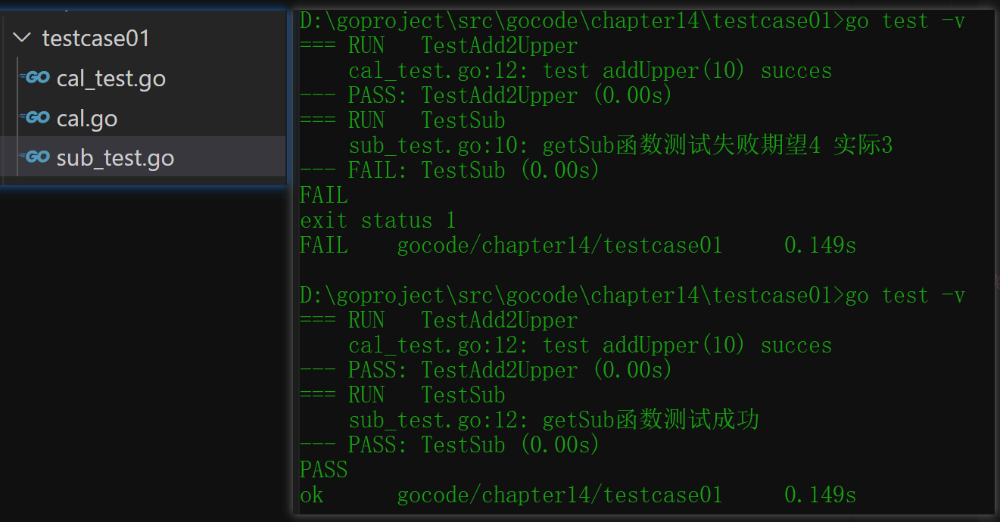

**快速入门总结**

1. 要编写一个新的测试套件，需要创建一个名称以 _test.go 结尾的文件，该文件包含 `TestXxx` 函数，如上所述。 将该文件放在与被测试的包相同的包中。该文件将被排除在正常的程序包之外，但在运行 “go test” 命令时将被包含。 有关详细信息，请运行 “go help test” 和 “go help testflag” 了解。

2. 

   ```go
   import "testing"
   //testing 提供对 Go 包的自动化测试的支持。通过 `go test` 命令，能够自动执行如下形式的任何函数：
   func TestXxx(*testing.T)
   //其中 Xxx 可以是任何字母数字字符串（但第一个字母不能是 [a-z]），用于识别测试例程。在这些函数中，使用 Error, Fail 或相关方法来发出失败信。
   ```

3. TestXxx(t *testing.T) 的形参必须是 *testing.T

4. 一个测试用例文件中，可以有多个测试用例函数，比如 TestAddUpper、TestSub

5. 运行指令

   ```bash
   cmd>go test  [如果运行正确，无日志，错误时，输出日志]
   cmd>go test -v [正确与否，都输出日志]
   ```

6. 当出现错误时，可以使用 t.Fatalf来格式化输出错误信息，**并退出程序**

7. t.Logf 方法可以输出相应的日志

8. 测试用例函数，并没有放在main函数中也能执行，这就是其方便之处[原理图]

9. PASS表示测试用例运行成功，FAIL 表示测试用例运行失败

10. 测试单个文件，一定要带上被测试的原文件

	```
	go test -v  cal_test.go cal.go
	```

11. 测试单个方法

	```
	go test -v -test.run TestAddUpper
	```

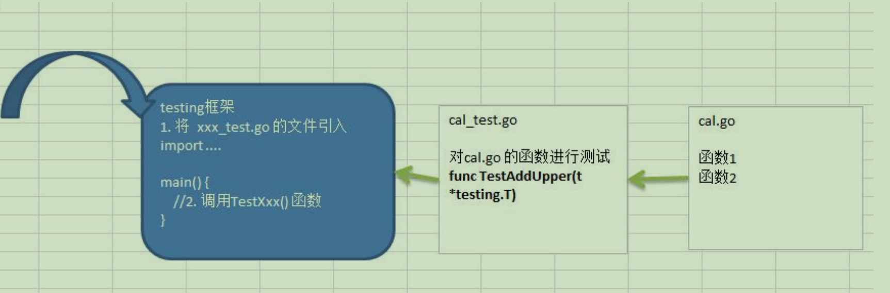


## 13.goroutine和channel

### 1.进程和线程说明

1. 进程就是程序在操作系统中的一次执行过程，是系统进行资源分配和调度的基本单位。
2. 线程是进程的一个执行实例，是程序执行的最小单元，它是比进程更小的能独立运行的基本单位。
3. 一个进程可以创建和销毁多个线程，同一个进程中的多个线程可以并发执行。
4. 一个程序至少有一个进程，一个进程至少有一个线程

### 2.并发和并行

并行(concurrency)：多线程程序在单核上运行

并行(parrallel)：多线程程序在多核上运行

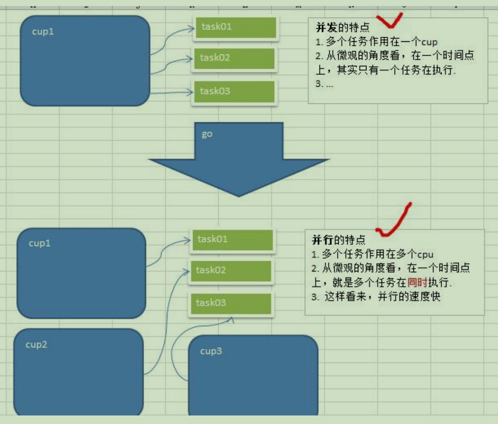

### 3.go协程和go主线程

#### 1.协程介绍和特点

1. go主线程(有的程序员直接称为**线程**/也可以理解成**进程**)：一个go线程上，可以起多个协程，可以理解为，协程是轻量级的线程[编译器做优化]
2. go协程的特点
	1. 有独立的栈空间
	2. 共享程序堆空间
	3. 调度由用户控制
	4. 协程是轻量级的线程

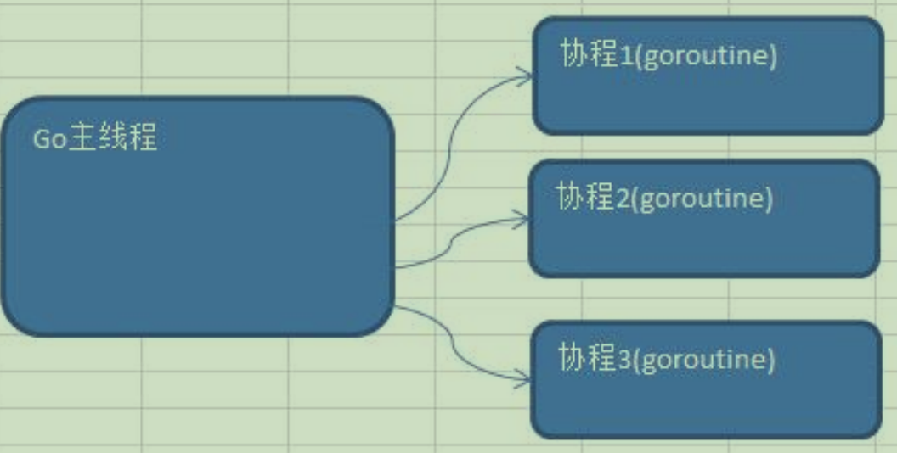

#### 2.快速入门

```go
package main
import (
	"fmt"
	"time"
	"strconv"
)

func test() {
	for i := 0; i < 10; i++ {
		fmt.Println("test hello,world " + strconv.Itoa(i))
		time.Sleep(time.Second)
	}
}

func main() {
	go test() //开启了一个协程

	for i := 0; i < 10; i++ {
		fmt.Println("test hello,go " + strconv.Itoa(i))
		time.Sleep(time.Second)
	}
}
```

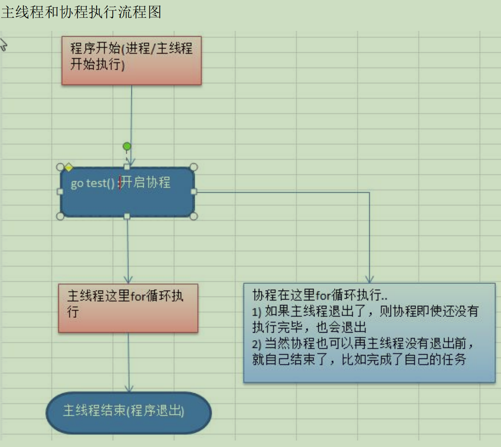

小结

1. 主线程是一个物理线程，直接作用在cpu上、是重量级的，非常耗费cpu资源。
2. 协程是从主线程开启的，是轻量级的线程，是逻辑态。对资源消耗较小。
3. go的协程机制是重要的特点，可以轻松的开启上万个协程。其他编程语言的并发机制是一般基于线程的，开启过多的线程，资源耗费大，这里就突显go在并发上的优势了。

#### 3.goroutine的调度模型

**MPG模式**

MPG的运行状态1

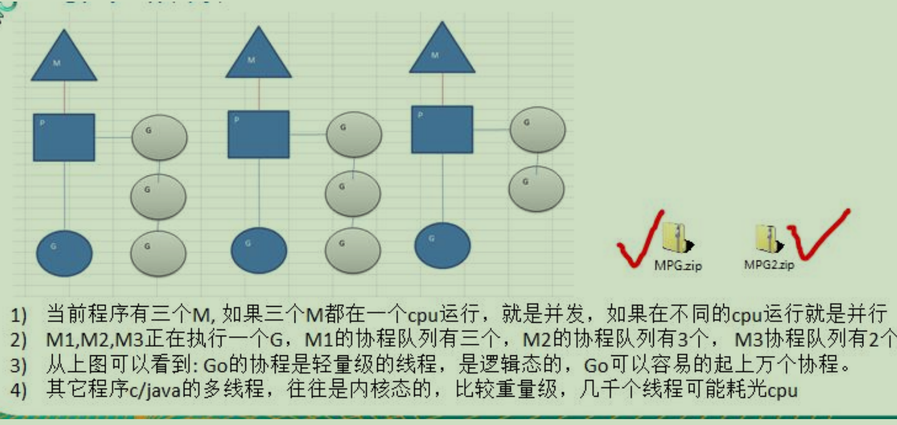

MPG的运行状态2

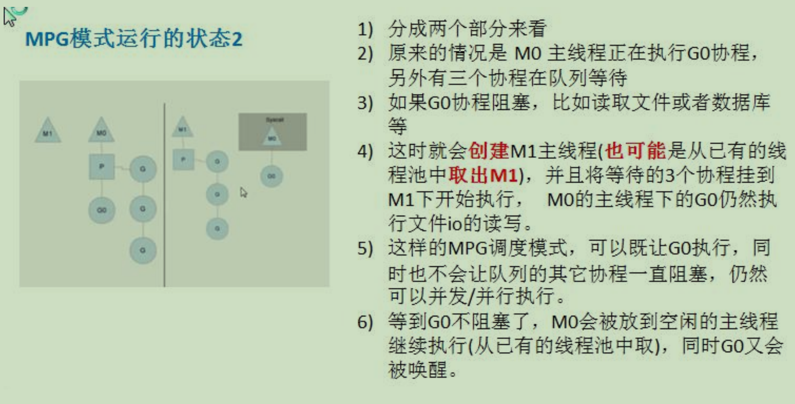

#### 4.设置go运行的cpu数

介绍:为了充分利用多核cpu优势，在fo程序中，设置运行的cpu数目

```go
package main
import (
	"fmt"
	"runtime"
)

func main() {
	cpuNum := runtime.NumCPU()
	fmt.Println("cpuNum=", cpuNum)

	//可以自己设置使用多个cpu
	runtime.GOMAXPROCS(cpuNum - 1)
	fmt.Println("ok")
}
// go1.8后，默认让程序运行在多核上，可以不用设置了
```

#### 5.全局互斥锁解决资源竞争

问题：不同goroutine之间如何通讯

1.全局变量的互斥锁 2.使用管道channel来解决

```go
package main
import (
	"fmt"
	"time"
	"sync"
)

var (
	myMap = make(map[int]int, 10)
	//声明一个全局的互斥锁
	//lock 是一个全局互斥锁
	//sync 是包: synchornized
	//Mutex:是互斥
	lock sync.Mutex
)

func test(n int) {
	res := 1
	for i := 1; i <= n; i++ {
		res *= i
	}

	//将res放入myMap
	//加锁
	lock.Lock()
	myMap[n] = res
	//解锁
	lock.Unlock()

}

func main() {
	//开启多个协程
	for i := 1; i <= 200; i++ {
		go test(i)
	}
	//休眠10s
	time.Sleep(time.Second * 10)

	//输出结果
	 //加锁
	lock.Lock()
	for i, v := range myMap {
		fmt.Printf("map[%d]=%d\n", i, v)
	}
	 //解锁
	lock.Unlock()
}
```

### 4.channel(管道)

#### 1.为什么需要channel

1. 前面使用全局变量加锁同步来解决goroutine的通讯，但不完美
2. 主线程在等待所有 goroutine 全部完成的时间很难确定，我们设置10s仅仅是估算
3. 如果主线程休眠时间长了，会加长等待时间，如果等待时间短了，可能还有goroutine处于工作状态，这时也会随主线程的退出而销毁
4. 通过全部变量加锁同步来实现通讯，也并不利用多个协程对全局变量的读写操作。

#### 2.channel的基本介绍

1. channel 本质就是一个数据结构-队列
2. 数据是先进先出【FIFO：first in first out】
3. 线程安全，多goroutine访问时，不需要加锁，就是说 channel 本身就是线程安全的
4. channel有类型，一个string的channel只能存放string类型数据

#### 3.channel-基本使用

```go
var 变量名 chan 数据类型
//例如
var intChan chan int(inrChan用于存放int数据)
var mapChan chan map[int]string (mapChan用于存放map[int]string类型)
var perChan chan Person
var perChan2 chan *Person
```

说明：

1. channel是**引用类型**
2. channel必须初始化才能写入数据，及make后才能使用
3. 管道是有类型的，intChan 只能写入 整数int

```go
package main
import (
	"fmt"
)

func main() {

	//演示一下管道的使用
	//1.创建一个可以存放3个int类型的管道
	var intChan chan int
	intChan = make(chan int, 3)

	//2.打印看看 intChan
	fmt.Printf("intChan 的值=%v intChan 本身的地址=%p\n",
		intChan, &intChan)

	//3.向管道写入数据
	intChan<- 10
	num := 211
	intChan<- num

	//4.看看管道长度和cap(容量)
	fmt.Printf("channel len=%v cap=%v\n",
		 len(intChan), cap(intChan))
	
	//5.从管道中读取数据
	var num2 int
	num2 = <-intChan 
	fmt.Println("num2=", num2)
	fmt.Printf("channel len=%v cap=%v\n",
	len(intChan), cap(intChan))
	 
	 //写入和读取超范围报错： all goroutines are asleep - deadlock!
	 //goroutine 1 [chan send]:		goroutine 1 [chan receive]:
}
```

**注意事项：**

1. channel 中只能存放指定的数据类型
2. channel 的数据放满后， 就不能再放入了
3. 如果从 channel 取出数据后，可以继续放入
4. 在没有使用协程的情况下，如果channel 数据取完了，再取，就会报 dead lock

#### 4.channel的遍历和关闭

**channel的关闭**

​	使用内置函数 close 可以关闭channel, 当 channel 关闭后， 就不能再向 channel 写数据了，但是仍然可以从该 channel 读取数据

**channel的遍历**

channel 支持 for-range 的方式进行遍历，需注意两个细节

1. 在遍历时，如果 channel 没有关闭， 则会出现 deadlock 错误
2. 在遍历时，如果 channel 已经关闭，则会正常遍历数据，遍历完后，就会退出遍历。

```go
package main
import (
	"fmt"
)

func main() {

	intChan := make(chan int, 3)
	intChan<- 100
	intChan<- 200
	//close 关闭管道
	close(intChan) 
	fmt.Println("channel intChan has closed")
// 	intChan<- 233 
	//channel intChan has closed panic: send on closed channel

	//遍历管道
	intChan2 := make(chan int, 100)
	for i := 0; i < 100; i++ {
		intChan2<- i * 2 //放入100个数据到管道
	}

	//先关闭管道
	close(intChan2)

	for v := range intChan2 {
		fmt.Println("v=", v)
	}

	// for len(intChan2) > 0 {
	// 	fmt.Println("v=", <-intChan2)
	// }
}
```

#### 5.管道阻塞的机制

```go
//待研究
```

#### 6.channel使用细节和注意事项

1. channel 可以声明为只读， 或者只写性质

	```go
	func main() {
		 //1.双向
		 var chan1 chan int
		 
		 //2.只写
		 var chan2 chan<- int
		 chan2 = make(chan int, 3)
		 chan2<- 20
		 //num2 := <-chan2 //error
		 
		 //3.只读
		var chan3 <-chan int
		 chan3 = make(chan int, 3)
		 num3 := <-chan3
		 //chan3<- 30 //erroe
	}
	```

2. 使用 selet 可以解决从管道取数据的阻塞问题

	```go
	package main
	
	import (
		"fmt"
	)
	
	func main() {
	
		intChan := make(chan int, 10)
		for i := 0; i < 10; i++ {
			intChan <- i
		}
	
		stringChan := make(chan string, 5)
		for i := 0; i < 5; i++ {
			stringChan <- "hello" + fmt.Sprintf("%d", i)
		}
	
		//传统的方法在遍历管道时，如果不关闭会阻塞而导致 deadlock
	label:
		for {
			select {
			case v := <-intChan:
				fmt.Printf("从intChan读取的数据%d\n", v)
			case v := <-stringChan:
				fmt.Printf("从stringChan读取的数据%s\n", v)
			default:
				fmt.Println("都取不到了...")
				break label
			}
	
		}
	
	}
	```

3. goroutine 中使用 recover,解决协程中出现 panic,导致程序崩溃问题


## 14.反射

### 1.基本介绍

1. 反射可以在运行时**动态获取变量的各种信息**，比如变量的类型(type),类别(kind)
2. 如果是结构体变量，还可以获取到结构体本身的信息(包括结构体的**字段、方法**)
3. 通过反射，可以修改变量的值，可以调用关联的方法。
4. 使用反射，需要 import("**reflect**")

### 2.反射重要的函数和概念

1. reflect.TypeOf(变量名)，获取变量的类型，返回reflect.Type类型
2. reflect.ValueOf(变量名)，获取变量的值，返回reflect.Value类型reflect.Value 是一个结构体类型。
3. 变量、interface{} 和 reflect.Value 是可以相互转换的，这点在实际开发中，会经常使用到。

```go
//interface{} -> reflect.Value
func ValueOf(i interface{}) Value
//reflect.Value -> interface{}
func (v Value) Interface() (i interface{})
//类型断言
i.(type)
```

### 3.反射的注意事项和细节

1. reflect.Value.Kind,  获取变量的类型，返回的是一个常量

2. Type和Kind的区别

   Type 是类型，Kind是类别，Type和Kind可能是相同的，也可能是不同的。

   比如：var num int = 10 num的Type是int,Kind也是int

   比如：var stu Student stu的Type是 package.Student , Kind是 struct 

3. 通过反射可以让变量在nterface{} 和 reflect.Value 之间相互转换

   ​     变量<-------->interface{}<-------->reflect.Value

4. 使用反射的方式来获取变量的值(并返回对应的类型)，要求数据类型匹配，比如x是int,那么就应该使用 reflect.Value(x).Int(),而不能使用其它的，否则报panic

5. 通过反射来修改变量，注意当使用SetXxx方法来设置需要通过对应的指针类型来完成，这样才能改变传入的变量的值，同时需要使用到reflect.Value.Elem()方法

6. reflect.Value.Elem()方法

```go
func (v Value) Elem() Value
//Elem返回v持有的接口保管的值的Value封装，或者v持有的指针指向的值的Value封装。如果v的Kind不是Interface或Ptr会panic；如果v持有的值为nil，会返回Value零值。
```

### 4.反射最佳实践

1.使用**反射来遍历结构体的字段**，**调用结构体的方法**，并**获取结构体标签**的值

```go
func (v Value) Method(i int) value

func (v Value) Call(in []Value) []Value
```


## 15.tcp编程

### 1.网络编程基本介绍

网络编程有两种

1). TCP Socket编程，是网络编程的主流，底层基于 Tcp/ip 协议。 比如：QQ

2). b/s 结构的http编程，我们使用浏览器去访问服务器时，使用的就是http协议，而http底层依旧是tcp socket实现的。比如：京东商城

### 2.网络编程的基本知识

```txt
1.网线，网卡，无线网卡
2.协议(tcp/ip)
3.OSI与Tcp/ip参考模型
4.ip地址
5.端口(port)
```

### 端口介绍

我们这里所指的端口不是指物理意义上的端口，而是特指 TCP/IP 协议中的端口，是逻辑意义上的端口。

**分类**

```txt
0号是保留端口

1-1024 是固定端口(程序员不要使用)
	又叫 有名端口，即被某些程序固定使用，一般程序员不使用
	22：SSH 远程登陆协议  23：telnet使用  21：ftp 使用
	25：smtp 服务使用  80：iis使用  7：echo服务

1025-65535是动态端口
	这些端口，程序员可以使用
```

**使用注意**

```txt
1.在计算机(尤其是做服务器)要尽可能的少开端口
2.一个端口只能被一个程序监听
3.如果使用 netstat -an 可以查看本机有哪些端口在监听
4.可以使用 netstat -anb 来查看监听端口的pid，再结合任务管理器关闭不安全的端口
```

### 3.tcp socket 编程的客户端和服务端

### 1.tcp socket编程快速入门

### 1). 服务端的处理流程

1. 监听端口 8888
2. 接收客户端的tcp链接，建立客户端和服务端的链接
3. 创建 **goroutine**,处理该链接的请求(通常客户端会通过链接发送请求包)

### 2). 客户端的处理流程

1. 建立与服务端的链接
2. 发送请求数据[终端]，接收服务器端返回的结果数据
3. 关闭链接

server.go

```go
package main

import (
	"fmt"
	"io"
	"net" //网络socket开发时，net包非常重要
)

func process(conn net.Conn) {
	//循环接收客户端发送的数据
	defer conn.Close() //关闭连接

	for {
		//创建一个新切片
		buf := make([]byte, 1024)
		//conn.Read(buf)
		//1.等待客户端通过conn发送信息
		//2.如果客户端没有write[发送]，那么协程就阻塞在这里
		// fmt.Printf("服务器在等待客户端%s 发送信息\n", conn.RemoteAddr().String())
		n, err := conn.Read(buf)
		if err == io.EOF {
			fmt.Printf("客户端%s 退出\n", conn.RemoteAddr().String())
			return
		}
		//3. 显式客户端发送的内容到服务端
		fmt.Print(string(buf[:n]))
	}
}

func main() {

	fmt.Println("服务器开始监听了....")
	listen, err := net.Listen("tcp", "0.0.0.0:8888")
	if err != nil {
		fmt.Println("listen err=", err)
		return
	}
	defer listen.Close() //延时关闭

	//循环等待客户端连接
	for {
		fmt.Println("等待客户端来连接...")
		conn, err := listen.Accept()
		if err != nil {
			fmt.Println("Accept() err=", err)
		} else {
			fmt.Printf("Accept() suc con=%v 客户端ip=%v\n", conn, conn.RemoteAddr().String())
		}
		go process(conn)
	}

	// fmt.Printf("listen suc=%v\n", listen)
}

```

client.go

```go
package main

import (
	"bufio"
	"fmt"
	"net"
	"os"
	"strings"
)

func main() {

	conn, err := net.Dial("tcp", "127.0.0.1:8888")
	defer conn.Close()
	if err != nil {
		fmt.Println("client dial err=", err)
		return
	}
	//功能一：客户端可以发送单行数据，然后就退出
	reader := bufio.NewReader(os.Stdin)

	for {
		//从终端读取一行用户输入，并准备发送给服务器
		line, err := reader.ReadString('\n')
		if err != nil {
			fmt.Println("readString err=", err)
		}
		if strings.Trim(line, "\r\n") == "exit" {
			fmt.Printf("client退出")
			break
		}

		//再将line 发送给服务器
		_, errW := conn.Write([]byte(line))
		if errW != nil {
			fmt.Println("conn.Write err=", err)
		}
	}

}

```

## 16.Go连接Redis

### 1.基本介绍

1. Redis是NoSQL数据库，不是传统的关系型数据库
2. Redis: Remote Dictionary Server  ，Redis性能非常高，单机能够达到15w qps，通常适合做缓存，也可以持久化。
3. 是完全开源免费的，高性能的(key/value)分布式内存数据库，基于内存运行并支持持久化的NoSQL数据库，是最热门的NoSql数据库之一，也称为数据结构服务器。

### 2.Redis特点

```txt
1.非关系型数据库
2.C语言开发的
3.数据是存储在内存/磁盘
4.key-value的形式存储数据
5.Redis支持存储的数据类型：
	String list set zset hash(map)
```

### 3.使用

```go
启动方式：
	方式一：
	
	方式二：redis-server.exe redis.windows.conf
		多用tab提示

连接redis:
	1.连接本机
		双击 redis-cli.exe
	2.连接外网
		在当前的目录打开命令行输入 redis-cli -h IP地址 -p 端口号6379
```

#### Strig类型相关操作

```bash
1.放值 set key value
	  setex key second value  setex(set with expire)有过期时间 
2.取值 get key
3.批量操作 mset [key value...]
4.批量获取 mget [key...]
5.自增 incr key
6.自减 decr key
7.增加指定步长      incrBy key
8.减少指定步长        decrBy key
```

#### key相关操作

```bash
1.keys *  获取所有的key
2.del key 删除指定的key们
3.expire key 秒 设置过期时间
4.ttl key  查看过期时间  -2已经过期
```

```bash
redis 默认有16个数据库
	切换 select 库下标[0-15]
	flushdb 清空当前库
	flushall 清空所有库
```

#### Hash

```txt
Redis hash 是一个键值对集合
Redis hash 是一个string类型的field和value的映射表，hash特别适合用于存储对象。
```

```bash
1.hset key field value 存放
2.hget key field 获取
3.hgetall key 获取所有
4.hdel key field [field ...]  删除key对应的field
5.hmset key field value [field value ...]  一次性设置多个字段和值
6.hmget key field [field ...] 一次性返回多个字段的值
7. hexists key field 查看哈希表key中，给定的field是否存在
```

#### list(队列)

```txt
队列是简单的字符串列表，按照插入顺序排序。可以添加一个元素到列表的头部(左边)或者尾部(右边)

List本质是个链表，List的元素是有序的，元素值可以重复

使用细节和注意事项
1.index,按照索引下标获取元素(从左到右，编号从0开始)
2.llen key  获取key的长度，如果key不存在，则key被解释为一个空列表，返回0
3.List数据可以从左或者右 插入添加
4.如果值全移除，对应的键也就消失了。
```

```bash
放数据	
	1.lpush key [value...] 从左边放数据 
	2.rpush key [value...] 从右边放数据
取数据 
	3.lpop key 移出并返回左边的第一个数据
	4.rpop key 移出并返回右边的第一个数据
查询数据
	5.lrange key start stop  查询key数据  start--开始位置 stop--结束位置（-1代表所有）
移出数据
	6.lrem key count value  
		count:  >0 从列表头开始搜索count个 value对应元素 删除
				<0 从列表尾开始搜索count个 value对应元素 删除
				=0 将所有 value对应元素 删除  
```

#### set(集合)

```txt
Redis的Set是string类型的无序集合
底层是HashTable数据结构，Set 也是存放很多字符串元素，字符串元素是无序的，而且元素的值不能重复
```

```bash
1.sadd key member [member ...]  添加
2.smembers key  取出所有制
3.sismember key member 判断值是否是成员
4.srem key member [member ...] 删除指定值
```

#### 面试题

```txt
Redis如何实现堆栈的存储效果？
	堆栈： 先进后出
	设置reids 放数据和取数据在一个方向即可
```

### 4.go连接Redis

#### 安装第三方开源Redis库

```txt
1.使用第三方开源的redis库：github.com/garyburd/redigo/redis
2.在使用Redsis前，先安装第三方Redis库，在GOPATH路径下执行安装指令：D:\goproject>github.com/garyburd/redigo/redis
```

#### 操作代码

```go
package main

import (
	"fmt"
	"github.com/garyburd/redigo/redis"
)

func main() {
	//1.通过密码连接redis对应库
	pwd := redis.DialPassword("54321")
	db := redis.DialDatabase(6)
	conn, err := redis.Dial("tcp", "127.0.0.1:6379", pwd, db)
	if err != nil {
		fmt.Println("connect redis error :", err)
		return
	}
	defer conn.Close()
	fmt.Println("connect success...")

	//2.String操作 set写入
	_, err = conn.Do("set", "name", "weason")
	if err != nil {
		fmt.Println("set error :", err)
		return
	}
	fmt.Println("set操作成功")

	//获取字符串
	res, err := redis.String(conn.Do("get", "name"))
	if err != nil {
		fmt.Println("get err=", err)
		return
	}
	fmt.Println("get操作成功 name =", res)

	//3.hash操作
	conn.Do("hmset", "emp", "name", "weason", "age", 28)
	if err != nil {
		fmt.Println("hmset err=", err)
		return
	}
	result, err := redis.Strings(conn.Do("hmget", "emp", "name", "age"))
	if err != nil {
		fmt.Println("hmget err=", err)
		return
	}
	fmt.Printf("hmget操作成功 emp =%v\n", result)

	//4.设置过期时间
	_, err = conn.Do("expire", "name", 10) //10秒过期
	if err != nil {
		fmt.Println("set expire error: ", err)
		return
	}
}
```

### 5.Redis连接池

#### 连接池介绍及作用

```txt
1.事先初始化一定数量的连接放入连接池
2.当 Go 需要操作Redis时，直接从Redis连接池取出连接即可
3.这样可以节省临时获取Redis连接的时间，从而提升效率
```

#### 代码实现

```go
package main

import (
	"fmt"

	"github.com/garyburd/redigo/redis"
)

var pool *redis.Pool

//程序启动时，初始化连接池
func init() {
	pool = &redis.Pool{
		MaxIdle:     8,
		MaxActive:   0,
		IdleTimeout: 100,
		Dial: func() (redis.Conn, error) {
			return redis.Dial("tcp", "localhost:6379", redis.DialPassword("54321"), redis.DialDatabase(6))
		},
	}
}

func main() {
	//先从pool 取出一个连接
	conn := pool.Get()
	defer conn.Close()

	_, err := conn.Do("Set", "hero", "taka")
	if err != nil {
		fmt.Println("set err=", err)
		return
	}

	//取出
	res, err := redis.String(conn.Do("get", "hero"))
	if err != nil {
		fmt.Println("get err=", err)
		return
	}
	fmt.Println("hero is", res)
}
```


