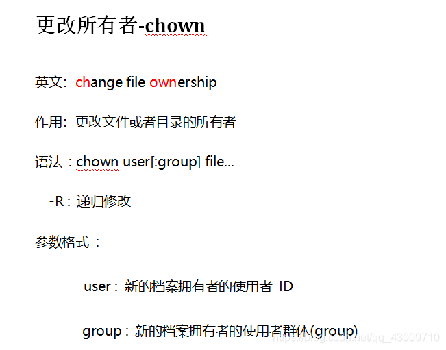
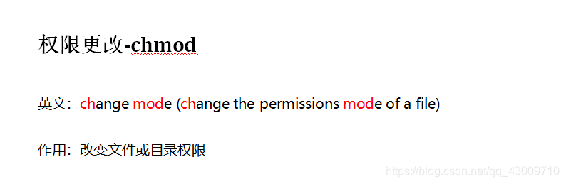
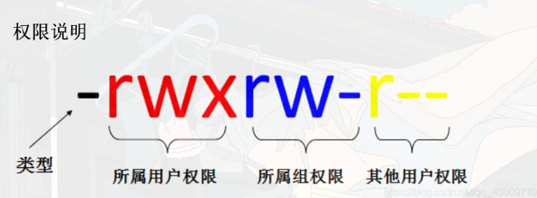
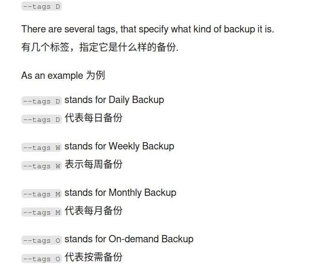

# 1. linux命令

## 1.1. 1.常用命令

```bash
#1.打印当前目录
pwd
#2.新建文件夹
mkdir foldername
#3.新建文件
touch filename
#4.删除文件夹
rm -r filename
#5.ss命令查看端口状态
ss -lntu


```

```bash
ls /some_path # 查看某个文件夹下的文件与子文件夹。/ 代表根目录，是 Linux 最顶端的路径，以此开头则为绝对路径
pwd # 查看当前终端所在路径
cd /home/testuser # 切换目录命令。将当前终端切换到某一个路径下
cp ./a.py ./b.py # 复制命令。将当前路径下的 a.py 复制一份并命名为 b.py。./ 代表当前文件夹所在路径，以此开头则为相对路径
cp -r ./a ./b # 复制整体文件夹
rm b.py # 删除命令。删除 b.py
mv a.py b.py # 移动（重命名）命令。将 a.py 更名为 b.py
mkdir my_folder # 新建名为 my_folder 的文件夹
sudo some_command # 使普通用户以 root 权限执行某些命令
```


## 1.2. 2.系统服务

```bash
systemctl start dhcpcd # 启动服务
systemctl stop dhcpcd # 停止服务
systemctl restart dhcpcd # 重启服务
systemctl reload dhcpcd # 重新加载服务以及它的配置文件
systemctl status dhcpcd # 查看服务状态
systemctl enable dhcpcd # 设置开机启动服务
systemctl enable --now dhcpcd # 设置服务为开机启动并立即启动这个单元
systemctl disable dhcpcd # 取消开机自动启动
systemctl daemon-reload dhcpcd # 重新载入 systemd 配置。扫描新增或变更的服务单元、不会重新加载变更的配置
```


## 1.3. 3.文件压缩

```bash
# 一般形式
tar -cvf xxx.tar ./dir		#将 ./dir 目录打包到 xxx.tar
tar -xvf xxx.tar 		#将 xxx.tar 解打包到当前目录
tar -xvf xxx.tar -C ./dir	#将 xxx.tar 解打包到 ./dir 目录
tar -tvf xxx.tar		#将 xxx.tar 包中的内容列出


# .tar.gz的压缩格式只需要添加 -z参数
# .tar.bz2的压缩格式只需要添加-j参数

tar -zcvf xxx.tar.gz [files]
tar -zxvf xxx.tar.gz -C [path]
tar -jcvf xxx.tar.bz2 [files]
tar -jxvf xxx.tar.bz2 -C [path]


```


## 1.4. 4.磁盘空间信息

```bash
df -h # 以人类可读格式显示
```


## 1.5. 5.文件传输

scp 命令

```bash
```

## 1.6. 6.chown & chmod

### 1.6.1. chown
>在Linux系统中，chown命令用于改变文件或目录的所有者和/或所属群组。这个命令对于系统管理员和需要管理文件权限的用户来说是非常有用的。

<div align=left></div> 

```zsh
# 1.更改文件的所有者： 
# 把file.txt的所有者更改为username。
chown username file.txt

# 2.同时更改文件的所有者和群组：
# 把file.txt的所有者更改为username，并将群组更改为groupname
chown username:groupname file.txt

# 递归更改目录及其所有子目录和文件的所有者
chown -R username /path/to/directory
# -R或--recursive选项表示递归地更改目录及其内部所有文件和子目录的所有者

# 将文件 file1.txt 的拥有者设为 runoob，群体的使用者 runoobgroup :
chown runoob:runoobgroup file1.txt

# 将目前目录下的所有文件与子目录的拥有者皆设为runoob，群体的使用者runoobgroup:
chown -R runoob:runoobgroup *

```
### 1.6.2. chmod

>chmod命令是Unix和Linux系统中用于改变文件或目录访问权限的命令。通过chmod，用户可以控制谁可以读取、写入或执行文件或目录。该命令有两种主要用法：数字设定法和符号设定法。

<div align=left></div> 

**数字设定法**

>在数字设定法中，权限通过三个八进制数字来表示，分别对应文件所有者（user, u）、用户组（group, g）和其他用户（others, o）的权限。每个数字是读（r=4）、写（w=2）和执行（x=1）权限的总和。

- 0：表示没有任何权限。
- 1：表示可执行权限（x）。
- 2：表示可写权限（w）。
- 4：表示可读权限（r）。
>例如，权限755表示：
文件所有者（u）有读（4）、写（2）和执行（1）权限，总和为7。
用户组（g）和其他用户（o）都有读（4）和执行（1）权限，但没有写权限，总和为5。
数字设定法的一般形式为：

```bash
# 一般形式
chmod [mode] 文件名
chmod 755 file.txt
chmod -R 755 目录名
```

<div align=left></div>


**符号设定法**

>符号设定法使用字母和操作符来表达权限的更改。操作符可以是+（添加权限）、-（删除权限）或=（赋予指定权限并取消其他所有权限）。

- u：表示文件所有者（user）。
- g：表示用户组（group）。
- o：表示其他用户（others）。
- a：表示所有用户（all），它是u、g和o的简写。
- r：表示读权限（read）。
- w：表示写权限（write）。
- x：表示执行权限（execute）。

```zsh

sudo chmod a+w /etc/hosts

```


## 1.7. 7.镜像备份

```zsh
# by timeshift
# 备份
sudo timeshift --create --btrfs --comments "add flameshot"
# 查询
sudo timeshift --list
```




 